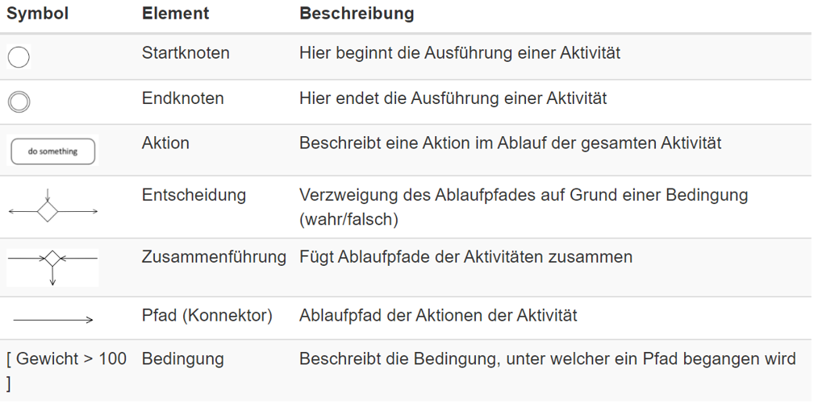
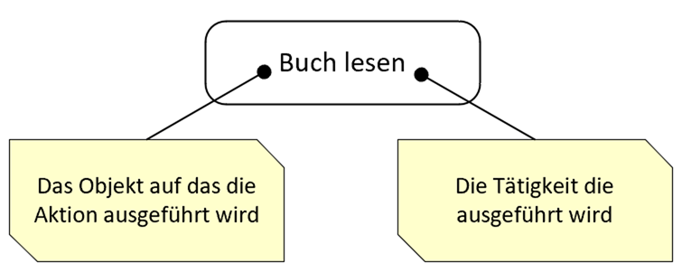
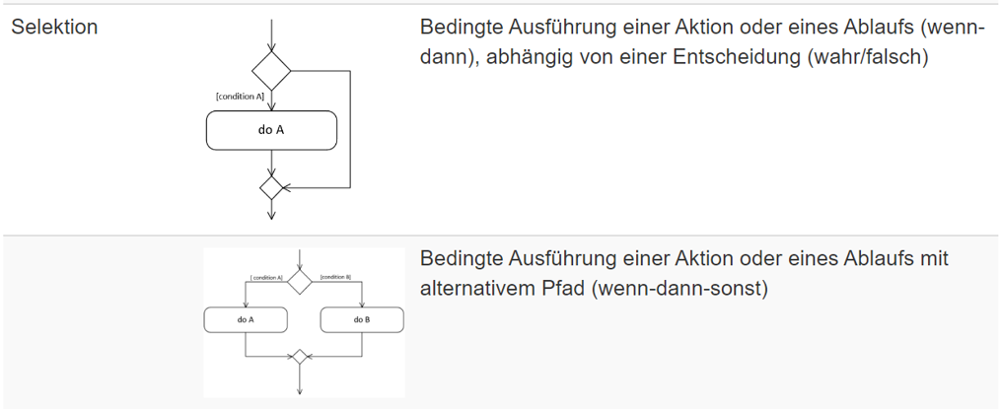
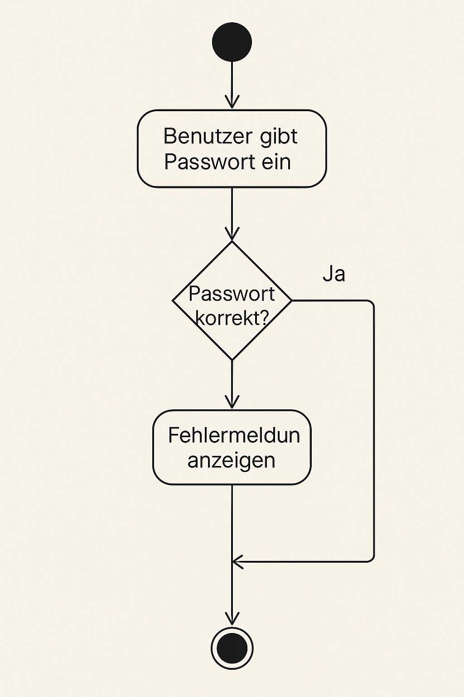

|                             |                          |                                        |
| --------------------------- | ------------------------ | -------------------------------------- |
| **Elektrotechniker/-in HF** | **Programmiertechnik A** |  |

- [1. UML-Aktivitätsdiagramm](#1-uml-aktivitätsdiagramm)
  - [1.1. Grundelemente eines Aktivitätsdiagramms](#11-grundelemente-eines-aktivitätsdiagramms)
    - [1.1.1. Startknoten (Initial Node)](#111-startknoten-initial-node)
    - [1.1.2. Endknoten (Activity Final Node)](#112-endknoten-activity-final-node)
  - [1.2. Aktion (Action / Activity Node)](#12-aktion-action--activity-node)
  - [1.3. Entscheidungsknoten (Decision Node)](#13-entscheidungsknoten-decision-node)
  - [1.4. Kontrollfluss (Control Flow)](#14-kontrollfluss-control-flow)
  - [1.5. Fork-Knoten (Parallelisierung)](#15-fork-knoten-parallelisierung)
  - [1.6. Join-Knoten (Synchronisation)](#16-join-knoten-synchronisation)
  - [1.7. Objektknoten (Object Node)](#17-objektknoten-object-node)
  - [1.8. Swimlanes (Aktivitätsbereiche / Zuständigkeiten)](#18-swimlanes-aktivitätsbereiche--zuständigkeiten)
  - [1.9. Ablauf-Elemente - Iteration](#19-ablauf-elemente---iteration)
  - [1.10. Aktivität](#110-aktivität)
  - [1.11. Beispiel Aktivitätsdiagramm](#111-beispiel-aktivitätsdiagramm)
  - [1.12. Wozu Aktivitätsdiagramms](#112-wozu-aktivitätsdiagramms)
- [2. Aufgaben](#2-aufgaben)
  - [2.1. Aufgabe Aktivitätsdiagramm entwickeln](#21-aufgabe-aktivitätsdiagramm-entwickeln)
  - [2.2. Aufgabe Aktivitätsdiagramm entwickeln](#22-aufgabe-aktivitätsdiagramm-entwickeln)

---

 

# 1. UML-Aktivitätsdiagramm

Ein **Aktivitätsdiagramm** (engl. Activity Diagram) ist eine Art von Verhaltensdiagramm in der **UML (Unified Modeling Language)**, das den Ablauf von Aktivitäten oder Prozessen darstellt – ähnlich wie ein Flussdiagramm, jedoch strukturierter und objektorientierter.

Ein **Aktivitätsdiagramm** zeigt, welche Aktionen (Aktivitäten) in welcher Reihenfolge ausgeführt werden, wo Entscheidungen getroffen werden und wie parallele Abläufe aussehen können.
Es wird vor allem zur Modellierung von Geschäftsprozessen, Arbeitsabläufen oder Programmabläufen verwendet.

[Aktivitätsdiagramm Wiki](https://de.wikipedia.org/wiki/Aktivit%C3%A4tsdiagramm)

## 1.1. Grundelemente eines Aktivitätsdiagramms

| **Name**             | **Bedeutung**                                                    |
| -------------------- | ---------------------------------------------------------------- |
| **Startpunkt**       | Markiert den Beginn des Prozesses                                |
| **Aktivität**        | Ein Schritt oder eine Aktion, z. B. "Benutzer eingeben"          |
| **Entscheidung**     | Verzweigung mit Bedingungen (z. B. "Passwort korrekt?")          |
| **Kontrollfluss**    | Verbindungslinie, zeigt die Reihenfolge der Aktionen             |
| **Endpunkt**         | Beendet den Prozess                                              |
| **Fork/Join-Knoten** | Teilt Prozesse auf (Parallelität) oder führt sie wieder zusammen |
| **Objektknoten**     | Datenfluss: zeigt an, wann Daten ein- oder ausgehen              |

### 1.1.1. Startknoten (Initial Node)

- **Schwarzer ausgefüllter Kreis** (●)
- Der Startpunkt eines Prozesses.
- Von hier aus beginnt der Ablauf.

> Beispiel: Beim Anmeldeprozess: Der Nutzer öffnet das Login-Formular.

### 1.1.2. Endknoten (Activity Final Node)

- **Schwarzer Kreis** mit Umrandung (◯)
- Beendet den Ablauf vollständig.
- Nach diesem Punkt läuft keine Aktivität mehr.

> Beispiel: Nach erfolgreichem Login wird die Startseite angezeigt → Prozess endet.

## 1.2. Aktion (Action / Activity Node)

Eine Aktion ist ein einzelner, **atomarer Schritt** innerhalb einer **Aktivität** – also eine konkrete Handlung, wie z.B. "Zähne putzen", "Tasse aus dem Schrank holen" oder "Passwort eingeben".
**Sie ist nicht weiter unterteilt**.

- **Rechteck** mit abgerundeten Ecken
- Ein einzelner Bearbeitungsschritt, z. B. eine Eingabe, Berechnung oder Aktion.
- Es handelt sich um eine "auszuführende Aktivität".

> Beispiel: Benutzerdaten eingeben, "Zahlung berechnen", "PDF generieren".

## 1.3. Entscheidungsknoten (Decision Node)

- Raute (◆)
- Dient der Verzweigung mit Bedingungen.
- Es gibt mindestens zwei ausgehende Pfeile, beschriftet mit Bedingungen wie "ja" / "nein" oder "> 100" / "<= 100".

> Beispiel: "Ist das Passwort korrekt?" → Ja: Weiter zu "Zugang erlauben", Nein: "Fehlermeldung anzeigen".

## 1.4. Kontrollfluss (Control Flow)

- **Pfeile** zwischen den Knoten
- Zeigt die logische Reihenfolge der Aktivitäten.
- Verbindet Aktionen, Entscheidungen, Start- und Endpunkte.

`[Sequenz](./x_gitres/aktivitätsdiagram-sequenz.png)

## 1.5. Fork-Knoten (Parallelisierung)

- Schwarzer horizontaler oder vertikaler **Balken**
- Spaltet den Ablauf in mehrere parallele Prozesse auf.
- Jeder ausgehende Pfad läuft gleichzeitig ab.

> Beim Online-Kauf werden gleichzeitig E-Mail gesendet und Rechnung erstellt.

## 1.6. Join-Knoten (Synchronisation)

- Gleiches Symbol wie Fork (**Balken**)
- Führt mehrere parallele Abläufe wieder zusammen.
- Der Ablauf geht erst weiter, wenn alle parallelen Pfade abgeschlossen sind.

> Beispiel: Nach "E-Mail gesendet" und "Rechnung erstellt" folgt "Bestellung abgeschlossen".

## 1.7. Objektknoten (Object Node)

- **Rechteck** mit Objektname (optional mit Typ)
- Zeigt den Datenfluss (welches Objekt oder welche Information zwischen Aktivitäten übergeben wird).
- Optional mit Richtungspfeil für Ein- oder Ausgabe.

> Beispiel: Ein "Benutzerobjekt" wird in der Aktivität "Authentifizieren" verwendet.

## 1.8. Swimlanes (Aktivitätsbereiche / Zuständigkeiten)

- Unterteilung des Diagramms in vertikale oder horizontale Bahnen
- Zeigen, welcher Akteur (z. B. System, Benutzer, Admin) welche Aktivität durchführt.
- Oft genutzt zur Zuweisung von Verantwortlichkeiten.

> Beispiel: Ein Swimlane für "Kunde", ein anderer für "System". "Kunde gibt Daten ein", "System prüft Daten".

## 1.9. Ablauf-Elemente - Iteration

## 1.10. Aktivität

Eine **Aktivität** ist ein **komplexer Ablauf oder ein gesamter Prozess**, der sich aus mehreren Teilschritten zusammensetzt. Sie kann mehrere Aktionen enthalten und wird oft als **gesamtes Aktivitätsdiagramm** dargestellt.

## 1.11. Beispiel Aktivitätsdiagramm

## 1.12. Wozu Aktivitätsdiagramms

- Klar strukturierter Ablauf
- Darstellung von Verzweigungen und Parallelität
- Gut geeignet für technische wie auch fachliche Teams
- Unterstützt bei der Systemanalyse und Planung

---

 

# 2. Aufgaben

## 2.1. Aufgabe Aktivitätsdiagramm entwickeln

| **Vorgabe**         | **Beschreibung**                                       |
| :------------------ | :----------------------------------------------------- |
| **Lernziele**       | Ein UML-Aktivitätsdiagramm erstellt                    |
|                     | Grundelementen der UML-Notation                        |
|                     | Verständnis für für strukturierte Ablaufbeschreibungen |
|                     | Abläufe und Prozesse grafisch darzustellen             |
| **Sozialform**      | Einzelarbeit                                           |
| **Auftrag**         | siehe unten                                            |
| **Hilfsmittel**     |                                                        |
| **Zeitbedarf**      | 15min                                                  |
| **Lösungselemente** | Vollständiges Aktivitätsdiagramm                       |

Zeichne ein Aktivitätsdiagramm für folgendes Programm:

- Einlesen einer Zahl von einem User Input
- Vergleichen der Zahl, ob Sie grösser 0 ist.
- Ausgeben der Zahl falls Sie grösser als 0 ist.

---

## 2.2. Aufgabe Aktivitätsdiagramm entwickeln

| **Vorgabe**         | **Beschreibung**                                       |
| :------------------ | :----------------------------------------------------- |
| **Lernziele**       | Ein UML-Aktivitätsdiagramm erstellt                    |
|                     | Grundelementen der UML-Notation                        |
|                     | Verständnis für für strukturierte Ablaufbeschreibungen |
|                     | Abläufe und Prozesse grafisch darzustellen             |
| **Sozialform**      | Partnerarbeit                                          |
| **Auftrag**         | siehe unten                                            |
| **Hilfsmittel**     |                                                        |
| **Zeitbedarf**      | 40min                                                  |
| **Lösungselemente** | Vollständiges Aktivitätsdiagramm                       |

**Auftrag:**

Wähle eine Aktivität aus deinem täglichen Leben, bei der mehrere Schritte oder Entscheidungen eine Rolle spielen.

Beispiele könnten sein:

- Der Ablauf deines Morgens (z.B. "Morgens fertig machen und zur Schule gehen")
- Das Zubereiten eines Gerichts
- Der Weg von zuhause zur Schule
- Eine Online-Bestellung tätigen
- Ein YouTube-Video hochladen

Anschliessend erstellst du ein UML-Aktivitätsdiagramm, das diese Aktivität mit den korrekten Elementen darstellt.

**Vorgehen:**

Wähle eine Aktivität aus deinem **Alltag**, die du interessant findest und die mehrere Teilschritte beinhaltet.

Zerlege die Aktivität in einzelne Schritte. Achte dabei auf:

- Startpunkt der Aktivität
- Reihenfolge der Aktionen
- Eventuelle Entscheidungen (Verzweigungen)
- Parallele Abläufe (wenn vorhanden)
- Endpunkt der Aktivität

Erstelle ein UML-Aktivitätsdiagramm mit den folgenden Grundelementen:

- Startknoten
- Aktivitätsknoten (Aktionen)
- Entscheidungsknoten mit Bedingungen
- Kontrollflüsse (Pfeile)
- Verzweigungs-/Zusammenführungsknoten (falls nötig)
- Endknoten

Nutze ggf. ein geeignetes Zeichenwerkzeug (Papier, Draw.io, Lucidchart, UMLet oder ein anderes UML-Tool deiner Wahl).

Beschrifte dein Diagramm klar und verständlich. Achte auf saubere Darstellung und korrekte Verwendung der UML-Symbole.
