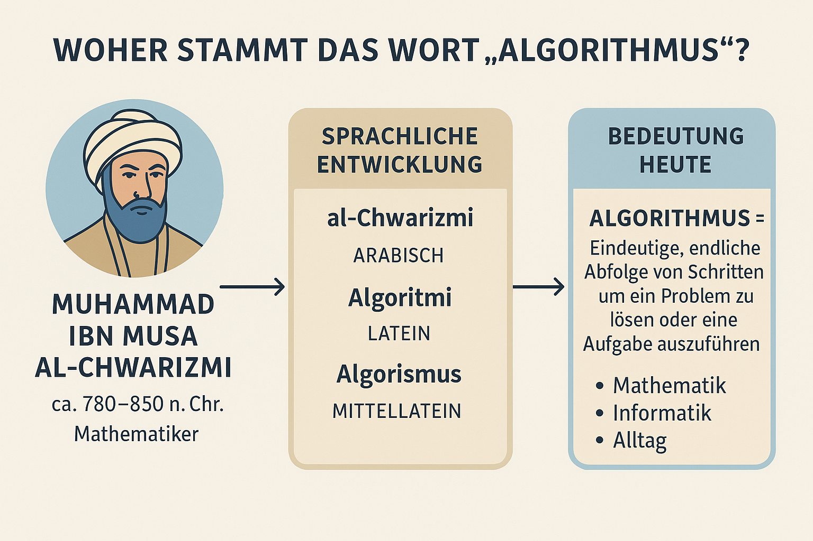
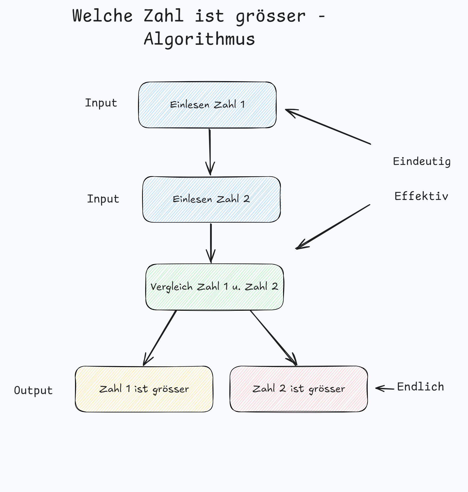

|                             |                          |                                        |
| --------------------------- | ------------------------ | -------------------------------------- |
| **Elektrotechniker/-in HF** | **Programmiertechnik A** |  |

- [1. Algorithmen Grundlagen](#1-algorithmen-grundlagen)
  - [1.1. Ursprung](#11-ursprung)
  - [1.2. Definition](#12-definition)
  - [1.3. Merkmale eines Algorithmus](#13-merkmale-eines-algorithmus)
  - [1.4. Der Weg vom Problem zur Lösung](#14-der-weg-vom-problem-zur-lösung)
  - [1.5. Grundstrukturen](#15-grundstrukturen)
  - [1.6. Erweiterte Strukturen](#16-erweiterte-strukturen)
    - [1.6.1. Annehmende und Abweisende Schleife](#161-annehmende-und-abweisende-schleife)
    - [1.6.2. Mehrfachauswahl](#162-mehrfachauswahl)
  - [1.7. Beispiele](#17-beispiele)
    - [1.7.1. Alltag – Zähneputzen (menschlicher Algorithmus)](#171-alltag--zähneputzen-menschlicher-algorithmus)
    - [1.7.2. Navigation – Wegbeschreibung (Algorithmus zur Wegfindung)](#172-navigation--wegbeschreibung-algorithmus-zur-wegfindung)
- [2. Aufgaben](#2-aufgaben)
  - [2.1. Aufgabe Algorithmen aus dem Alltag](#21-aufgabe-algorithmen-aus-dem-alltag)
  - [2.2. Aufgabe Kuchen backen](#22-aufgabe-kuchen-backen)
  - [2.3. Aufgabe Einkaufsliste](#23-aufgabe-einkaufsliste)

---

 

# 1. Algorithmen Grundlagen

## 1.1. Ursprung

**„Algorithmus“** stammt vom Namen des Mathematikers **al-Chwarizmi**.
Durch Übersetzungen wurde aus **al-Chwarizmi → Algoritmi → Algorismus → Algorithmus**.

## 1.2. Definition

Ein Algorithmus ist eine s**ystematische, logische Reihe von Anweisungen**, die es ermöglicht, ein bestimmtes Problem zu lösen. Er besteht aus klar definierten Schritten und Regeln, die bei der Ausführung zu einem vorhersehbaren Ergebnis führen. **Algorithmen** sind die Grundbausteine der Programmierung und der technischen Informatik, da sie die Basis für die Entwicklung effizienter und funktionaler Software bieten

**Algorithmen** spielen in zahlreichen Bereichen eine zentrale Rolle, z.B. in der Informatik, Mathematik, Wirtschaft und Biologie. Sie sind die Grundlage für Softwareentwicklung, künstliche Intelligenz, Datenanalyse und vieles mehr.

Ein **Algorithmus** ist das **Herzstück** jeder Computeranwendung, aber auch im Alltag nutzen wir ständig implizite Algorithmen – beim Kochen, Autofahren oder Planen. In der Informatik sind Algorithmen besonders wichtig, weil sie den Computer anweisen, wie er Aufgaben lösen soll – egal ob es sich um Suchfunktionen, Bildbearbeitung oder maschinelles Lernen handelt.

Ein **Algorithmus** ist eine **Verarbeitungsvorschrift** zur Lösung einer Klasse von Problemen. Sie muss dabei so präzise formuliert sein, dass sie im Prinzip **maschinell** ausgeführt werden kann.

Die Lösung des Problems wird dabei durch die Festlegung von **Eingabewerten**, **Verarbeitungsschritten** und **Ausgabewerten** beschrieben.

Algorithmen und Programme sind **nicht** dasselbe. Ein Algorithmus ist ein abstraktes Objekt, welches

- unabhängig von der Programmierspache ist, in der er geschrieben werden soll.
- unabhängig vom Computertyp oder der verwendeten Rechnertechnologie ist.

> **Programme sind demzufolge konkrete Formulierungen abstrakter Algorithmen.**

## 1.3. Merkmale eines Algorithmus

- **Endlichkeit**: Ein Algorithmus muss nach einer endlichen Anzahl von Schritten abgeschlossen sein. Der Algorithmus muss unabhängig von den Eingabewerten terminieren.
- **Eindeutigkeit**: Jeder Schritt ist klar und unmissverständlich definiert. Die Abfolge der Anweisungen ist **eindeutig**. Bei gleichen Eingabewerten werden die gleichen Anweisungen durchgeführt.
- **Input und Output**: Algorithmen nehmen Daten auf (Input), verarbeiten diese und produzieren Ergebnisse (Output).
- **Effektivität**: Jeder Schritt muss durchführbar und klar definiert sein. Jeder Schritt löst einen Teil des Problems (Keine „magischen“ Anweisungen).
- **Allgemeinheit**: Die Anwendung eines Algorithmus ist nicht auf eine spezifische Problemstellung beschränkt, sondern allgemein einsetzbar.

## 1.4. Der Weg vom Problem zur Lösung

## 1.5. Grundstrukturen

Ein Algorithmus umfasst grundsätzlich drei Arten von Strukturen

| **Art**                        | **Beschreibung**                                                                                               |
| :----------------------------- | :------------------------------------------------------------------------------------------------------------- |
| **Sequenzen (Folge)**          | Eine Abfolge von Schritten oder Anweisungen, die nacheinander ausgeführt werden.                               |
| **Entscheidungen**             | Punkte im Algorithmus, an denen auf Grundlage einer Bedingung zwischen zwei oder mehreren Pfaden gewählt wird. |
| **Wiederholungen (Schleifen)** | Eine Reihe von Anweisungen, die wiederholt ausgeführt werden, bis eine bestimmte Bedingung erfüllt ist.        |

## 1.6. Erweiterte Strukturen

### 1.6.1. Annehmende und Abweisende Schleife

- **Annehmende (fußgesteuerte) Schleife**: Führt den Schleifenkörper mindestens einmal aus, da die Bedingung am Ende der Schleife überprüft wird (Beispiel: do-while-Schleife in C/C++).
- **Abweisende (kopfgesteuerte) Schleife**: Überprüft die Bedingung vor dem Ausführen des Schleifenkörpers, was bedeutet, dass der Schleifenkörper möglicherweise nie ausgeführt wird, wenn die Bedingung von Beginn an falsch ist (Beispiel: while-Schleife in C/C++).

### 1.6.2. Mehrfachauswahl

Lässt sich in einem Struktogramm als geschachtelte Entscheidungsstruktur darstellen, in der mehrere Bedingungen geprüft und entsprechende Aktionen für jede Bedingung ausgeführt werden.

## 1.7. Beispiele

### 1.7.1. Alltag – Zähneputzen (menschlicher Algorithmus)

**Problem**: Zähne putzen

**Algorithmus**:

1. Zahnbürste nehmen
2. Zahnpasta auftragen
3. Wasser auf Zahnbürste geben
4. Zähne 2 Minuten lang in kreisenden Bewegungen putzen
5. Mund ausspülen
6. Zahnbürste auswaschen

### 1.7.2. Navigation – Wegbeschreibung (Algorithmus zur Wegfindung)

**Problem**: Den schnellsten Weg von A nach B finden

**Algorithmus (vereinfacht):**

1. Starte an Punkt A
2. Ermittle alle Nachbarn von A
3. Berechne die Entfernung zu Punkt B über jeden Nachbarn
4. Wähle den Nachbarn mit der kürzesten Strecke
5. Wiederhole ab Schritt 2 mit neuem Punkt, bis B erreicht ist

Ein solcher Algorithmus wird z. B. von Google Maps verwendet, oft basierend auf dem Dijkstra- oder A*-Algorithmus.

 

# 2. Aufgaben

## 2.1. Aufgabe Algorithmen aus dem Alltag

| **Vorgabe**         | **Beschreibung**                          |
| :------------------ | :---------------------------------------- |
| **Lernziele**       | Verständnis des Algorithmusbegriffs       |
|                     | Formulieren von Algorithmen               |
| **Sozialform**      | Partnerarbeit                             |
| **Auftrag**         | siehe unten                               |
| **Hilfsmittel**     |                                           |
| **Zeitbedarf**      | 15min                                     |
| **Lösungselemente** | Vollständige Beschreibung des Algorithmus |

Findet selber Algorithmen aus dem Alltag, die ihr heute selber machen musstet oder gesehen habt und schreibt diese auf u. diskutiert diese (2er-Gruppen).

---

## 2.2. Aufgabe Kuchen backen

| **Vorgabe**         | **Beschreibung**                          |
| :------------------ | :---------------------------------------- |
| **Lernziele**       | Verständnis des Algorithmusbegriffs       |
|                     | Formulieren von Algorithmen               |
| **Sozialform**      | Partnerarbeit                             |
| **Auftrag**         | siehe unten                               |
| **Hilfsmittel**     |                                           |
| **Zeitbedarf**      | 20min                                     |
| **Lösungselemente** | Vollständige Beschreibung des Algorithmus |

- Sie wollen einen Kuchen backen und sind bereits so weit, dass der Kuchen für 30 Minuten bei 180C in den Ofen muss.
- Dann steht dies in einem Backrezept in etwas so:
  - und den Kuchen nun für 30 Minuten bei 180 C backen.

**Aufgabe:**
Versuche die obige Anweisung in einer ausführen Beschreibung für einen Computer zu formulieren.
Erstelle aus der Beschreibung ein Pseudocode

> Pseudocode dient zur Beschreibung eines Algorithmus unabhängig von der später verwendeten Programmiersprache und ist damit leichter verständlich.

---

## 2.3. Aufgabe Einkaufsliste

| **Vorgabe**         | **Beschreibung**                          |
| :------------------ | :---------------------------------------- |
| **Lernziele**       | Verständnis des Algorithmusbegriffs       |
|                     | Formulieren von Algorithmen               |
|                     | Darstellung von Algorithmen               |
| **Sozialform**      | Partnerarbeit                             |
| **Auftrag**         | siehe unten                               |
| **Hilfsmittel**     |                                           |
| **Zeitbedarf**      | 20min                                     |
| **Lösungselemente** | Vollständige Beschreibung des Algorithmus |

Schreibe einen Algorithmus in natürlicher Sprache (wie ein Rezept), der beschreibt, wie man eine Einkaufsliste erstellt und einkauft.
Formuliere einen Algorithmus in Schritt-für-Schritt-Form, der folgendes Problem löst:

> **Ich will meine Woche planen und brauche Lebensmittel für zu Hause.**
