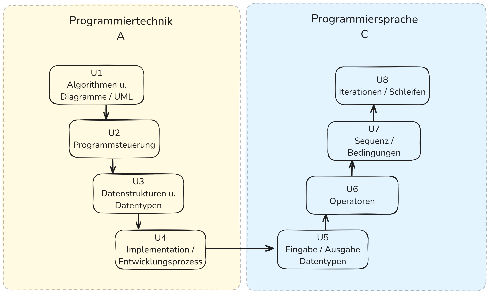

|                             |                          |                                        |
| --------------------------- | ------------------------ | -------------------------------------- |
| **Elektrotechniker/-in HF** | **Programmiertechnik A** |  |

# Einführung

## Handlungskompetenz

- Die **Dipl. Elektrotechniker/-in HF** müssen sich bei Diskussionen im Fachgebiet **Programmiertechnik** kompetent
einbringen können.
- Sie können den technischen Argumentationen folgen und sie verstehen die **technischen Zusammenhänge**. Damit sind sie in der Lage, Grundlagen für Entscheidungen zu erarbeiten.
- Sie **entwerfen**, **programmieren** und bauen neue Geräte, Anlagen und Systeme.

---

## Curriculum

| **Vorgabe**   | **Beschreibung** |
| :------------ | :--------------- |
| **Fachcode**  | PROA.TI1A        |
| **Lektionen** | 40               |
| **Semester**  | D                |
| **Prüfung**   | 1 x Teilprüfung  |

---

## Lehrgang

[Ausschreibung](https://www.ipso.ch/angebote/dipl-elektrotechnikerin-hf?school=ibz)

---

## Unterrichtsorganisation

- Lektionen: 40 Lektionen
  - 50% Theorie, 50% Übungen
  - Gruppenarbeiten
  - Einzelarbeiten
  - Gemeinsames lösen von Aufgaben
- Prüfungen
  - 1 Prüfung eine Note (21.06.2025) Online mit Microsoft Forms 2h
- Hausaufgaben
  - Werden im Unterricht oder per Mail angekündigt
  - Richtgrösse: 2h / Block
- Erreichbarkeit
  - lukas.mueller@dozent.ipso.ch innerhalb von 3 Tagen (Antwort)

---

## Unterrichtsstrukturierung

---

## Vorstellung

### Wer bin ich

- Name/Vorname: Lukas Müller
- Wohnort: 5426 Lengnau AG
- Mail: <lukas.mueller@dozent.ipso.ch>

- Kleines Softwarebüro, technische Softwareentwicklung (Fertigungsindustrie, Automation)
  - Datenbankentwicklung (MS-SQL, Oracle)
  - Softwareentwicklung (C/C++, C#)
- Fachdozent bei IPSO (HF u. EFZ), HBU Uster, Juventus Zürich

---

## Wer sind Sie?

- Name, Vorname
- Ausbildung/Beruf
- Arbeitgeber/Tätigkeiten
- Berufliche Ziele
- Grund für diese Ausbildung
- Erfahrungen mit Programmieren/Software-Entwicklung
- Erwartungen an den Kurs "Programmiertechnik A+B"
