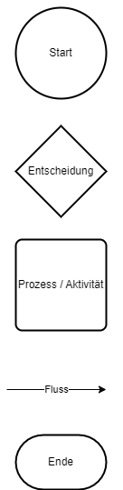
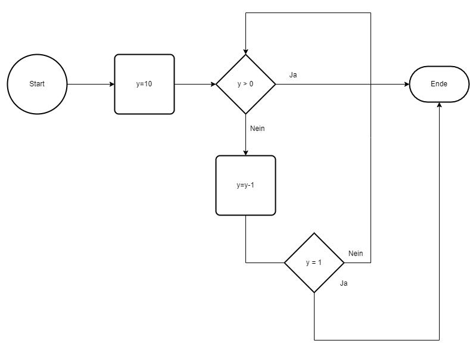
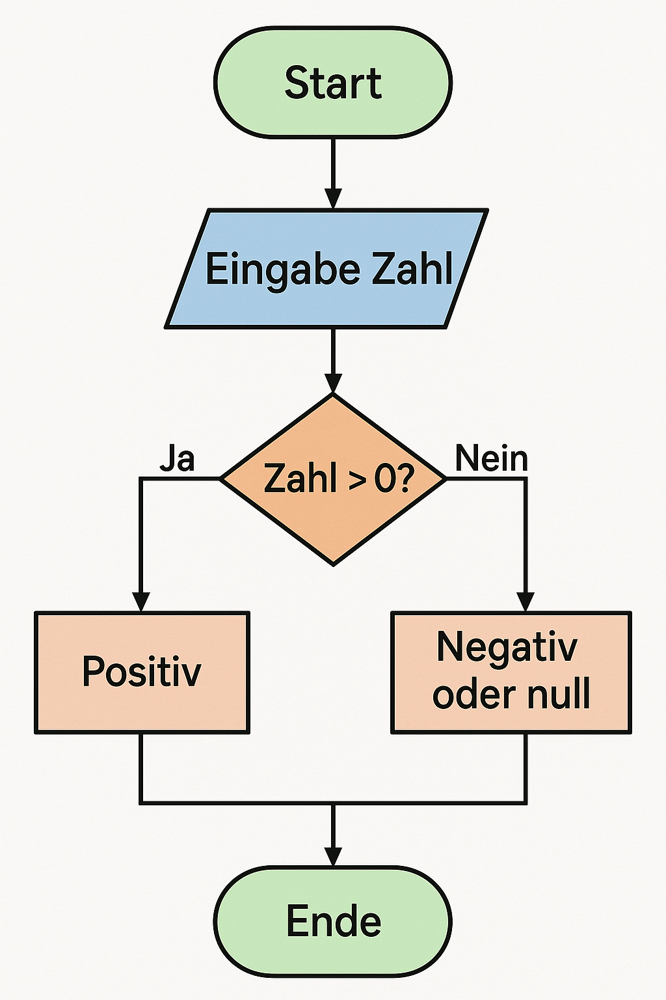

|                             |                          |                                        |
| --------------------------- | ------------------------ | -------------------------------------- |
| **Elektrotechniker/-in HF** | **Programmiertechnik A** |  |

- [1. Flussdiagram (PAP Programmablaufplan)](#1-flussdiagram-pap-programmablaufplan)
  - [1.1. Einleitung](#11-einleitung)
  - [1.2. Grundelemente](#12-grundelemente)
    - [1.2.1. Übersicht der Grundelemente](#121-übersicht-der-grundelemente)
    - [1.2.2. Beispiel der Grundelemente](#122-beispiel-der-grundelemente)
  - [1.3. Beispiel](#13-beispiel)
  - [1.4. Zweck u. Ziele](#14-zweck-u-ziele)
  - [1.5. Mit draw.io einen Programmablaufplan (PAP) erstellen](#15-mit-drawio-einen-programmablaufplan-pap-erstellen)
- [2. Aufgaben](#2-aufgaben)
  - [2.1. Zahl auswerten](#21-zahl-auswerten)

---

 

# 1. Flussdiagram (PAP Programmablaufplan)

## 1.1. Einleitung

Ein **Flussdiagramm** (auch **Programmablaufplan**, englisch: flowchart) ist eine grafische Darstellung eines Ablaufs oder Prozesses.
Es zeigt Schritte, Entscheidungen und Abläufe in Form von Symbolen, die durch Pfeile miteinander verbunden sind. Flussdiagramme werden häufig verwendet, um **Algorithmen**, Programme oder Geschäftsprozesse übersichtlich darzustellen.

[Programmablaufplan Wiki](https://de.wikipedia.org/wiki/Programmablaufplan)

## 1.2. Grundelemente

Ein Flussdiagramm beginnt immer mit einem Startsymbol.
Von dort aus folgt man den Pfeilen von oben nach unten bzw. von Entscheidungspunkt zu Entscheidungspunkt.

| **Symbol**         | **Bedeutung**              | **Beschreibung**                                        |
| ------------------ | -------------------------- | ------------------------------------------------------- |
| **Oval**           | Start / Ende               | Markiert den Anfang oder das Ende des Prozesses         |
| **Rechteck**       | Anweisung / Aktion         | Ein Schritt im Ablauf (z. B. „x = x + 1“)               |
| **Parallelogramm** | Ein- oder Ausgabe          | Benutzerinteraktion (z. B. „Zahl eingeben“)             |
| **Raute**          | Entscheidung / Verzweigung | Logische Frage mit zwei möglichen Wegen („ja“ / „nein“) |
| **Pfeile**         | Ablauf                     | Zeigen die Reihenfolge der Schritte an                  |

---

### 1.2.1. Übersicht der Grundelemente

---

### 1.2.2. Beispiel der Grundelemente

## 1.3. Beispiel

## 1.4. Zweck u. Ziele

- Visuell und leicht verständlich
- Ideal für Einsteiger in die Programmierung
- Unterstützt beim Debuggen
- Verdeutlicht logische Abläufe
- Macht Programme und Prozesse leichter verständlich
- Hilft bei der Planung und Analyse
- Unterstützt beim Debugging und der Kommunikation in Teams
- Geeignet für Präsentationen und Dokumentationen

## 1.5. Mit draw.io einen Programmablaufplan (PAP) erstellen

[Kleines Tutorial](https://www.youtube.com/watch?v=QmF2p_fUcnM)

---

 

# 2. Aufgaben

## 2.1. Zahl auswerten

| **Vorgabe**         | **Beschreibung**                                  |
| :------------------ | :------------------------------------------------ |
| **Lernziele**       | Kenn die Grundelemente eines Flussdiagrammes      |
|                     | Kann ein Flussdiagramm entwickeln                 |
|                     | Kann Algorithmen in einem Flussdiagram darstellen |
| **Sozialform**      | Partnerarbeit                                     |
| **Auftrag**         | siehe unten                                       |
| **Hilfsmittel**     |                                                   |
| **Zeitbedarf**      | 20min                                             |
| **Lösungselemente** | Vollständiges Flussdiagramm                       |

Zeichne ein Flussdiagramm für folgendes Programm:

- Einlesen einer Zahl von einem User Input
- Vergleichen der Zahl, ob Sie grösser 0 ist.
- Ausgeben der Zahl falls Sie grösser als 0 ist.

