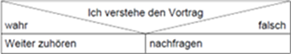
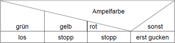
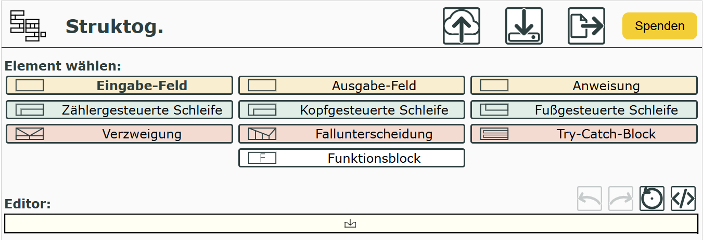

|                             |                          |                                        |
| --------------------------- | ------------------------ | -------------------------------------- |
| **Elektrotechniker/-in HF** | **Programmiertechnik A** |  |

- [1. Struktogramm](#1-struktogramm)
  - [1.1. Wozu Struktogramme](#11-wozu-struktogramme)
  - [1.2. Vorgehen](#12-vorgehen)
  - [1.3. Grundelemente](#13-grundelemente)
    - [1.3.1. Sequenz (Anweisung)](#131-sequenz-anweisung)
      - [1.3.1.1. Beispiel Sequenz](#1311-beispiel-sequenz)
  - [1.4. Alternation (Bedingte Auswahl, Verzweigung)](#14-alternation-bedingte-auswahl-verzweigung)
    - [1.4.1. Beispiel Alternation](#141-beispiel-alternation)
  - [1.5. Alternation (Mehrfachauswahl)](#15-alternation-mehrfachauswahl)
    - [1.5.1. Beispiel Mehrfachauswahl](#151-beispiel-mehrfachauswahl)
  - [1.6. Iteration (Wiederholungen)](#16-iteration-wiederholungen)
    - [1.6.1. Iteration mit Eintrittsbedingung](#161-iteration-mit-eintrittsbedingung)
      - [1.6.1.1. Beispiel Iteration mit Eintrittsbedingung](#1611-beispiel-iteration-mit-eintrittsbedingung)
    - [1.6.2. Iteration mit Wiedereintrittsbedingung](#162-iteration-mit-wiedereintrittsbedingung)
      - [1.6.2.1. Beispiel Iteration mit Wiedereintrittsbedingung](#1621-beispiel-iteration-mit-wiedereintrittsbedingung)
    - [1.6.3. Spezialform (Zählschleife)](#163-spezialform-zählschleife)
  - [1.7. Prozedur Aufruf (Unterprogramm)](#17-prozedur-aufruf-unterprogramm)
    - [1.7.1. Beispiel](#171-beispiel)
  - [1.8. Entwurf von Programmen (E-Book)](#18-entwurf-von-programmen-e-book)
  - [1.9. Zusammenfassung](#19-zusammenfassung)
  - [1.10. Beispiele](#110-beispiele)
    - [1.10.1. Aufgabe lösen](#1101-aufgabe-lösen)
    - [1.10.2. Fakultät](#1102-fakultät)
- [2. Aufgaben](#2-aufgaben)
  - [2.1. Zahl auswerten](#21-zahl-auswerten)

---

# 1. Struktogramm

Ein **Struktogramm** ist eine **grafische Darstellung eines Algorithmus**, die die strukturelle Programmierung visuell zeigt – also die Aufteilung in Anweisungen, Bedingungen und Wiederholungen.
Aufgabe eines **Struktogramms** ist es, den Ablauf eines Computerprogramms auf dem Papier darzustellen. Dazu wurden in den 70er Jahren des vergangenen Jahrhunderts von **Isaac Nassi** und **Ben Shneidermann** graphische Grundelemente entwickelt, die es ermöglichen sollten, Programmabläufe **ohne Sprunganweisungen** darzustellen.
Die Notwendigkeit ergab sich daraus, dass im Laufe der Zeit Computerprogramme immer komplexer und damit unübersichtlicher geworden waren. Mit der Einführung von Struktogrammen wurde es erforderlich, die Programmlogik wieder gründlich und ohne Sprünge zu planen. Man bezeichnete dies als strukturierte Programmierung.
Es ist eine Alternative zu **Flussdiagrammen** und wird besonders in der Schule und bei der Programmplanung eingesetzt, weil es klar, logisch und leicht lesbar ist.

## 1.1. Wozu Struktogramme

Strukturiertes Vorgehen

- Erst die Struktur des Programms entwickeln, dann Programm schreiben.
- Fehler vermeiden
- Strukturiertes Vorgehen statt trial and error.
- Bevor man das Programm schreibt, macht man sich
- Gedanken zum Aufbau und Ablauf des Algorithmus.
- Übersichtliche Darstellung unabhängig von der Programmiersprache.
- Programme, die entsprechend eines Struktogramms implementiert werden, sind in ihrem Aufbau und ihrer Logik leichter überschaubar.

## 1.2. Vorgehen

- Ein Struktogramm wird von **oben nach unten gelesen**
- Die Teilalgorithmen bzw. Anweisungen werden in Form von Rechtecken dargestellt
- Jedes Struktogramm hat jeweils einen Eingang (obere Kante) und einen Ausgang (untere Kante)
- Der Ausgang des einen Segments ist der Eingang des nachfolgenden
- Man beginnt mit einem Grobentwurf und verfeinert diesen schrittweise, d.h. eine Anweisung wird durch einen Teilalgorithmus ersetzt
- Struktogramme können verschachtelt werden. Überall dort, wo eine Anweisung stehen darf, kann ein Teilalgorithmus oder ein ganzes Struktogramm eingefügt werden

---

## 1.3. Grundelemente

### 1.3.1. Sequenz (Anweisung)

Eine **Sequenz** ist die Aneinanderreihung von Teilalgorithmen bzw. Anweisungen

- Pro Anweisung gibt es ein **Rechteck**
- Die Anweisungen werden von oben nach unten abgearbeitet
- Eine oder mehrere Anweisungen werden nacheinander ausgeführt.

#### 1.3.1.1. Beispiel Sequenz

---

## 1.4. Alternation (Bedingte Auswahl, Verzweigung)

- Sollen Anweisungen nur in Abhängigkeit von bestimmten **Bedingungen** ausgeführt werden, verwendet man eine Auswahl bzw. Verzweigung
  - Die Bedingung steht oben
  - **Link**, wenn wahr
  - **Rechts**, wenn falsch
- Ist die Bedingung wahr, so wird der **"WAHR"**-Block ausgeführt, ansonsten, der **"FALSCH"**-Block
- Jeder der Blöcke
  - kann eine Anweisung
  - ein Teilalgorithmus
  - ein ganzes Struktogramm oder auch keine Anweisung (Bedingte Auswahl) enthalten
- Wird als Rechteck, das in zwei Zweige geteilt ist dargestellt.

Es kann auch nur ein Anweisungsblock (wahr oder falsch) ausgeführt werden.

### 1.4.1. Beispiel Alternation

---

## 1.5. Alternation (Mehrfachauswahl)

- Auch Fallunterscheidung genannt
- Mehrere Alternativen werden berücksichtigt
- Je nachdem, welchen Wert der Ausdruck enthält, wird einer der Fälle ausgewählt
- Trifft keiner der Fälle zu, wird der „SONST“-Block ausgeführt
- Wird als Rechteck mit mehreren horizontalen Bereichen für die **verschiedenen Fälle** dargestellt

### 1.5.1. Beispiel Mehrfachauswahl

---

## 1.6. Iteration (Wiederholungen)

Iteration ist die Wiederholung eines Teilalgorithmus in Abhängigkeit von einer Bedingung.

### 1.6.1. Iteration mit Eintrittsbedingung

Am Anfang der Iteration steht eine Eintrittsbedingung

- Kopfgesteuerte Iteration (solange)
- Die Bedingung wird **zuerst geprüft**. Nur wenn sie wahr ist, wird der Schleifenblock ausgeführt.
- Der anschliessende Teilalgorithmus wird wiederholt, solang die Bedingung erfüllt ist
- Ist die Bedingung von Beginn an nicht erfüllt, kommt der Teilalgorithmus auch nicht zur Ausführung

#### 1.6.1.1. Beispiel Iteration mit Eintrittsbedingung

### 1.6.2. Iteration mit Wiedereintrittsbedingung

Der Teilalgorithmus wird ausgeführt, solange die **Wiedereintrittsbedingung** erfüllt ist

- Schleifenbedingung steht unten
- Der Block wird **mindestens einmal** ausgeführt, danach wird geprüft.
- Ist die Bedingung nichtmehr erfüllt, wird die Wiederholung beendet
- Der Teilalgorithmus wird mindestens einmal ausgeführt.

#### 1.6.2.1. Beispiel Iteration mit Wiedereintrittsbedingung

### 1.6.3. Spezialform (Zählschleife)

Eine **Zählschleife** (auch zählende Schleife genannt) ist eine Schleifenform, bei der eine Schleifenvariable schrittweise verändert wird, bis eine bestimmte Anzahl von Durchläufen erreicht ist.

- Man verwendet sie, wenn man **genau weiss, wie oft** eine Wiederholung stattfinden soll.
- Wird häufig verwendet, um von A bis B zu zählen

---

## 1.7. Prozedur Aufruf (Unterprogramm)

Der Aufruf einer **Prozedur** oder einer Methode, die wiederum aus einer Menge von Anweisungen bestehen kann, wird durch die Doppelstriche am Rand des Strukturblocks dargestellt.
Nach deren Durchlauf wird zu der aufrufenden Stelle zurückgesprungen und der nächstfolgende Strukturblock durchlaufen. Dieses Symbol ist nicht genormt

### 1.7.1. Beispiel

---

## 1.8. Entwurf von Programmen (E-Book)

---

## 1.9. Zusammenfassung

Komplexe Abläufe werden durch Schachtelung von Kontrollstrukturen beschrieben

- Innerhalb von Schleifen können wieder Schleifen oder Auswahlanweisungen stehen
- Kontrollstrukturen können in beliebiger Kombination beliebig tief ineinander verschachtelt werden
- Funktionen werden in einem separaten Struktogramm dargestellt

> **Immer vom Groben zum Feinen Anweisungen durch Teilalgorithmen ersetzen, dann geht nichts schief!**

---

## 1.10. Beispiele

### 1.10.1. Aufgabe lösen

### 1.10.2. Fakultät

---

 

# 2. Aufgaben

## 2.1. Zahl auswerten

| **Vorgabe**         | **Beschreibung**                                  |
| :------------------ | :------------------------------------------------ |
| **Lernziele**       | Kennt die Grundelemente eines Struktogramms       |
|                     | Kann ein Struktogramm entwickeln                  |
|                     | Kann Algorithmen in einem Struktogramm darstellen |
| **Sozialform**      | Einzelarbeit                                      |
| **Auftrag**         | siehe unten                                       |
| **Hilfsmittel**     |                                                   |
| **Zeitbedarf**      | 30min                                             |
| **Lösungselemente** | Vollständiges Struktogramm                        |

Zeichne ein Struktogramm für folgendes Programm:

- Einlesen einer Zahl von einem User Input
- Vergleichen der Zahl, ob Sie grösser 0 ist.
- Ausgeben der Zahl falls Sie grösser als 0 ist.

Das Struktogramm kann wahlweise in [**draw.io**](https://app.diagrams.net/) oder mit dem [**Struktogramm Editor**](https://dditools.inf.tu-dresden.de/ovk/Informatik/Programmierung/Grundlagen/Struktogramme.html) erstellt werden.

