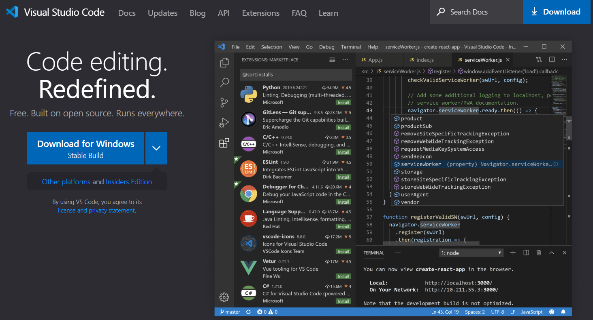
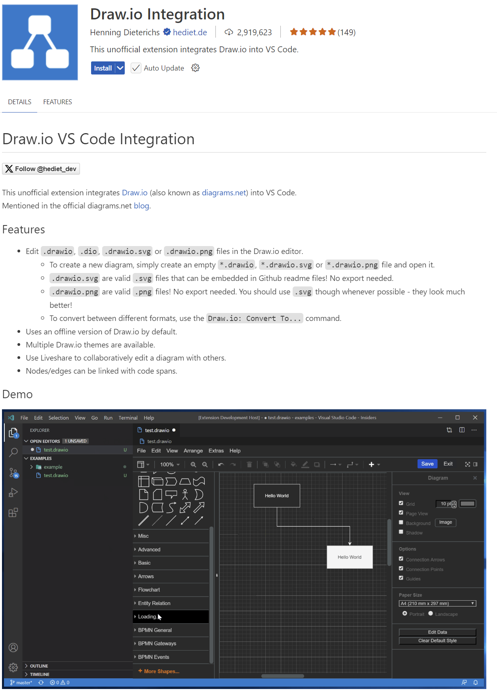
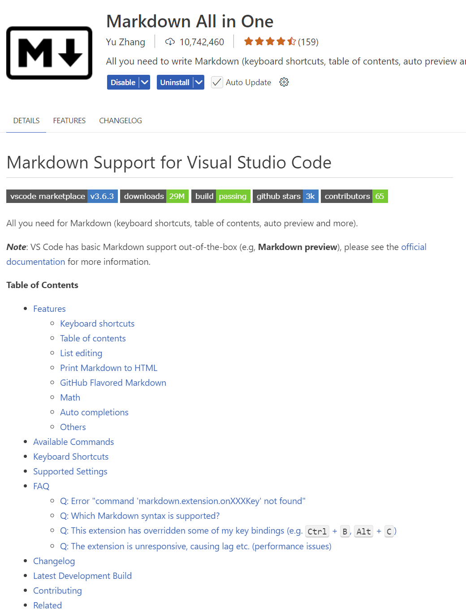
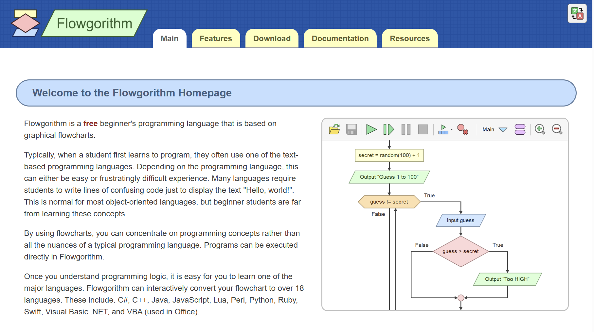
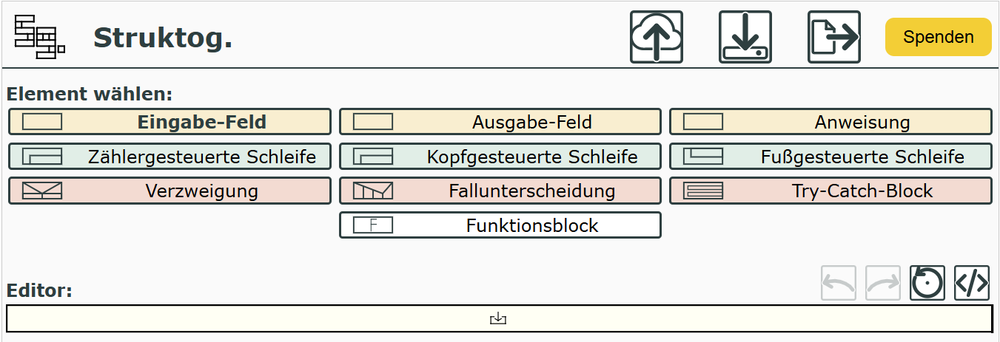

|                             |                          |                                        |
| --------------------------- | ------------------------ | -------------------------------------- |
| **Elektrotechniker/-in HF** | **Programmiertechnik A** |  |

- [1. Voraussetzungen](#1-voraussetzungen)
  - [1.1. Visual Studio Code](#11-visual-studio-code)
  - [1.2. Extension Draw.io Integration](#12-extension-drawio-integration)
  - [1.3. Installation "Using GCC with MinGW"](#13-installation-using-gcc-with-mingw)
  - [1.4. Extension C/C++](#14-extension-cc)
  - [1.5. Extension Material Icon Theme (empfohlen)](#15-extension-material-icon-theme-empfohlen)
  - [1.6. Extension Markdown All in One (empfohlen)](#16-extension-markdown-all-in-one-empfohlen)
  - [1.7. Flowgorithm](#17-flowgorithm)
  - [1.8. Struktogramme](#18-struktogramme)
- [2. Aufgaben](#2-aufgaben)
  - [2.1. GitHub Account erstellen](#21-github-account-erstellen)
  - [2.2. Installation u. Softwarevoraussetzungen](#22-installation-u-softwarevoraussetzungen)

---

  

# 1. Voraussetzungen

## 1.1. Visual Studio Code

[Download Visual Studio Code](https://code.visualstudio.com/)

---

 

## 1.2. Extension Draw.io Integration

Alternativ stehen auch folgende Möglichkeiten zur Verfügung:

- [Web-App](https://app.diagrams.net/)
- [Lokale Installation](https://www.drawio.com/)

---

 

## 1.3. Installation "Using GCC with MinGW"

[Installationsanleitung](https://code.visualstudio.com/docs/cpp/config-mingw#_prerequisites)

[Installing MinGW to build C++ Code on Windows](https://www.youtube.com/watch?v=oC69vlWofJQ)

> Wichtig: `pacman -S --needed base-devel mingw-w64-ucrt-x86_64-toolchain`

---

 

## 1.4. Extension C/C++

---

 

## 1.5. Extension Material Icon Theme (empfohlen)

---

 

## 1.6. Extension Markdown All in One (empfohlen)

---

 

## 1.7. Flowgorithm

[Download Flowgorithm](http://www.flowgorithm.org/download/index.html)

---

 

## 1.8. Struktogramme

[Struktogramme erstellen](https://dditools.inf.tu-dresden.de/ovk/Informatik/Programmierung/Grundlagen/Struktogramme.html)

---

 

# 2. Aufgaben

## 2.1. GitHub Account erstellen

| **Vorgabe**         | **Beschreibung**                           |
| :------------------ | :----------------------------------------- |
| **Lernziele**       | GitHub Account seht zur Verfügung          |
|                     | GitHub Benutzername in OneNote eingetragen |
| **Sozialform**      | Einzelarbeit                               |
| **Auftrag**         | siehe unten                                |
| **Hilfsmittel**     | Internet / Browser                         |
| **Zeitbedarf**      | 20min                                      |
| **Lösungselemente** |                                            |

Erstelle einen GitHub Account. Verwende dabei wenn möglich eine IPSO E-Mail Adresse.
Gehe dabei wie folgt vor:

1. Gehe auf die Website
   1. <https://github.com/>
2. Klicke auf **„Sign up“**
   1. Oben rechts auf der Startseite findest du die Schaltfläche „Sign up“ (Registrieren).
3. Gib deine E-Mail-Adresse ein
   1. Beispiel: <dein.name@student.ipso.ch>
   2. → Klicke dann auf **„Continue“**
4. Wähle einen Benutzernamen
   1. Das ist dein öffentlicher Name auf GitHub, z.B. **codefan123**.
5. Lege ein sicheres Passwort fest
   1. Mindestens 8 Zeichen, am besten mit Gross-, Kleinbuchstaben, Zahlen und Symbolen.
6. Gib an, ob du E-Mails von GitHub erhalten willst
   1. Das ist optional.
7. Verifiziere, dass du kein Roboter bist
   1. GitHub zeigt dir manchmal ein kleines Rätsel oder Bild-Puzzle.
8. Bestätige deine E-Mail-Adresse
   1. GitHub sendet dir eine Mail mit einem Bestätigungslink – klicke darauf, um dein Konto zu aktivieren.
9. Wähle deine GitHub-Einstellungen
   1. Privatperson oder Unternehmen
   2. Deine Interessen
10. Fertig!
    1. Du wirst zu deinem GitHub-Dashboard weitergeleitet.
11. Trage nun dein GitHub Benutzername im Class Notebook (Teams) bei Kursnotizen ein.

---

 

## 2.2. Installation u. Softwarevoraussetzungen

| **Vorgabe**         | **Beschreibung**                     |
| :------------------ | :----------------------------------- |
| **Lernziele**       | Softwarevoraussetzungen sind erfüllt |
| **Sozialform**      | Einzelarbeit                         |
| **Auftrag**         | siehe unten                          |
| **Hilfsmittel**     | siehe Download links                 |
| **Zeitbedarf**      | 30min                                |
| **Lösungselemente** |                                      |

Installiere alle erforderlichen Softwarekomponenten auf Deinem Rechner.
Teste soweit möglich, dass alle Komponenten ohne Fehler ausgeführt werden und funktionstauglich sind.
