|                             |                          |                                        |
| --------------------------- | ------------------------ | -------------------------------------- |
| **Elektrotechniker/-in HF** | **Programmiertechnik A** |  |

- [1. Programmsteuerung](#1-programmsteuerung)
  - [1.1. Definition](#11-definition)
  - [1.2. Elemente der Programmsteuerung](#12-elemente-der-programmsteuerung)
  - [1.3. Sequenz (Anweisung)](#13-sequenz-anweisung)
  - [1.4. Auswahl (Entscheidungsstrukturen)](#14-auswahl-entscheidungsstrukturen)
    - [1.4.1. Wenn (if)](#141-wenn-if)
    - [1.4.2. Wenn-Sonst (if-else)](#142-wenn-sonst-if-else)
    - [1.4.3. Mehrfachauswahl (switch case)](#143-mehrfachauswahl-switch-case)
  - [1.5. Wiederholungen (Schleifen)](#15-wiederholungen-schleifen)
  - [1.6. Sprung (GoTo)](#16-sprung-goto)
  - [1.7. Logische Verknüpfungen](#17-logische-verknüpfungen)
- [2. Aufgaben](#2-aufgaben)
  - [2.1. Flowgorithm Einführung](#21-flowgorithm-einführung)
  - [2.2. Kleinste Zahl](#22-kleinste-zahl)
  - [2.3. Auswahl](#23-auswahl)
  - [2.4. Verzweigung (Auswahl)](#24-verzweigung-auswahl)
  - [2.5. Mehrfachauswahl](#25-mehrfachauswahl)
  - [2.6. Wiederholungen](#26-wiederholungen)
  - [2.7. Gerade Zahlen](#27-gerade-zahlen)
  - [2.8. Mehrwertsteuer](#28-mehrwertsteuer)
  - [2.9. Taschenrechner](#29-taschenrechner)
  - [2.10. Kreisfläche berechnen](#210-kreisfläche-berechnen)

---

# 1. Programmsteuerung

## 1.1. Definition

**Programmsteuerung** bezeichnet die **logische Abfolge** von **Anweisungen**, **Bedingungen**, **Schleifen** und **Verzweigungen**, durch die ein Programm kontrolliert, gesteuert und ausgeführt wird. Sie legt fest, wie das Programm auf Benutzereingaben, interne Zustände oder äussere Ereignisse reagiert und entsprechend den vordefinierten Regeln fortschreitet.

## 1.2. Elemente der Programmsteuerung

- **Sequenz (lineare Ausführung)**: Befehle werden der Reihe nach ausgeführt.
- **Verzweigung (z. B. `if/else`)**: Entscheidungen beeinflussen den weiteren Programmfluss.
- **Schleifen (z. B. for, `while`)**: Wiederholungen von Anweisungen.
- **Funktions-/Methodenaufrufe**: Steuerung durch Strukturierung in Unterprogramme.

## 1.3. Sequenz (Anweisung)

Eine **Sequenz** beschreibt dabei die lineare, schrittweise Ausführung von Anweisungen in der Reihenfolge, in der sie im Code stehen.
Eine Sequenz ist eine **Abfolge von Anweisungen**, die nacheinander, also "der Reihe nach", ausgeführt werden – **von oben nach unten**.

**Struktogramm:**

> 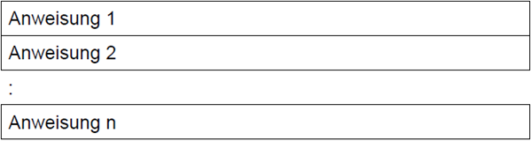

**Programmablaufplan:**

> 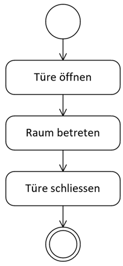

**Aktivitätsdiagramm:**

> 

---

## 1.4. Auswahl (Entscheidungsstrukturen)

Die Auswahl ist ein **Steuerungskonstrukt**, bei dem das Programm abhängig von einer Bedingung entscheidet, welcher Anweisungsblock ausgeführt wird.
Sie erlaubt das reagierende Verhalten des Programms auf **unterschiedliche Situationen**.

| **Art der Auswahl**                                                    | **Beschreibung**                                                                |
| :--------------------------------------------------------------------- | ------------------------------------------------------------------------------- |
| **Einfache Auswahl (`if`)**                                            | Führt nur einen Block aus, wenn die Bedingung wahr ist.                         |
| **Zweiseitige Auswahl (`if - else`)**                                  | Wählt zwischen zwei Blöcken, je nachdem, ob die Bedingung wahr oder falsch ist. |
| **Mehrfachauswahl** (**`if - else if - else`** oder **`switch-case`**) | Es gibt mehrere mögliche Fälle. Der passende wird ausgeführt.                   |

Sie ermöglicht es, Programme dynamisch und intelligent auf unterschiedliche Eingaben und Situationen reagieren zu lassen, statt einfach nur stur Anweisungen der Reihe nach auszuführen.

### 1.4.1. Wenn (if)

**Struktogramm:**

> 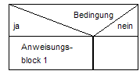

**Programmablaufplan:**

> 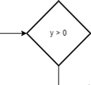

**Aktivitätsdiagramm:**

> 

### 1.4.2. Wenn-Sonst (if-else)

**Struktogramm:**

> 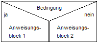

**Programmablaufplan:**

> 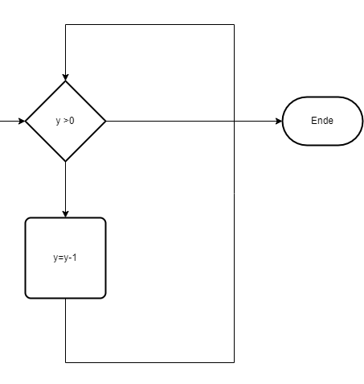

**Aktivitätsdiagramm:**

> 

### 1.4.3. Mehrfachauswahl (switch case)

**Struktogramm:**

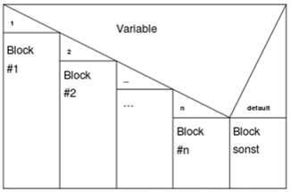

**Programmablaufplan:**

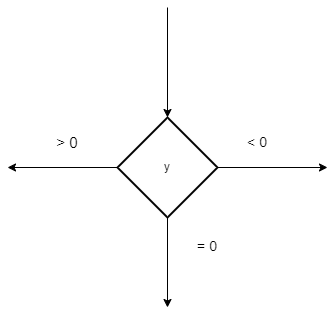

**Aktivitätsdiagramm:**

---

## 1.5. Wiederholungen (Schleifen)

Die **Wiederholung** in der Programmsteuerung ist ein zentrales Konzept, das es ermöglicht, bestimmte Anweisungen **mehrfach** auszuführen, ohne sie jedes Mal neu schreiben zu müssen. Man spricht hierbei auch von **Schleifen** oder **Loops**.
Eine **Wiederholung** (auch **Schleife**) ist ein Programmkonstrukt, das einen Anweisungsblock **mehrfach** ausführt, solange **eine bestimmte Bedingung erfüllt ist** – oder so lange, wie es der Programmierer vorgibt.

Man unterscheidet zwischen **zählergesteuerten** und **bedingungsgesteuerten Schleifen**.

| **Schleifenart**                         | **Beschreibung**                                                                                      |
| :--------------------------------------- | ----------------------------------------------------------------------------------------------------- |
| **Zählerschleife (`for`)**               | Führt Anweisungen eine bestimmte Anzahl von Malen aus                                                 |
| **Kopfgesteuerte Schleife (`while`)**    | Führt Anweisungen aus, solange eine Bedingung erfüllt ist (Bedingung wird vor der Ausführung geprüft) |
| **Fussgesteuerte Schleife (`do-while`)** | Führt Anweisungen aus und prüft die Bedingung danach – wird also mindestens einmal ausgeführt         |

**Struktogramm:**

> 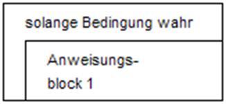

**Programmablaufplan:**

> 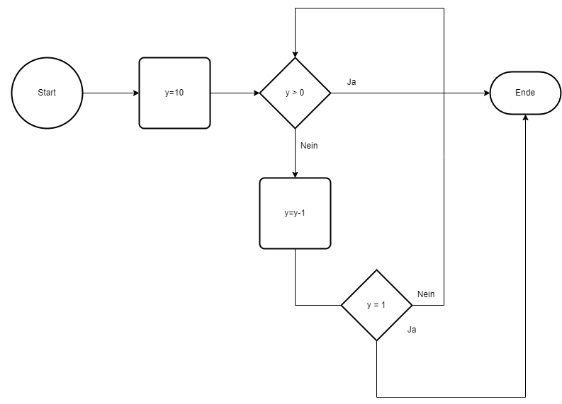

**Aktivitätsdiagramm:**

> 

---

## 1.6. Sprung (GoTo)

- Die **Sprunganweisung** ist ein wichtiges, aber oft auch **vorsichtig** zu verwendendes Konzept in der Programmsteuerung.
- Eine **Sprunganweisung** ist ein Befehl in einem Programm, der bewirkt, dass der Programmablauf nicht der normalen Reihenfolge (von oben nach unten) folgt, sondern an eine **andere Stelle springt**.
- Sprunganweisungen sind mächtig, aber sollten sparsam und überlegt eingesetzt werden.
- Zu viele unkontrollierte Sprünge führen zu sogenanntem **"Spaghetti-Code"** – unübersichtlich und schwer wartbar.

> Sie **unterbricht** also den linearen Ablauf und ändert den Programmfluss gezielt, z.B. durch einen Sprung in eine andere Codezeile, Schleife oder Methode.

| **Sprunganweisung** | **Beschreibung**                                                                                          |
| :------------------ | --------------------------------------------------------------------------------------------------------- |
| **`break`**         | Beendet eine Schleife oder **`switch`**-Anweisung sofort.                                                 |
| **`continue`**      | Springt zum **nächsten Schleifendurchlauf**, überspringt den **Rest des aktuellen Durchlaufs**.           |
| **`return`**        | Bricht die Ausführung einer Methode/Funktion **ab** und gibt ggf. einen Wert zurück.                      |
| **`goto`**          | Springt zu einer **markierten Codezeile** – meist **nicht empfohlen**, da es unübersichtlich werden kann. |

**Struktogramm:**

> 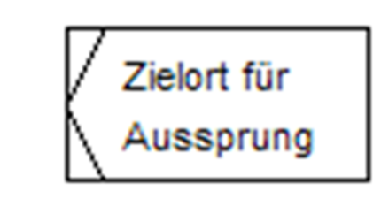

**Aktivitätsdiagramm:**

> 

---

## 1.7. Logische Verknüpfungen

- Die **logischen Verknüpfungen** sind ein zentraler Bestandteil der Programmsteuerung – sie ermöglichen es dem Programm, **Entscheidungen** zu treffen, **Bedingungen** zu prüfen und **Verzweigungen zu steuern**.
- **Logische Verknüpfungen** (auch **logische Operatoren**) verbinden zwei oder mehr Bedingungen miteinander.
- Das Ergebnis ist immer ein Boolescher Wert:
  - **true** (wahr) oder
  - **false** (falsch).

| **Operator** | **Name**    | Bedeutung                               | Beispiel                                  |
| :----------- | ----------- | --------------------------------------- | ----------------------------------------- |
| **`&&`**     | UND (AND)   | Beide Bedingungen müssen **wahr** sein  | `wenn (Alter >= 18 && Wohnort == "DE")`   |
| **`\|\|`**   | ODER (OR)   | Nur eine Bedingungen muss **wahr** sein | `wenn (Alter >= 18 \|\| Wohnort == "DE")` |
| **`!`**      | NICHT (NOT) | Kehrt den Wahrheitswert **um**.         | `wenn (!EingabeIstLeer)`                  |

**Aktivitätsdiagramm:**

> 

Beispiele Diagramme: Diese werden meistens als Kombination in einer Bedingung dargestellt

---
 

# 2. Aufgaben

## 2.1. Flowgorithm Einführung

| **Vorgabe**         | **Beschreibung**                                    |
| :------------------ | :-------------------------------------------------- |
| **Lernziele**       | Kenn die Grundelemente eines Flowgorithm Programmes |
|                     | Kann ein Flowgorithm entwickeln                     |
|                     | Kann Algorithmen in Flowgorithm prüfen              |
| **Sozialform**      | Einzelarbeit                                        |
| **Auftrag**         | siehe unten                                         |
| **Hilfsmittel**     |                                                     |
| **Zeitbedarf**      | 30min                                               |
| **Lösungselemente** | Vollständiges Flowgorithm                           |

a)
Start das **Flowgorithm** und ändere die Sprache mit **F3** oder über das Menü "**Appearance->Change Language...**"  z.B. auf Deutsch.

b)
Rufe über das Menü "Hilfe->Dokumentation" die Online Hilfe auf und verschaffe Dir einen Überblick zu den "**Basic Shapes: Assignment, Declare, Input und Outpupt**"

c)
Versuche den PAP "Zahl auswerten" in Flowgorithm umzusetzen.

---

## 2.2. Kleinste Zahl

| **Vorgabe**         | **Beschreibung**                                   |
| :------------------ | :------------------------------------------------- |
| **Lernziele**       | Kennt die Grundelemente eines Flussdiagramms       |
|                     | Kann ein Flussdiagramm entwickeln                  |
|                     | Kann Algorithmen in einem Flussdiagramm darstellen |
| **Sozialform**      | Einzelarbeit                                       |
| **Auftrag**         | siehe unten                                        |
| **Hilfsmittel**     |                                                    |
| **Zeitbedarf**      | 20min                                              |
| **Lösungselemente** | Vollständiges Flussdiagramm                        |

a)
Schreibe ein PAP, in welchem zwei Werte eingelesen und der grössere Wert danach am Bildschirm angezeigt wird
Versuchen Sie diese Aufgabe mit **draw.io** zu lösen.

---

## 2.3. Auswahl

| **Vorgabe**         | **Beschreibung**                                  |
| :------------------ | :------------------------------------------------ |
| **Lernziele**       | Kennt die Grundelemente eines Struktogramms       |
|                     | Kann ein Struktogramm entwickeln                  |
|                     | Kann Algorithmen in einem Struktogramm darstellen |
| **Sozialform**      | Einzelarbeit                                      |
| **Auftrag**         | siehe unten                                       |
| **Hilfsmittel**     |                                                   |
| **Zeitbedarf**      | 40min                                             |
| **Lösungselemente** | Vollständiges Struktogramm                        |

Zeichne ein **Flussdiagramm**, ein **Aktivitätsdiagramm** und ein **Struktogramm** für folgendes Programm:

- Einlesen einer Zahl vom User (Console)
- Einlesen einer 2. Zahl
- Einlesen einer 3. Zahl
- Ausgabe der des Mittelwertes der 3 Zahlen, wenn der Mittelwert grösser 10 ist.

---

## 2.4. Verzweigung (Auswahl)

| **Vorgabe**         | **Beschreibung**                                  |
| :------------------ | :------------------------------------------------ |
| **Lernziele**       | Kennt die Grundelemente eines Struktogramms       |
|                     | Kann ein Struktogramm entwickeln                  |
|                     | Kann Algorithmen in einem Struktogramm darstellen |
| **Sozialform**      | Einzelarbeit                                      |
| **Auftrag**         | siehe unten                                       |
| **Hilfsmittel**     |                                                   |
| **Zeitbedarf**      | 20min                                             |
| **Lösungselemente** | Vollständiges Struktogramm                        |

- Gegeben ist die Variable `q`. Wenn `q` einen Zahlenwert grösser als 20 hat, dann soll die **Tätigkeit A** ausgeführt werden.
- Sonst ist die **Tätigkeit B** zu erledigen.

Zeichne Sie das Struktogramm

---

## 2.5. Mehrfachauswahl

| **Vorgabe**         | **Beschreibung**                                  |
| :------------------ | :------------------------------------------------ |
| **Lernziele**       | Kennt die Grundelemente eines Struktogramms       |
|                     | Kann ein Struktogramm entwickeln                  |
|                     | Kann Algorithmen in einem Struktogramm darstellen |
| **Sozialform**      | Einzelarbeit                                      |
| **Auftrag**         | siehe unten                                       |
| **Hilfsmittel**     |                                                   |
| **Zeitbedarf**      | 20min                                             |
| **Lösungselemente** | Vollständiges Struktogramm                        |

Gegeben ist die Variable **`q`**.
Ist `q = 50` dann ist die **Tätigkeit A** auszuführen.
Ist `q = 40` dann ist die **Tätigkeit B** auszuführen.
Ist `q = 80` dann ist die **Tätigkeit C** auszuführen.
Ist `q > 80` dann ist die **Tätigkeit D** auszuführen.

Zeichne das Struktogramm!

## 2.6. Wiederholungen

| **Vorgabe**         | **Beschreibung**                                                     |
| :------------------ | :------------------------------------------------------------------- |
| **Lernziele**       | Kennt die Grundelemente von Struktogramm, PAP und Aktivitätsdiagramm |
|                     | Kann Algorithmen in einem Diagramm darstellen                        |
| **Sozialform**      | Partnerarbeit                                                        |
| **Auftrag**         | siehe unten                                                          |
| **Hilfsmittel**     |                                                                      |
| **Zeitbedarf**      | 20min                                                                |
| **Lösungselemente** | Vollständiges Diagramm                                               |

Zeichne mit einem Diagramm eurer Wahl folgendes Programm:

- Einlesen einer Zahl vom User (Console)
- Einlesen von **n-Zahlen** in einer Schleife bis der User nichts mehr eingibt.
- Ausgabe der des Mittelwertes der **n-Zahlen**

## 2.7. Gerade Zahlen

| **Vorgabe**         | **Beschreibung**                                            |
| :------------------ | :---------------------------------------------------------- |
| **Lernziele**       | Kennt die Grundelemente eines UML-Aktivitätsdiagramm        |
|                     | Kann ein UML-Aktivitätsdiagramm entwickeln                  |
|                     | Kann Algorithmen in einem UML-Aktivitätsdiagramm darstellen |
| **Sozialform**      | Einzelarbeit                                                |
| **Auftrag**         | siehe unten                                                 |
| **Hilfsmittel**     |                                                             |
| **Zeitbedarf**      | 40min                                                       |
| **Lösungselemente** | Vollständiges UML-Aktivitätsdiagramm                        |

- Schreiben Sie ein Programm, das alle **geraden Zahlen** zwischen **1 und 368** auf dem Bildschirm ausgibt.
- Es sollen immer 8 (durch Tabulator getrennte) Zahlen in einer Zeile ausgegeben werden, bevor ein Zeilenumbruch erfolgt.

> **Tipp: Modulo verwenden**

## 2.8. Mehrwertsteuer

| **Vorgabe**         | **Beschreibung**                                        |
| :------------------ | :------------------------------------------------------ |
| **Lernziele**       | Kennt die Grundelemente eines Programmablaufplan        |
|                     | Kann ein Programmablaufplan entwickeln                  |
|                     | Kann Algorithmen in einem Programmablaufplan darstellen |
| **Sozialform**      | Einzelarbeit                                            |
| **Auftrag**         | siehe unten                                             |
| **Hilfsmittel**     |                                                         |
| **Zeitbedarf**      | 40min                                                   |
| **Lösungselemente** | Vollständiges Flowgorithm Programm                      |

Schreiben Sie in Flowgorithm ein Programmablaufplan (PAP), das nach einem Rechnungsbetrag fragt und danach den Mehrwertsteuerbetrag ermittelt und diesen zusammen mit dem Gesamtbetrag ausgibt.

## 2.9. Taschenrechner

| **Vorgabe**         | **Beschreibung**                                        |
| :------------------ | :------------------------------------------------------ |
| **Lernziele**       | Kennt die Grundelemente eines Programmablaufplans       |
|                     | Kann ein Programmablaufplan entwickeln                  |
|                     | Kann Algorithmen in einem Programmablaufplan darstellen |
| **Sozialform**      | Einzelarbeit                                            |
| **Auftrag**         | siehe unten                                             |
| **Hilfsmittel**     |                                                         |
| **Zeitbedarf**      | 40min                                                   |
| **Lösungselemente** | Vollständiges Flowgorithm Programm                      |

Schreiben sie ein kleines Taschenrechnerprogramm (PAP) das zwei Zahlen zusammenzählen, abzählen, multiplizieren oder dividieren kann.

- Zuerst sollen die beiden Zahlen eingegeben werden.
- Danach soll durch die Eingabe des Charakters '+' zusammengezählt, '-' abgezählt, '*' multipliziert oder '/' dividiert werden.

## 2.10. Kreisfläche berechnen

| **Vorgabe**         | **Beschreibung**                                        |
| :------------------ | :------------------------------------------------------ |
| **Lernziele**       | Kennt die Grundelemente eines Programmablaufplans       |
|                     | Kann ein Programmablaufplan entwickeln                  |
|                     | Kann Algorithmen in einem Programmablaufplan darstellen |
| **Sozialform**      | Einzelarbeit                                            |
| **Auftrag**         | siehe unten                                             |
| **Hilfsmittel**     |                                                         |
| **Zeitbedarf**      | 40min                                                   |
| **Lösungselemente** | Vollständiges Flowgorithm Programm                      |

Schreiben Sie ein Programm (PAP), das nach einem Radius eines Kreises fragt und danach die Kreisfläche errechnet und ausgibt.
