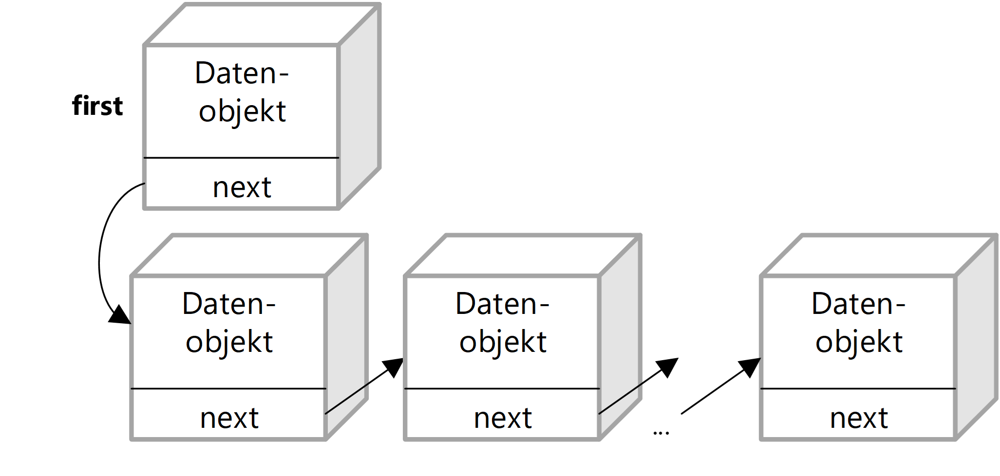
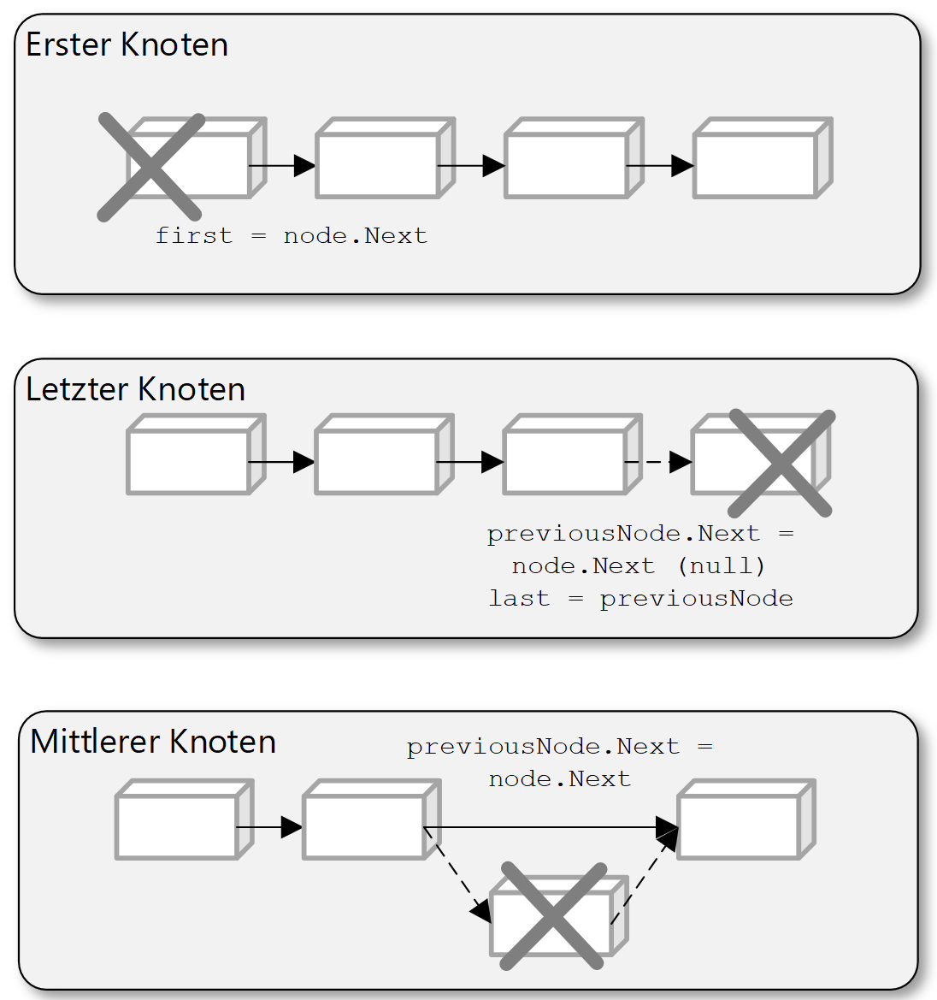
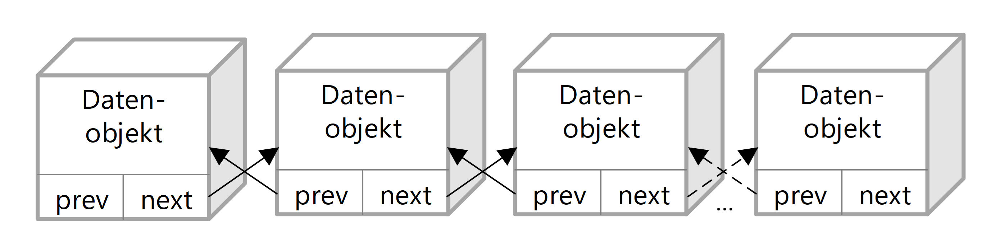
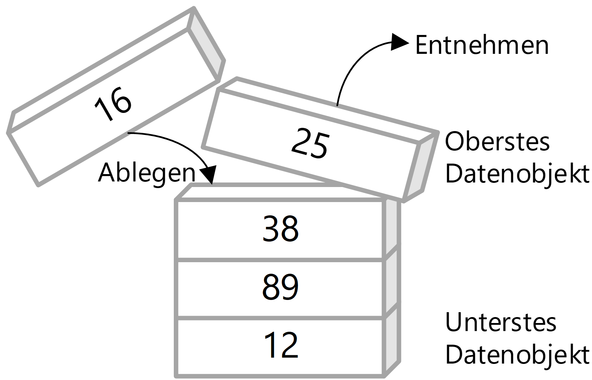
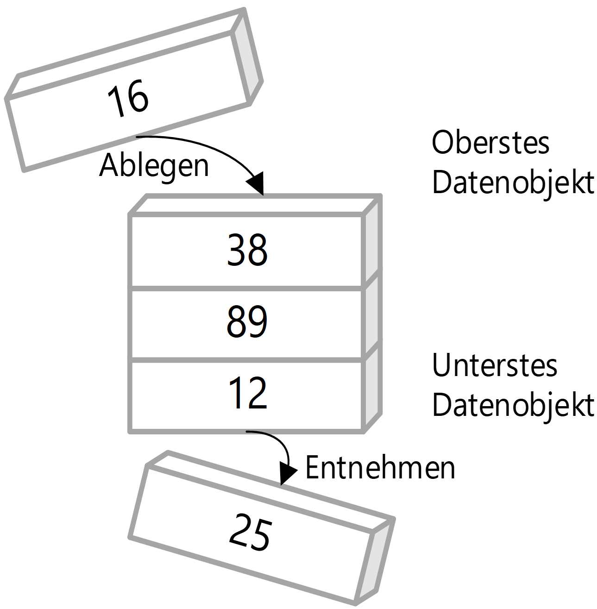

|                             |                          |                                        |
| --------------------------- | ------------------------ | -------------------------------------- |
| **Elektrotechniker/-in HF** | **Programmiertechnik A** |  |

- [1. Datenstrukturen](#1-datenstrukturen)
  - [1.1. Was sind Datenstrukturen](#11-was-sind-datenstrukturen)
  - [1.2. Dynamische Datenstrukturen](#12-dynamische-datenstrukturen)
    - [1.2.1. Lineare Datenstrukturen](#121-lineare-datenstrukturen)
    - [1.2.2. List](#122-list)
      - [1.2.2.1. Einfach verkettete Liste](#1221-einfach-verkettete-liste)
      - [1.2.2.2. Doppeltverkettete Liste](#1222-doppeltverkettete-liste)
    - [1.2.3. Stack](#123-stack)
    - [1.2.4. Queue](#124-queue)
    - [1.2.5. Mobile App "Algorithms"](#125-mobile-app-algorithms)
- [2. Aufgaben](#2-aufgaben)
  - [2.1. Datenstruktur bestimmen](#21-datenstruktur-bestimmen)

---

 

# 1. Datenstrukturen

## 1.1. Was sind Datenstrukturen

**Datenstrukturen** sind spezielle Formate zur Organisation, Verwaltung und Speicherung von Daten in einem Computer, sodass sie effizient genutzt und verarbeitet werden können.
Sie sind ein **fundamentaler Bestandteil** der Informatik und Softwareentwicklung, da sie bestimmen, wie Daten gespeichert, abgerufen und manipuliert werden.
**Datenstrukturen** sind ein **zentrales Konzept** in der Informatik. Ein tiefes Verständnis dieser Strukturen ermöglicht es Entwicklern, **effizientere, schnellere und robustere Programme** zu schreiben. Egal ob Anfänger oder Profi – wer programmiert, arbeitet unweigerlich mit **Datenstrukturen**.

Anforderungen, wo Datenstrukturen eingesetzt werden sind u.a.:

- Wie können riesige Menge an Informationen effizient sortiert werden?
- Wie können Daten schnell gesucht werden?

Datenstrukturen sind wichtig, weil sie:

- Effizienz verbessern (z.B. bei der Suche, Einfügen oder Löschen von Daten)
- Speicher optimieren
- und geeignete Modelle für reale Probleme bieten, z. B. Warteschlangen in Systemen oder Beziehungen zwischen Objekten.

Datenstrukturen kommen überall in der Informatik vor, z.B.:

- In Datenbanken zur Organisation von Datensätzen.
- In Suchmaschinen, um Milliarden von Webseiten effizient zu durchsuchen.
- In Spielen, um Objekte, Karten und Ereignisse zu verwalten.
- In Betriebssystemen, um Prozesse, Dateien und Speicher zu managen.

## 1.2. Dynamische Datenstrukturen

Eine **Datenstruktur** setzt sich immer aus mehreren einzelnen Werten zusammen und den darauf auszuführenden Methoden und Operationen.
In der allgemeinen Literatur wird der Begriff enger gefasst als allgemein einsetzbare Datentypen. Zu diesen gehören u.a.

- Listen
- Baumstrukturen
- Warteschlangen
- Stapel
- Hashtabellen
- Graphen

[Wiki Datenstrukturen](https://de.wikipedia.org/wiki/Datenstruktur)

### 1.2.1. Lineare Datenstrukturen

Diese ordnen Daten in einer linearen Reihenfolge:

- **Liste** (z. B. verkettete Liste)
  - Besteht aus Knoten, die Daten und einen Verweis auf den nächsten Knoten enthalten.
  - Vorteil: Dynamische Grösse.
  - Nachteil: Kein direkter Zugriff (langsamer als Array).
  - [Listen](https://dditools.inf.tu-dresden.de/ovk/Informatik/Algorithmen/Datenstrukturen/Listen.html)
- **Stack** (Stapel)
  - Prinzip: Last In, First Out (LIFO).
  - Beispiel: Rückgängig-Funktion in Programmen.
- **Queue** (Warteschlange)
  - Prinzip: First In, First Out (FIFO).
  - Beispiel: Druckaufträge in einer Druckerwarteschlange.
- **Baum** (Tree)
  - Hierarchische Struktur mit „Wurzel“ und „Kindern“.
  - Spezialform: Binärbaum, AVL-Baum, B-Baum etc.
  - Anwendung: Datei-Systeme, Datenbanken.
  - [Baumstruktur](https://dditools.inf.tu-dresden.de/ovk/Informatik/Algorithmen/Datenstrukturen/Baeume.html)
- **Graph** (Graphenstruktur)
  - Besteht aus Knoten (Vertices) und Kanten (Edges).
  - Anwendung: Soziale Netzwerke, Routenplanung, Webcrawler.

### 1.2.2. List

- Liste, in die im Gegensatz zum Array beliebig viele Objekte eingefügt werden können.
- Implementierung über verkettete Liste oder Array

#### 1.2.2.1. Einfach verkettete Liste

#### 1.2.2.2. Doppeltverkettete Liste

### 1.2.3. Stack

- Ablegen und Entnahme der Elemente von **oben**, d.h. die Elemente, die **zuletzt eingefügt wurden, werden als nächstes wieder entnomme**n (**Last-in-First-out, LIFO**).

### 1.2.4. Queue

- Ablegen der Elemente erfolgt von **oben** und Entnahme von **unten**, d.h. die Elemente, die zuletzt eingefügt wurden, werden als letzte wieder entnommen (**First-in-First-out, FIFO**).

---

### 1.2.5. Mobile App "Algorithms"

Ausgezeichnete mobile Anwendung zum Verständnis verschiedener Algorithmen (The best way to learn algorithms!).

[Algorithm.Wiki](http://algorithm.wiki/en/app/)

 

# 2. Aufgaben

## 2.1. Datenstruktur bestimmen

| **Vorgabe**         | **Beschreibung**                                                    |
| :------------------ | :------------------------------------------------------------------ |
| **Lernziele**       | Kennt die elementaren Datentypen                                    |
|                     | Kann korrekte Datentypen festlegen                                  |
|                     | Kennt den Wertebereich der Datentypen                               |
|                     | Kennt den Einsatzbereich von komplexten Datenstrukturen             |
| **Sozialform**      | Einzelarbeit                                                        |
| **Auftrag**         | siehe unten                                                         |
| **Hilfsmittel**     | [Wiki Datenstrukturen](https://de.wikipedia.org/wiki/Datenstruktur) |
| **Zeitbedarf**      | 20min                                                               |
| **Lösungselemente** |                                                                     |

Wähle für folgende Fälle die richtige Datenstruktur:

- Eine Zählvariable
- Variablen, welchen den Notendurchschnitt rechnen
- Einen Algorithmus, welcher eine komplexe Formel verwendet.
- Eine Adresse.
- Eine Baumstruktur
- Eine Zeichenkette.
- Zahlen welche sortiert werden sollen die Anzahl der Zahlen ist bekannt.
- Zahlen welche sortiert werden sollen die Anzahl der Zahlen ist erst zur Laufzeit bekannt.
- Eine Folderstruktur mit Dateien
- Ein Baumstruktur von Kaffeerezepten (Tassengrösse, Bohnenart, Brühzeit)
