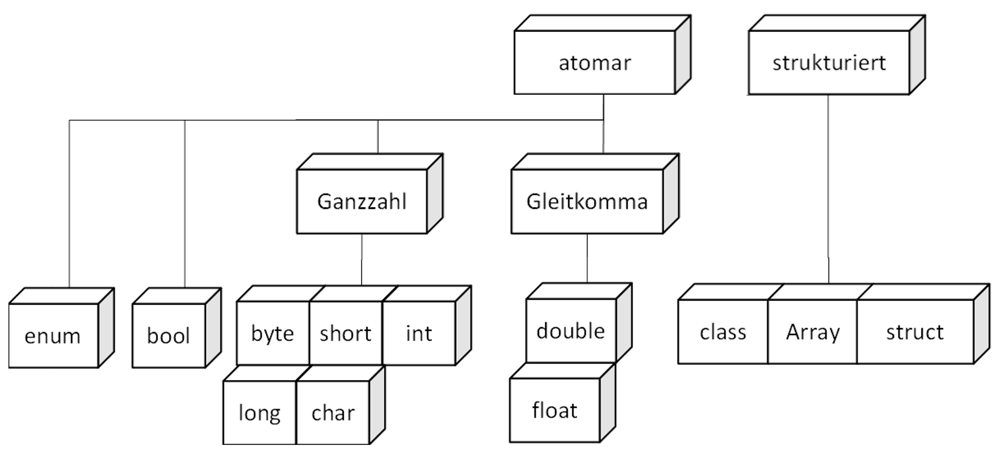

|                             |                          |                                        |
| --------------------------- | ------------------------ | -------------------------------------- |
| **Elektrotechniker/-in HF** | **Programmiertechnik A** |  |

- [1. Datentypen](#1-datentypen)
  - [1.1. Elementare Datentypen](#11-elementare-datentypen)
    - [1.1.1. Elementare Datentypen in C](#111-elementare-datentypen-in-c)
    - [1.1.2. Gleitkommazahlen (Floating-Point)](#112-gleitkommazahlen-floating-point)
    - [1.1.3. Zusammenfassung](#113-zusammenfassung)
  - [1.2. Strukturierte Datentypen](#12-strukturierte-datentypen)
    - [1.2.1. Array (Datenfeld)](#121-array-datenfeld)
      - [1.2.1.1. Beispiel Wochentage](#1211-beispiel-wochentage)
    - [1.2.2. Benutzerdefinierter Datentyp (struct)](#122-benutzerdefinierter-datentyp-struct)
      - [1.2.2.1. typedef](#1221-typedef)
      - [1.2.2.2. Komplette struct-Verwendung](#1222-komplette-struct-verwendung)
- [2. Aufgaben](#2-aufgaben)
  - [2.1. Datentypen bestimmen](#21-datentypen-bestimmen)
  - [2.2. Recherche Wiki](#22-recherche-wiki)

---

</br>

# 1. Datentypen

## 1.1. Elementare Datentypen

**Elementare Datentypen** (auch: primitive Datentypen) sind die grundlegendsten Datentypen, die von nahezu allen Programmiersprachen bereitgestellt werden.
Sie dienen dazu, einfache Werte wie Zahlen, Zeichen oder Wahrheitswerte zu speichern.

Die **elementaren Datentypen** sind der Grundbaustein jeder Software. Sie ermöglichen das Speichern und Verarbeiten einfacher Werte, die wiederum die Grundlage für komplexere Datenmodelle, Algorithmen und Programme bilden.
Ein gutes Verständnis dieser Typen hilft dir, effizienter und fehlerfreier zu programmieren.

Ein **Datentyp** beschreibt die von ihm gespeicherten Werte und die darauf auszuführenden Methoden und Operationen.
Kann ein Datentyp nur einen **einzelnen Wert** aufnehmen, so ist es ein **atomarer Datentyp**, ansonsten eine Datenstruktur.

[Wiki Datentypen](https://de.wikipedia.org/wiki/Datentyp)

Diese Datentypen bilden die Basis, auf der komplexere Datenstrukturen (wie Listen, Arrays, Objekte etc.) aufgebaut werden.

- **Ganzzahlen (Integer / int)**
  - Speichern ganze Zahlen (positiv, negativ, null).
  - Beispielwerte: `-7, 0, 42, 2025`
  - Speicherbedarf: Abhängig von der Sprache (z. B. 8, 16, 32 oder 64 Bit).
  - Verwendung: Zählen, Indizieren von Arrays, Schleifen.
- **Gleitkommazahlen (Float / Double)**
  - Speichern Dezimalzahlen mit Komma.
  - Beispiele: `3.14, -0.001, 2.71828`
  - float: einfacher Gleitkommatyp (geringere Genauigkeit)
  - double: doppelte Genauigkeit (höhere Präzision)
  - Verwendung: Messwerte, wissenschaftliche Berechnungen.
- **Zeichen (Character / char)**
  - Speichern ein einzelnes Zeichen.
  - Beispiele: `'a', 'Z', '9', '%'`
  - Achtung: In vielen Sprachen in einfache Anführungszeichen geschrieben ('x').
  - Technisch oft als numerischer Code gespeichert (ASCII, Unicode).
- **Wahrheitswerte (Boolean / bool)**
  - Nur zwei mögliche Werte: `true` oder `false`.
  - Verwendung: Bedingte Anweisungen (if, while), logische Operationen.
- **Zeichenketten (String / str)**
  - Speichern eine Reihe von Zeichen (also mehrere char aneinandergereiht).
  - Beispiele: `"Hallo Welt", "123abc!"`
  - Obwohl technisch oft zusammengesetzt, gelten sie in vielen Sprachen als „einfacher“ Typ.
  - Wichtig für Benutzereingaben, Textverarbeitung, Ausgaben.

### 1.1.1. Elementare Datentypen in C

- C bietet eine klare, aber leistungsstarke Auswahl an primitiven Datentypen.
- Um Programme effizient und portabel schreiben zu können, ist ein gutes Verständnis dieser Typen und ihrer Grenzen unerlässlich.

| **Typ**                | **Speichergrösse** | **Wertebereich**                                                                    |
| :--------------------- | :----------------- | :---------------------------------------------------------------------------------- |
| **char**               | 1 Byte             | -128 bis 127 (signed) oder 0 bis 255 (unsigned)                                     |
| **unsigned char**      | 1 Byte             | 0 bis 255                                                                           |
| **signed char**        | 1 Byte             | -128 bis 127                                                                        |
| **int**                | 4 Bytes            | -2.147.483.648 bis 2.147.483.647                                                    |
| **unsigned int**       | 4 Bytes            | 0 bis 4.294.967.295                                                                 |
| **short**              | 2 Bytes            | -32.768 bis 32.767                                                                  |
| **unsigned short**     | 2 Bytes            | 0 bis 65.535                                                                        |
| **long**               | 4 oder 8 Bytes     | i. d. R. -2.147.483.648 bis 2.147.483.647 (32-Bit) oder grösser auf 64-Bit-Systemen |
| **unsigned long**      | 4 oder 8 Bytes     | 0 bis 4.294.967.295 oder höher                                                      |
| **long long**          | 8 Bytes            | -9.223.372.036.854.775.808 bis 9.223.372.036.854.775.807                            |
| **unsigned long long** | 8 Bytes            | 0 bis 18.446.744.073.709.551.615                                                    |

> Die genauen Werte können abhängig vom Compiler und System (32-Bit/64-Bit) sein – aber die untenstehenden Angaben gelten für die meisten modernen Umgebungen (z.B. GCC auf einem 64-Bit-System).

### 1.1.2. Gleitkommazahlen (Floating-Point)

| **Typ**         | **Speichergrösse**                  | **Wertebereich**                            | Genauigkeit |
| :-------------- | :---------------------------------- | :------------------------------------------ |
| **float**       | 4 Bytes                             | ±1.2 × 10⁻³⁸ bis ±3.4 × 10³⁸                | 7 Stellen   |
| **double**      | 8 Bytes                             | ±2.3 × 10⁻³⁰⁸ bis ±1.7 × 10³⁰⁸              | 15 Stellen  |
| **long double** | 10–16 Bytes (abhängig vom Compiler) | Noch grössere Genauigkeit und Wertebereiche | 18 Stellen  |

### 1.1.3. Zusammenfassung

| **Typ**    | **Beispielwert** | **Beschreibung**                     |
| :--------- | :--------------- | :----------------------------------- |
| **int**    | 42               | Ganze Zahl                           |
| **float**  | 3.1415           | Kommazahl mit begrenzter Genauigkeit |
| **double** | 2.718281828      | Kommazahl mit hoher Genauigkeit      |
| **char**   | 'A'              | Einzelnes Zeichen                    |
| **bool**   | true             | Wahrheitswert (true/false)           |
| **string** | "Hallo"          | Zeichenkette                         |
| **byte**   | 0xAF             | 8-Bit-Wert (Binärdaten)              |



## 1.2. Strukturierte Datentypen

- Erlauben die Speicherung mehrere Elemente
- Unterstützung unterschiedliche elementare Datentypen
- Ermöglichen komplexere Datenstrukturen
- Datentypen
  - **Record (Datensatz)**: **Sammlung von Feldern**, Jedes Feld hat einen Wert (Variable), Beispiel Adresse
  - **Array (Feld)**: **Sammlung von Elementen mit gleichem elementarem Datentyp**, Feldzugriff über den Index, Beispiel – ein Array mit Integerwerten
  - **Dynamische Datenstrukturen**: Grössen wird zur **Laufzeit** definiert und geändert, Beispiele: Verkettete Listen, Bäume (Trees), Hash-Tabelle

### 1.2.1. Array (Datenfeld)

- Ablegen mehrerer Datenobjekte vom gleichen Typ.
- Sammlung von Elementen mit fester Grösse.
- Jedes Element hat einen Index (z. B. array[0]).
- Schneller direkter Zugriff über numerischen Index.
- Vorteil: Schneller Zugriff.
- Nachteil: Feste Grösse.
- Zugriff
  - `Geburtsjahr[1] = 90`
- Assoziatives Array
  - Zugriff über beliebiges Objekt. `Geburtsjahr["Hans Muster"] = 90`


#### 1.2.1.1. Beispiel Wochentage

Um Wochentage zu verwalten, kann für jeden Tag ein Variable deklariert werden:

```c#
string monday = "Montag";
string tuesday = "Dienstag";
string wednesday = "Mittwoch";
string thursday = "Donnerstag";
string friday = "Freitag";
string saturday = "Samstag";
string sunnday = "Sonntag";
```

Für derartige Aufgaben sollten Arrays verwendet werden:

```c
const char* wochentage[] = {
        "Montag",
        "Dienstag",
        "Mittwoch",
        "Donnerstag",
        "Freitag",
        "Samstag",
        "Sonntag"
    };

printf("%s\n", wochentage[0]);    // Montag
// ...
printf("%s\n", wochentage[6]);    // Sonntag
```


### 1.2.2. Benutzerdefinierter Datentyp (struct)

- Der `struct`-Befehl ist in der Programmiersprache C ein zentrales Werkzeug zur Definition **benutzerdefinierter Datentypen**.
- Ein `struct` (kurz für structure) ist ein benutzerdefinierter Datentyp, der mehrere Variablen verschiedener Datentypen in einer einzigen Einheit zusammenfasst.
- Der `struct`-Befehl in C ist ein leistungsstarkes Werkzeug, um Daten logisch zu gruppieren und strukturierte Programme zu schreiben.
- Besonders bei der Arbeit mit **vielen verwandten Informationen** wird `struct` unverzichtbar – sei es im Speichern von Nutzerdaten, der Netzwerkprogrammierung oder der Speicherverwaltung.

Mit struct kann ein benutzerdefinierter Datentyp, der mehrere verschiedene Datentypen unter einem Namen gruppiert werden.

```c
struct Person {
    char name[50];
    int alter;
    float groesse;
};
```

Das definiert eine neue Struktur namens Person mit drei Feldern:

- einem `char`-Array für den Namen,
- einem `int` für das Alter,
- einem `float` für die Körpergrösse.

```c
// Deklaration der Strukturvariable
struct Person p1;

// Werte zuweisen
strcpy(p1.name, "Max Mustermann");
p1.alter = 30;
p1.groesse = 1.82;

// Zugriff auf Strukturmitglieder
printf("Name: %s\n", p1.name);
printf("Alter: %d\n", p1.alter);
printf("Grösse: %.2f m\n", p1.groesse);
```

#### 1.2.2.1. typedef

Mit typedef vereinfachen, um das Wort struct beim Deklarieren zu vermeiden:

```c
typedef struct {
    char name[50];
    int alter;
    float groesse;
} Person;

// Jetzt kannst Person wie einen normalen Datentyp verwenden werden – wie int oder float.
Person p2;
```

#### 1.2.2.2. Komplette struct-Verwendung

```c
#include <stdio.h>
#include <string.h>

typedef struct {
    char name[50];
    int alter;
    float groesse;
} Person;

int main() {
    Person p;

    strcpy(p.name, "Anna Schneider");
    p.alter = 25;
    p.groesse = 1.70;

    printf("Name: %s\n", p.name);
    printf("Alter: %d\n", p.alter);
    printf("Grösse: %.2f m\n", p.groesse);

    return 0;
}
```

---

</br>

# 2. Aufgaben

## 2.1. Datentypen bestimmen

| **Vorgabe**         | **Beschreibung**                                          |
| :------------------ | :-------------------------------------------------------- |
| **Lernziele**       | Kennt die elementaren Datentypen                          |
|                     | Kann korrekte Datentypen festlegen                        |
|                     | Kennt den Wertebereich der Datentypen                     |
| **Sozialform**      | Einzelarbeit                                              |
| **Auftrag**         | siehe unten                                               |
| **Hilfsmittel**     | [Wiki Datentypen](https://de.wikipedia.org/wiki/Datentyp) |
| **Zeitbedarf**      | 15min                                                     |
| **Lösungselemente** |                                                           |

Finden Sie für die aufgeführten Datenwerte geeignete Datentypen:

- Adresse z.B. Landstrasse 17
- Artikelpreis z.B. 35.20 CHF
- Lagerbestand (Stück) z.B. 40233
- Verheiratet Ja/Nein
- E-Mail-Adresse
- Tag im Monat (1…31)
- Genaues Körpergewicht in Kilogramm
- Einen Buchstaben aus ASCII Tabelle z.B A

---

## 2.2. Recherche Wiki

| **Vorgabe**         | **Beschreibung**                                                             |
| :------------------ | :--------------------------------------------------------------------------- |
| **Lernziele**       | Kennt die Begrifflichkeiten zu Datentypen, Datenstruktur, Klasse, und Objekt |
|                     | Kann die Unterschiede zwischen Datentypen, Datenstruktur, Klasse, und Objekt |
| **Sozialform**      | Gruppenarbeit                                                                |
| **Auftrag**         | siehe unten                                                                  |
| **Hilfsmittel**     | [Wiki Datenstrukturen](https://de.wikipedia.org/wiki/Datenstruktur)          |
| **Zeitbedarf**      | 20min                                                                        |
| **Lösungselemente** |                                                                              |

- Lesen Sie auf wikipedia.de über die Begriffe Datentyp, Datenstruktur, Klasse und Objekt.
- Diskutieren Sie mit Ihrem Nachbarn und grenzen Sie die Begriffe voneinander ab!
- Wodurch unterscheiden sich die Begriff?
