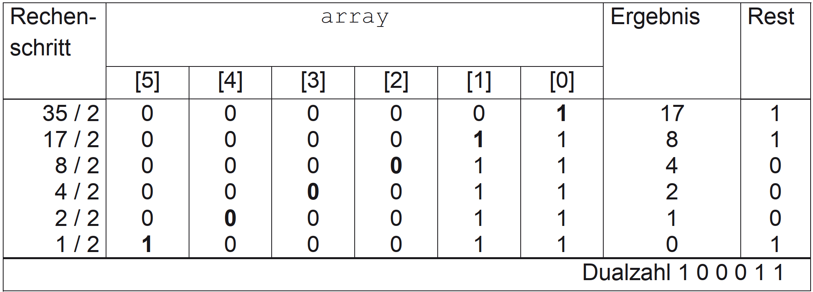
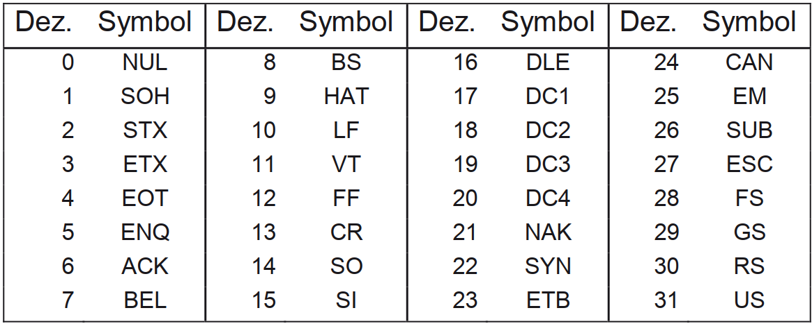
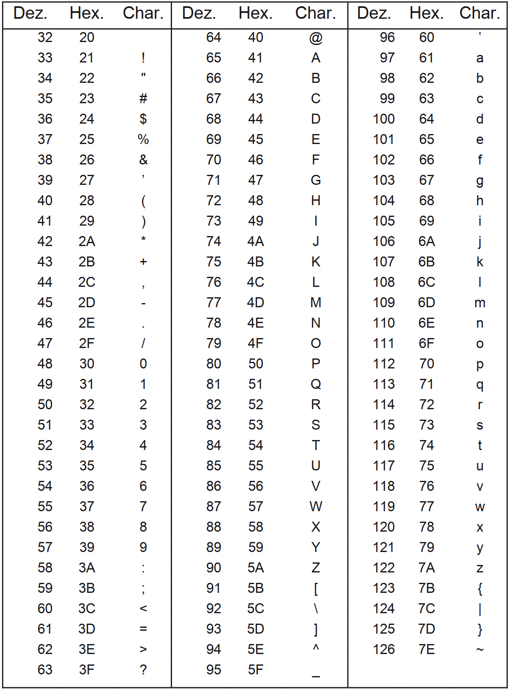

|                             |                          |                                        |
| --------------------------- | ------------------------ | -------------------------------------- |
| **Elektrotechniker/-in HF** | **Programmiertechnik A** |  |

- [1. Zahlensysteme](#1-zahlensysteme)
  - [1.1. Dezimalsystem (Zehnersystem)](#11-dezimalsystem-zehnersystem)
  - [1.2. Dualsystem (Binärsystem)](#12-dualsystem-binärsystem)
  - [1.3. Hexadezimalsystem (16er-System)](#13-hexadezimalsystem-16er-system)
  - [1.4. Wandlungen zwischen Zahlensystemen](#14-wandlungen-zwischen-zahlensystemen)
    - [1.4.1. Dezimal nach Dual](#141-dezimal-nach-dual)
    - [1.4.2. Umrechnung Binärzahl in eine Dezimalzahl](#142-umrechnung-binärzahl-in-eine-dezimalzahl)
    - [1.4.3. Umrechnung einer Hexadezimalzahl in eine Dezimalzahl](#143-umrechnung-einer-hexadezimalzahl-in-eine-dezimalzahl)
    - [1.4.4. Umrechnung einer Dezimalzahl in das Dualsystem](#144-umrechnung-einer-dezimalzahl-in-das-dualsystem)
    - [1.4.5. Umrechnung einer Dezimalzahl in das Hexadezimalsystem](#145-umrechnung-einer-dezimalzahl-in-das-hexadezimalsystem)
    - [1.4.6. Umwandlung Hexadezimal nach Dezimal](#146-umwandlung-hexadezimal-nach-dezimal)
- [2. ASCII-Zeichensatz](#2-ascii-zeichensatz)
- [3. Aufgaben](#3-aufgaben)
  - [3.1. Typenzuordnung und Zahlenumwandlung](#31-typenzuordnung-und-zahlenumwandlung)

# 1. Zahlensysteme

## 1.1. Dezimalsystem (Zehnersystem)

- Basis: 10
- Ziffern: 0 bis 9
- Verwendung: Unser Alltagssystem (z. B. beim Rechnen, Geld, Uhrzeit)

Beispiel: Die Zahl 345 bedeutet:
3 *10^2 + 4* 10^1 + 5 * 10^0 = 300 + 40 + 5

## 1.2. Dualsystem (Binärsystem)

- Basis: 2
- Ziffern: Nur 0 und 1
- Verwendung: In Computern, da diese nur zwei Zustände kennen (z. B. Strom an/aus)

Beispiel: Die Binärzahl 1011 entspricht:

1 *2^3 + 0* 2^2 + 1 *2^1 + 1* 2^0 = 8+0+2+1=11 (im Dezimalsystem)

## 1.3. Hexadezimalsystem (16er-System)

- Basis: 16
- Ziffern: `0–9` und `A–F` (wobei `A = 10, B = 11, ..., F = 15`)
- Verwendung: In der Informatik zur kompakten Darstellung von Binärzahlen (z. B. bei Farben, Speicheradressen)

Beispiel: Die Hexadezimalzahl 2F bedeutet:

2 *16^1* 15 * 16^0 = 32+15=47 (im Dezimalsystem)

## 1.4. Wandlungen zwischen Zahlensystemen

### 1.4.1. Dezimal nach Dual

Die folgende Tabelle visualisiert das Umwandeln der Zahl 35 dezimal in eine Dual-zahl mit Hilfe des Modulo-Operators:

### 1.4.2. Umrechnung Binärzahl in eine Dezimalzahl

Gegeben sei die Dualzahl **10111**.
Die Stellenwerttabelle ist gegeben durch:

|       |           |             |             |             |             |
| :---: | :-------: | :---------: | :---------: | :---------: | :---------: |
|       | **1*2^4** | + **0*2^3** | + **1*2^2** | + **1*2^1** | + **1*2^0** |
|   =   |  **16**   |   +**0**    |   +**4**    |   +**2**    |   +**1**    |
|   =   |  **23**   |             |             |             |             |

[Umwandlungstabelle Dezimal nach Dual](./x_gitres/zahlensystem-dual-dezimal-tabelle.png)

### 1.4.3. Umrechnung einer Hexadezimalzahl in eine Dezimalzahl

Gegeben sei die Hexadezimalzahl **`FA6B`**.

Die Stellenwerttabelle ist gegeben durch:

|                   |          |          |          |          |
| ----------------- | :------: | :------: | :------: | :------: |
| Hexadezimalsystem | **16^3** | **16^2** | **16^1** | **16^0** |
|                   |  **F**   |  **A**   |  **6**   |  **B**   |

Die in der Stellenwerttabelle eingetragene Zahl lautet im Dezimalsystem:
>**15 * 16^3 + 10 * 16^2 + 6 * 16^1 + 11 * 16^0 = 64107**

### 1.4.4. Umrechnung einer Dezimalzahl in das Dualsystem

Die Zahl **`53`** dezimal soll in das Dualsystem gewandelt werden:

|             |        |        |
| ----------- | ------ | ------ |
| 53 : 2 = 26 | Rest 1 | c0 = 1 |
| 26 : 2 = 13 | Rest 0 | c1 = 0 |
| 13 : 2 = 6  | Rest 1 | c2 = 1 |
| 6 : 2 = 3   | Rest 0 | c3 = 0 |
| 3 : 2 = 1   | Rest 1 | c4 = 1 |
| 1 : 2 = 0   | Rest 1 | c5 = 1 |

Damit ist die Binärzahl gegeben durch:
> **1 * 25 + 1 * 24 + 0 * 23 + 1 * 22 + 0 * 21 + 1 * 20**

[Umwandlungstabelle Dezimal nach Dual](./x_gitres/zahlensystem-dezimal-dual-tabelle.png)

### 1.4.5. Umrechnung einer Dezimalzahl in das Hexadezimalsystem

Die Zahl **`493`** soll in das Hexadezimalsystem umgerechnet werden.

|               |         |         |
| ------------- | ------- | ------- |
| 493 : 16 = 30 | Rest 13 | c0 = 13 |
| 30 : 16 = 1   | Rest 14 | c1 = 14 |
| 1 : 16 = 0    | Rest 1  | c2 = 1  |

Damit ist die Hexadezimalzahl gegeben durch:
> **1 * 16^2 + 14 * 16^1 + 13 * 16^0 = 1ED**

[Umwandlungstabelle Dezimal nach Hex](./x_gitres/zahlensystem-dezimal-hex-tabelle.png)

### 1.4.6. Umwandlung Hexadezimal nach Dezimal

| **Hex** | **Dezimal** |
| :-----: | :---------: |
|    1    |      1      |
|    2    |      2      |
|    3    |      3      |
|    4    |      4      |
|    5    |      5      |
|    6    |      6      |
|    7    |      7      |
|    8    |      8      |
|    9    |      9      |
|    A    |     10      |
|    B    |     11      |
|    C    |     12      |
|    D    |     13      |
|    E    |     14      |
|    F    |     15      |

[Umwandlungstabelle Hex nach Dezimal](./x_gitres/zahlensystem-hex-dezimal-tabelle.png)

---

# 2. ASCII-Zeichensatz

Der ASCII-Zeichensatz ist die US-nationale Ausprägung des ISO-7-Bit-Codes (ISO 646)

Die **ersten 32 ASCII-Zeichen** sind **Steuerzeichen** für die Ansteuerung von Peripheriegeräten und die Steuerung einer rechnergestützten Datenübertragung dar.
Diese Zeichen haben festgelegte Namen, wie beispielsweise **`FF`** als Abkürzung für Form Feed, d. h. Seitenvorschub, oder **`CR`** als Abkürzung für Carriage Return, dem Wagenrücklauf, der von der Schreibmaschine her bekannt ist.

Die 96 darstellbaren Zeichen des ASCII-Zeichensatzes

---

 

# 3. Aufgaben

## 3.1. Typenzuordnung und Zahlenumwandlung

| **Vorgabe**         | **Beschreibung**                                                          |
| :------------------ | :------------------------------------------------------------------------ |
| **Lernziele**       | Kennt die verschiedenene Zahlensysteme                                    |
|                     | Kann Umwandlungen von einem Zahlensystem in ein anderes ausführen         |
| **Sozialform**      | Einzelarbeit                                                              |
| **Auftrag**         | siehe unten                                                               |
| **Hilfsmittel**     | [Wiki Stellenwertsystem](https://de.wikipedia.org/wiki/Stellenwertsystem) |
| **Zeitbedarf**      | 15min                                                                     |
| **Lösungselemente** | Vollständige Lösungen                                                     |

Führe die folgenden Zahlensystem Umwandlungen durch:

1. Rechne die Zahl 0x1A ins Dezimalsystem um.
2. Rechne die Zahl 292 ins Hexadezimalsystem um.
3. Rechne die Zahl 010101111 ins Dezimalsystem um.
4. Rechne die Zahl 0xAAAA ins Dualsystem um.
