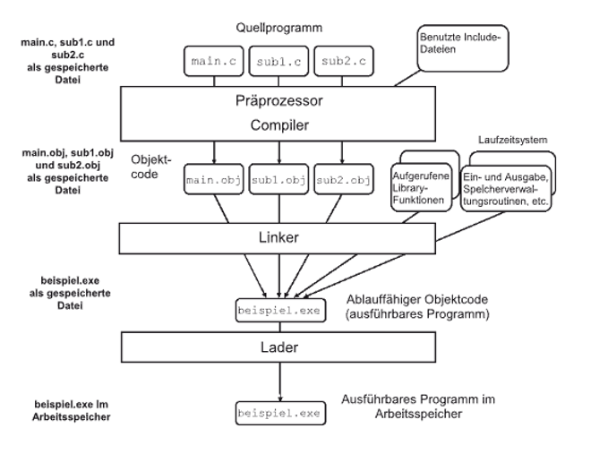

|                             |                          |                                        |
| --------------------------- | ------------------------ | -------------------------------------- |
| **Elektrotechniker/-in HF** | **Programmiertechnik A** |  |

- [1. Die Programmiersprache C](#1-die-programmiersprache-c)
  - [1.1. Entstehung von C](#11-entstehung-von-c)
  - [1.2. Einsatzgebiete](#12-einsatzgebiete)
  - [1.3. Standardisierung](#13-standardisierung)
  - [1.4. Basiskomponenten der C-Programmiersprache](#14-basiskomponenten-der-c-programmiersprache)
  - [1.5. Werkzeuge](#15-werkzeuge)
  - [Aufgbau eines C-Programmes / Syntax](#aufgbau-eines-c-programmes--syntax)
  - [Präprozessor (#Include, \*.h-Dateien)](#präprozessor-include-h-dateien)
  - [Standard Library, Compiler, Linker](#standard-library-compiler-linker)
  - [Bibliotheksfunktionen und Präprozessor-Anweisungen](#bibliotheksfunktionen-und-präprozessor-anweisungen)
  - [1.6. Das Hello World Programm](#16-das-hello-world-programm)
  - [Schritte von Quellcodedateien zum lauffähigen Programm](#schritte-von-quellcodedateien-zum-lauffähigen-programm)
  - [Compilerfehler vs. Linkerfehler](#compilerfehler-vs-linkerfehler)
- [2. Aufgaben](#2-aufgaben)
  - [2.1. E-Book, Kapitel 1 - Einführung in die Programmiersprache C](#21-e-book-kapitel-1---einführung-in-die-programmiersprache-c)
  - [2.1. Entwicklungswerkzeuge](#21-entwicklungswerkzeuge)
  - [2.1. Hello World Programm](#21-hello-world-programm)

---

# 1. Die Programmiersprache C

## 1.1. Entstehung von C

- Die Programmiersprache C wurde Anfang der 1970er Jahre von **Dennis Ritchie** am **Bell Telephone Laboratories (heute Bell Labs)** entwickelt.
- - Ihr Ursprung liegt in der Arbeit an dem Betriebssystem **UNIX**, das ursprünglich in der Assemblersprache geschrieben war.
- Die Entwickler suchten eine **effizientere**, aber dennoch maschinennahe Sprache, die sowohl **leistungsstark** als auch **portabel** war.

Zusammenfassung der Merkmale:

- Hohe Sprachexpressivität
- Sprachkonstrukte wie while, if etc.
- Sprechende Bezeichner (Variablen)
- Effizientäre Programmierung einfachere Fehlersuche
- Portable und maschinenunabhängig

- **C** wurde in den **1970er** und **1980er** Jahren extrem populär, insbesondere durch die Veröffentlichung des Buches "The C Programming Language" (1978) von **Brian W. Kernighan** und **Dennis M. Ritchie** – oft einfach als **"K&R C"** bezeichnet.
- Dieses Buch setzte Massstäbe und prägte die frühe C-Programmierung massgeblich.


Später wurde C durch den **ANSI-Standard (ANSI C)** 1989 offiziell standardisiert, was ihre Definition und Kompatibilität zwischen verschiedenen Compilern sicherte.

## 1.2. Einsatzgebiete

- Von Anfang an war das Haupteinsatzgebiet von C die **Systemprogrammierung**.
- Es kommt bei den zu entwickelnden Programmen besonders auf **Geschwindigkeit** und einen **kompakten Programmcode** an.
- Ausserdem soll die **Hardware** besonders effektiv angesprochen werden können

Einsatzbereiche:

- Steuergeräte
- Lift
- Flugzeug
- Kaffeemaschine
- Auto
- etc.

## 1.3. Standardisierung

| **Standard** | **Bemerkung**                                                                                                                                                                                                                                                                                          |
| ------------ | ------------------------------------------------------------------------------------------------------------------------------------------------------------------------------------------------------------------------------------------------------------------------------------------------------ |
| **K&R-C**    | Diese Version basiert hauptsächlich auf dem ersten Buch zu C von den beiden Autoren Kernighan und Ritchie von 1978.                                                                                                                                                                                    |
| **C89**      | Die erste echte Standardisierung erfolgte über das American National Standards Institute (ANSI) im Jahre 1989.                                                                                                                                                                                         |
| **C90**      | Ein Jahr nach dem Erscheinen des 1. Standards wurden kleine Änderungen hinzugefügt und die ISO-Norm C90 definiert. </br> Sie ist Basis vieler heutiger C-Implementierungen. Die wichtigsten Verbesserungen waren die Einführung von Funktionsprototypen sowie die Normierung der C-Standardbibliothek. |
| **C95**      | 1995 wurden in einem neuen Standard Fehlerbehebungen, einige neue Makros sowie die Unterstützung weiterer Zeichensätze zusammengefasst. </br> Obwohl dieser Standard schon relativ alt ist, wird er selten von den gängigen Compilern vollständig implementiert.                                       |
| **C99**      | Über die Jahre wurden einige häufig vermisste Sprachkonstrukte und Schreibweisen anderer Sprachen hinzugefügt wie der </br> Datentyp _Bool, der einzeilige C++- Zeilenkommentator "//" oder die Möglichkeit, Variablen direkt in einer for-Schleife zu definieren.                                     |
| **C11**      | Ende 2011 wurde der aktuelle C11-Standard verabschiedet. </br> Er enthält Korrekturen der Vorversion und Neuerungen wie beispielsweise Unterstützung von Multithreading, neue Datentypen und generische Ausdrücke.                                                                                     |

## 1.4. Basiskomponenten der C-Programmiersprache

| **Komponenten**          | **Syntax**                        | **Beschreibung**                                                                                                                                                                                                                                                                                 |
| ------------------------ | --------------------------------- | ------------------------------------------------------------------------------------------------------------------------------------------------------------------------------------------------------------------------------------------------------------------------------------------------ |
| **Präprozessor**         | **`#`** </br>`#include, #define`  | Präprozessoranweisung können als Textersatz immer wieder verwendet warden. </br> z.B: `#include` wird verwendet um Header-Dateien in C einzufügen. </br> `#include <stdio.h>` enthält Funktionen für Ein- u. Ausgabe `scanf` und `printf` `#define` definiert Makros und Constanten (Textersatz) |
| **Einstiegspunkt**       | **`main()`** </br> **`{ }`**      | **Startpunkt** der Ausführung – das erste, was beim Starten des Programms ausgeführt wird.                                                                                                                                                                                                       |
| **Variablen**            | **`int c=1;`**                    | **Variablendefinition** enthält eine Grösse und einen Datentyp und einen Wert. z.B. Integervariable mit Wert 1                                                                                                                                                                                   |
| **Funktionen**           | **`void test()`** </br> **`{ }`** | **Funktion**, welche immer wieder verwendet werden können                                                                                                                                                                                                                                        |
| **Bibliotheksfuntionen** | **`printf("Hallo")`**             | Funktionen der **Standardlibrary** ANSI-C                                                                                                                                                                                                                                                        |

## 1.5. Werkzeuge

| **Werkzeuge** | **Beschreibung**                                                                                                                                                                                                                      |
| ------------- | ------------------------------------------------------------------------------------------------------------------------------------------------------------------------------------------------------------------------------------- |
| **Compiler**  | Ein Programm, das den **Quellcode** eines C-Programms in **Maschinensprache (Binärcode)** übersetzt, die vom Computer direkt ausgeführt werden kann.                                                                                  |
| **Linker**    | Ein Werkzeug, das mehrere **Objektdateien**, die vom Compiler erzeugt wurden, zu einer einzigen **ausführbaren Datei** zusammenfügt und dabei sicherstellt, </br> dass alle Referenzen zwischen den Dateien korrekt aufgelöst werden. |
| **Debugger**  | Erlaubt eine schrittweise Ausführung des Programms mit verschiedenen Instrumenten wie Breakpoints, Step und Ansichten von Variablen, Speicherbereiche, Register etc.                                                                  |
| **IDE**       | **Entwicklungsumgebung (Integrated Development Environment)** mit Editor, Compiler, Linker u. Debugger z.B. Visual Studio, Github Codespace, Eclipse, Clion etc.                                                                      |



## Aufgbau eines C-Programmes / Syntax

- Ein C-Programm besteht aus mehreren Komponenten, die zusammen die Grundlage für die Ausführung des Programms bilden.
- Die Struktur eines solchen Programms beinhaltet **Präprozessoranweisungen**, **Funktionen**, **Variablendeklarationen** und -**definitionen** sowie **Kommentare**, die den Code lesbar und wartbar machen.

## Präprozessor (#Include, *.h-Dateien)

- `#Include`: Eine **Präprozessoranweisung**, die verwendet wird, um Header-Dateien in ein C-Programm einzufügen.
- Diese Header-Dateien enthalten Deklarationen von Funktionen und Makros, die im Programm verwendet werden können. Beispiel: `#include <stdio.h>` fügt die Standard-Input-Output-Bibliothek hinzu, die Funktionen wie `printf` und `scanf` enthält.
- .h-Dateien: Header-Dateien mit der Erweiterung `.h` enthalten Deklarationen von Funktionen, Makros und manchmal Typdefinitionen, die in verschiedenen Teilen des Programms oder in verschiedenen Programmen wiederverwendet werden können.

## Standard Library, Compiler, Linker

- Standard Library: Eine Sammlung vordefinierter Funktionen, die verschiedene Aufgaben wie Ein-/Ausgabeoperationen, Stringmanipulation, mathematische Berechnungen und mehr unterstützen.
- Compiler: Ein Programm, das den Quellcode eines C-Programms in Maschinensprache (Binärcode) übersetzt, die vom Computer direkt ausgeführt werden kann.
- Linker: Ein Werkzeug, das mehrere Objektdateien, die vom Compiler erzeugt wurden, zu einer einzigen ausführbaren Datei zusammenfügt und dabei sicherstellt, dass alle Referenzen zwischen den Dateien korrekt aufgelöst werden.

## Bibliotheksfunktionen und Präprozessor-Anweisungen

- Bibliotheksfunktionen (Standard Library): C bietet eine umfangreiche Standardbibliothek mit Funktionen für verschiedenste Aufgaben (z.B. `printf`, `scanf`, `strcpy`, `malloc`).
- Präprozessor-Anweisungen:  
  - `#include`: Bindet den Inhalt einer Header-Datei ein.
  - `#define`: Definiert Makros oder Konstanten.

## 1.6. Das Hello World Programm

```c
#include <stdio.h>  // Präprozessoranweisung: stdio.h wird inkludiert. Enhält Ein- und Ausgabefunktionen, wie scanf u. printf

void main(void)     // Einstiegspunkt: main-Funktion. Wird beim Programmstart aufgerufen
{
  printf("Hello World\n");  // Funktion printf von der Standardlibrary (Ausgabe auf Konsole)
}
```

## Schritte von Quellcodedateien zum lauffähigen Programm

1. **Schreiben des Quellcodes**: Der Entwickler schreibt den Quellcode in einer oder mehreren Dateien, typischerweise in einer Entwicklungsumgebung.
2. **Präprozessierung**: Präprozessor-Anweisungen wie `#include` und `#define` werden aufgelöst. Zum Beispiel werden Inhalte von Header-Dateien in den Quellcode eingefügt.
3. **Kompilierung**: Der Compiler übersetzt den Quellcode in Objektcode (Maschinencode, der noch externe Referenzen enthalten kann).
4. **Linking**: Der Linker kombiniert Objektcode aus verschiedenen Quellen, löst Referenzen auf und erzeugt eine ausführbare Datei.
5. **Ausführung**: Das fertige Programm kann vom Benutzer gestartet und genutzt werden.

## Compilerfehler vs. Linkerfehler

- **Compilerfehler**: Tritt auf, wenn der Compiler auf Probleme im **Quellcode** stößt, die ihn am erfolgreichen Kompilieren hindern. Beispiele hierfür sind **Syntaxfehler**, **Typkonflikte** oder n**icht deklarierte Variablen**.
- **Linkerfehler**: Tritt auf, wenn der Linker nicht alle **Referenzen** zwischen den Objektdateien auflösen kann, z.B. wenn eine Funktion aufgerufen wird, die nirgendwo definiert ist.

---

</br>

# 2. Aufgaben

## 2.1. E-Book, Kapitel 1 - Einführung in die Programmiersprache C

| **Vorgabe**         | **Beschreibung**                                                             |
| :------------------ | :--------------------------------------------------------------------------- |
| **Lernziele**       | Syntax u. Sematik eines C-Programmes sind bekannt                            |
|                     | Kennen die Schritte und Werkzeuge zur Programmerstellung                     |
|                     | Können die Basiselemente/Konstrukte in einem Hello Word C-Programm erläutern |
| **Sozialform**      | Einzelarbeit                                                                 |
| **Auftrag**         | siehe unten                                                                  |
| **Hilfsmittel**     |                                                                              |
| **Zeitbedarf**      | 15min                                                                        |
| **Lösungselemente** | Fragekatalog                                                                 |

- Lese im offiziellen Buch [C als erste Progammiersprache](./x_gitres/k01-Einführung-in-die-Programmiersprache-C.pdf) das Kapitel 1
- Erstelle zu Unklarheiten einen Fragekatalog, sodass wir die Fragen im Anschluss klären können.

---

## 2.1. Entwicklungswerkzeuge

| **Vorgabe**         | **Beschreibung**                                                               |
| :------------------ | :----------------------------------------------------------------------------- |
| **Lernziele**       | Können die wichtigsten Entwicklungswerkzeuge zur Programmentwicklung erläutern |
|                     | Können konkrete Einsatzbereiche der Entwicklungswerkzeuge benennen             |
| **Sozialform**      | Teamarbeit mit max. Grösse von 3-4 Personen                                    |
| **Auftrag**         | siehe unten                                                                    |
| **Hilfsmittel**     |                                                                                |
| **Zeitbedarf**      | Arbeit 30min, Präsentation max. 10min                                          |
| **Lösungselemente** | Präsentation (PowerPoint oder Markdown)                                        |

- Identifiziere alle wichtigen Informationen und Anwendungen zu den nachfolgend aufgeführten Entwicklungswerkzeugen gemäss der Zuteilung.
  - Editor / IDE
  - Compiler
  - Linker
  - Debugger
  
- Fasse die Punkte mittels konkreten Anwendungsbeispielen oder Grafiken zusammen.
- Stelle die Ergebnisse mittels einer Kurzpräsentation der Klasse vor.
- Verwende dabei die Hilfsmittel wie Flow-Charts, Video Beamer, Wandtafel usw. und verweisen Sie ggf. auf weitere die Literatur.
- Die Zusammenfassungen sind dann den anderen Klassenkameraden zur Verfügung zu stellen.

---

## 2.1. Hello World Programm

| **Vorgabe**         | **Beschreibung**                                                       |
| :------------------ | :--------------------------------------------------------------------- |
| **Lernziele**       | Können ein kleines C-Programm (Hello Word) programmieren und ausführen |
|                     | Können die Entwicklungswerkzeuge korrekt einsetzen                     |
| **Sozialform**      | Einzelarbeit                                                           |
| **Auftrag**         | siehe unten                                                            |
| **Hilfsmittel**     |                                                                        |
| **Zeitbedarf**      | 20min                                                                  |
| **Lösungselemente** | Lauffähiges C-Programm                                                 |

a)

- Erstelle auf GitHub Codespace das obige Hello World Programm
- Führe das Programm aus und prüfen die Terminalausgabe

b)

- Versuche das Progamm auch lokal mit Visual Studio Code umzusetzen
