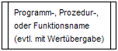
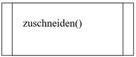

|                             |                          |                                        |
| --------------------------- | ------------------------ | -------------------------------------- |
| **Elektrotechniker/-in HF** | **Programmiertechnik A** |  |

- [1. Funktionen](#1-funktionen)
  - [1.1. Definition](#11-definition)
  - [1.2. Diagramme](#12-diagramme)
  - [1.3. Beispiel C-Programmcode](#13-beispiel-c-programmcode)
- [2. Aufgaben](#2-aufgaben)
  - [2.1. Funktion](#21-funktion)
  - [2.2. Celsius/Fahrenheit Umrechnung](#22-celsiusfahrenheit-umrechnung)
  - [2.3. Trennstriche ausgeben](#23-trennstriche-ausgeben)
  - [2.4. Benutzeranmeldung](#24-benutzeranmeldung)
  - [2.5. Zahl raten](#25-zahl-raten)

# 1. Funktionen

## 1.1. Definition

Eine Funktion ist ein **benannter Codeblock**, der eine bestimmte Aufgabe ausführt. Sie kann **Eingabewerte (Parameter)** erhalten, **intern Operationen** durchführen und ein **Ergebnis (Rückgabewert)** liefern.
**Funktionen** bzw. **Methoden** spielen eine zentrale Rolle in der Programmierung.
Sie dienen dazu, den Code besser zu **strukturieren**, **wiederverwendbar** zu machen und die **Lesbarkeit** sowie **Wartbarkeit** zu verbessern.

- **Wiederverwendbarkeit**
  - Einmal geschriebener Code kann mehrfach verwendet werden, ohne dass er dupliziert werden muss.
  - Beispiel: Eine Funktion zur Berechnung der Quadratwurzel kann überall im Programm genutzt werden.
- **Strukturierung des Codes**
  - Der Code wird in logische, übersichtliche Abschnitte unterteilt.
  - Dadurch wird ein Programm leichter verständlich und nachvollziehbar.
- **Vermeidung von Redundanz**
  - Gleichartige oder sich wiederholende Abläufe müssen nicht mehrmals geschrieben werden.
  - Änderungen müssen nur an einer Stelle gemacht werden.
- **Verbesserte Wartbarkeit**
  - Fehler können schneller lokalisiert und behoben werden.
  - Einzelne Funktionen lassen sich unabhängig testen (Stichwort: **Modularität**).
- **Abstraktion**
  - Komplexe Abläufe werden hinter einem Funktionsnamen „versteckt“.
  - Beispiel: sortiereListe(liste) sagt dem Leser sofort, was passiert – ohne die Details sehen zu müssen.
- **Parameterübergabe**
  - Funktionen können mit **Eingabewerten (Parametern)** aufgerufen werden, was ihre Flexibilität erhöht.
  - Beispiel: `berechneSteuerbetrag(einkommen)`
- **Rückgabewerte**
  - Funktionen liefern oft ein Ergebnis zurück, das dann weiterverwendet werden kann.
  - Beispiel: ergebnis = `addiere(3, 5)`

---

## 1.2. Diagramme

**Struktogramm:**

> 

**Programmablaufplan:**

> 

**UML-Aktivitätsdiagramm:**

> 

---

## 1.3. Beispiel C-Programmcode

```c
#include <stdio.h>

int addiere(int a, int b) {
    return a + b;
}

int main() {
    int summe = addiere(4, 7);
    printf("Die Summe ist: %d\n", summe);
    return 0;
}
```

Erklärung der Bestandteile:

- `int addiere(int a, int b)`:
  - int = Rückgabetyp → die Funktion gibt eine Ganzzahl zurück.
  - addiere = Name der Funktion.
  - `(int a, int b)` = zwei Parameter vom Typ int (also ganze Zahlen).
- `return a + b;`
  - Die Summe der Parameter wird zurückgegeben.

---

</br>

# 2. Aufgaben

## 2.1. Funktion

| **Vorgabe**         | **Beschreibung**                                                     |
| :------------------ | :------------------------------------------------------------------- |
| **Lernziele**       | Kennt die Grundelemente von Struktogramm, PAP und Aktivitätsdiagramm |
|                     | Kann Algorithmen in einem Diagramm darstellen                        |
| **Sozialform**      | Partnerarbeit                                                        |
| **Auftrag**         | siehe unten                                                          |
| **Hilfsmittel**     |                                                                      |
| **Zeitbedarf**      | 20min                                                                |
| **Lösungselemente** | Vollständiges Diagramm                                               |

Verpacke die Entscheidung und Ausgabe der Aufgabe Logische Verknüpfung in eine **Funktion**.


---

## 2.2. Celsius/Fahrenheit Umrechnung

| **Vorgabe**         | **Beschreibung**                                        |
| :------------------ | :------------------------------------------------------ |
| **Lernziele**       | Kennt die Grundelemente eines Programmablaufplan        |
|                     | Kann ein Programmablaufplan entwickeln                  |
|                     | Kann Algorithmen in einem Programmablaufplan darstellen |
| **Sozialform**      | Einzelarbeit                                            |
| **Auftrag**         | siehe unten                                             |
| **Hilfsmittel**     |                                                         |
| **Zeitbedarf**      | 40min                                                   |
| **Lösungselemente** | Vollständiges Flowgorithm                               |

a)

- Entwickle ein Programmablaufplan, das eine Umrechnung von **Celsius** nach **Fahrenheit** durchführt.
- Die Umrechnungsformel von Celsius nach Fahrenheit lautet: `F = (9 * C + 160) / 5`
  - c = Celsius, f = Fahrenheit

b)

Erweitere die Aufgabe a), sodass die Umrechnung alle Werte von –100 Celsius bis +100 Celsius ausgibt.

- Die Umrechnungsformel von Celsius nach Fahrenheit lautet: `F = (9 * C + 160) / 5`
  - c = Celsius, f = Fahrenheit
- Lösung als Zählschleife
- Lösung als kopfgesteuerte Schleife (Iteration)

c)

Erweitere die Aufgabe b), sodass die Umrechnung in einer Funktion programmiert bzw. vom Hauptprogramm ausgelagert ist.

d)

Erweitere die Aufgabe d), sodass der Wertebereich (von/bis) mit zwei Funktionsparameter an die Funktion übergeben wird.

---

## 2.3. Trennstriche ausgeben

| **Vorgabe**         | **Beschreibung**                                        |
| :------------------ | :------------------------------------------------------ |
| **Lernziele**       | Kennt die Grundelemente eines Programmablaufplan        |
|                     | Kann ein Programmablaufplan entwickeln                  |
|                     | Kann Algorithmen in einem Programmablaufplan darstellen |
| **Sozialform**      | Einzelarbeit                                            |
| **Auftrag**         | siehe unten                                             |
| **Hilfsmittel**     |                                                         |
| **Zeitbedarf**      | 40min                                                   |
| **Lösungselemente** | Vollständiges Flowgorithm                               |

Entwickle einen Programmablaufplan, der die Trennzeichen ausgibt.
Aus Gründen der Wiederverwendbarkeit soll die Ausgabe der Trennstriche in einer Funktion (TrennstricheAusgeben) programmiert werden.
Um unterschiedlich lange Trennlinien auszugeben, muss die Anzahl der Trennstriche als Parameter an die Funktion übergeben werden.

---

## 2.4. Benutzeranmeldung

| **Vorgabe**         | **Beschreibung**                                        |
| :------------------ | :------------------------------------------------------ |
| **Lernziele**       | Kennt die Grundelemente eines Programmablaufplan        |
|                     | Kann ein Programmablaufplan entwickeln                  |
|                     | Kann Algorithmen in einem Programmablaufplan darstellen |
| **Sozialform**      | Einzelarbeit                                            |
| **Auftrag**         | siehe unten                                             |
| **Hilfsmittel**     |                                                         |
| **Zeitbedarf**      | 40min                                                   |
| **Lösungselemente** | Vollständiges Flowgorithm                               |

In einer Benutzeranmeldung (Login) mit Benutzername u. Passwort muss folgender Ablauf programmiert werden:

- Der Benutzer wird zur Eingabe des Benutzernamens aufgefordert.
- Der Anwender hat max. drei Versuche den korrekten Benutzernamen einzugeben, danach wird eine Fehlermeldung ausgeben und das Programm bricht ab.
- Ist der Benutzername korrekt, erfolgt die Aufforderung zur Passworteingabe.
- Der Anwender hat wiederum max. drei Versuche das korrekte Passwort einzutippen, danach wird eine Fehlermeldung ausgegeben und das Programm bricht ab.
- Bei vollständiger Übereinstimmung von Benutzername u. Passwort wir die Meldung "Zugang freigegeben" angezeigt.

Erstelle für den obigen Vorgang ein Programmablaufplan (Flowgorithm).
Dabei sind die Benutzernamen- und Passworteingaben in separate Funktionen zu gliedern.

---

## 2.5. Zahl raten

| **Vorgabe**         | **Beschreibung**                                                     |
| :------------------ | :------------------------------------------------------------------- |
| **Lernziele**       | Kennt die Grundelemente von Struktogramm, PAP und Aktivitätsdiagramm |
|                     | Kann Algorithmen in einem Diagramm darstellen                        |
| **Sozialform**      | Einzelarbeit                                                         |
| **Auftrag**         | siehe unten                                                          |
| **Hilfsmittel**     |                                                                      |
| **Zeitbedarf**      | 40min                                                                |
| **Lösungselemente** | Vollständiges Diagramm                                               |

a)
Entwerfe den Algorithmus **"RateZahl"**.

- Der Anwender soll eine Zahl zwischen einem minimalen und maximalen Wert raten.
- Der Algorithmus wird beendet, sobald die korrekte Zahl vom Anwender eingegeben wurde.
- Sofern die eingegebene Zahl kleiner oder grösser ist, wird der Anwender darauf hingewiesen.

b)
Erweitere die Aufgabe a), sodass die Zufallszahl in einer Funktion generiert wird.

c)
Erweitere die Aufgabe b), sodass der Überprüfung in einer Funktion stattfindet.
