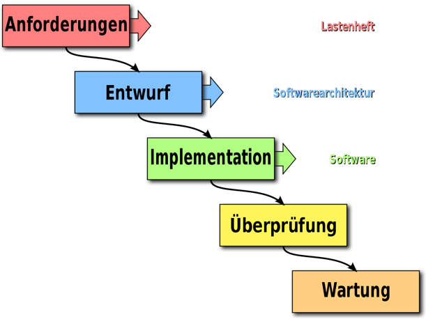
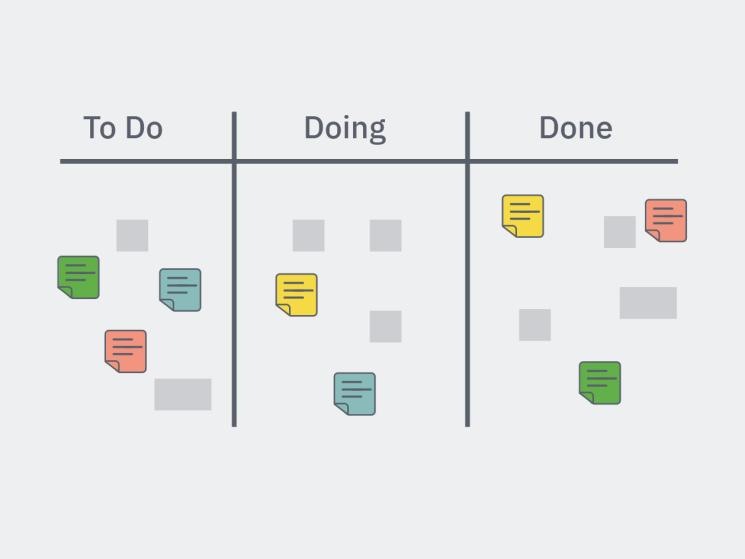
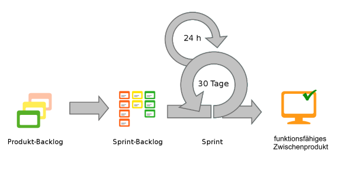
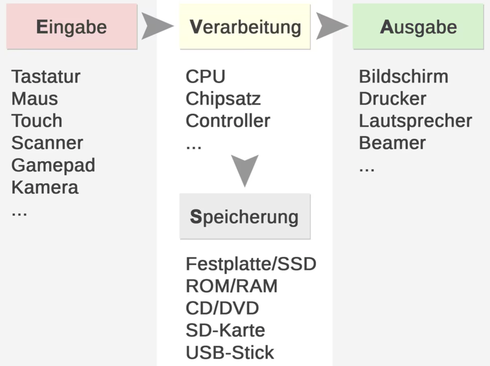
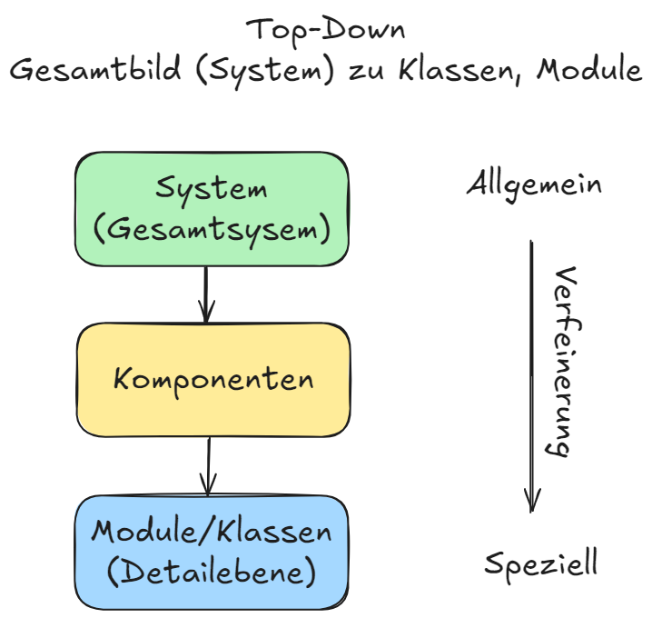
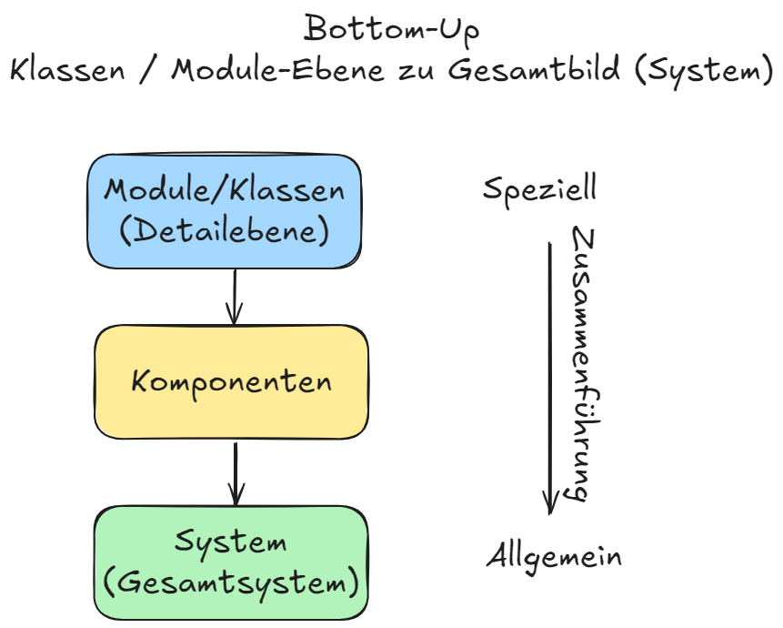
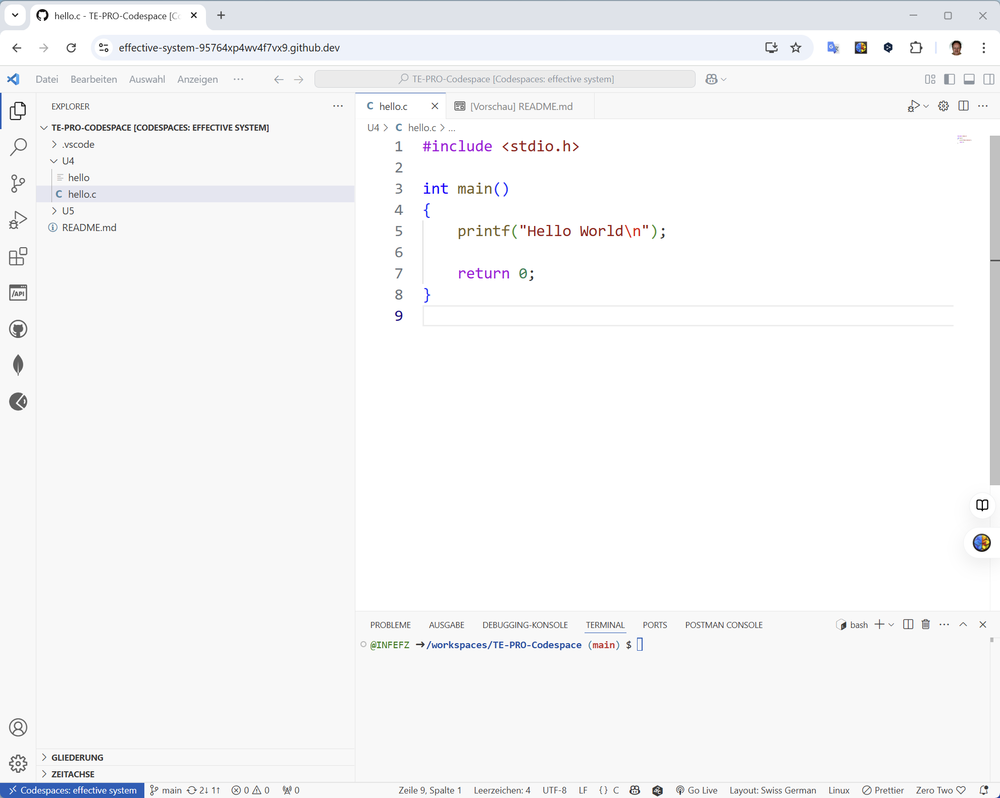
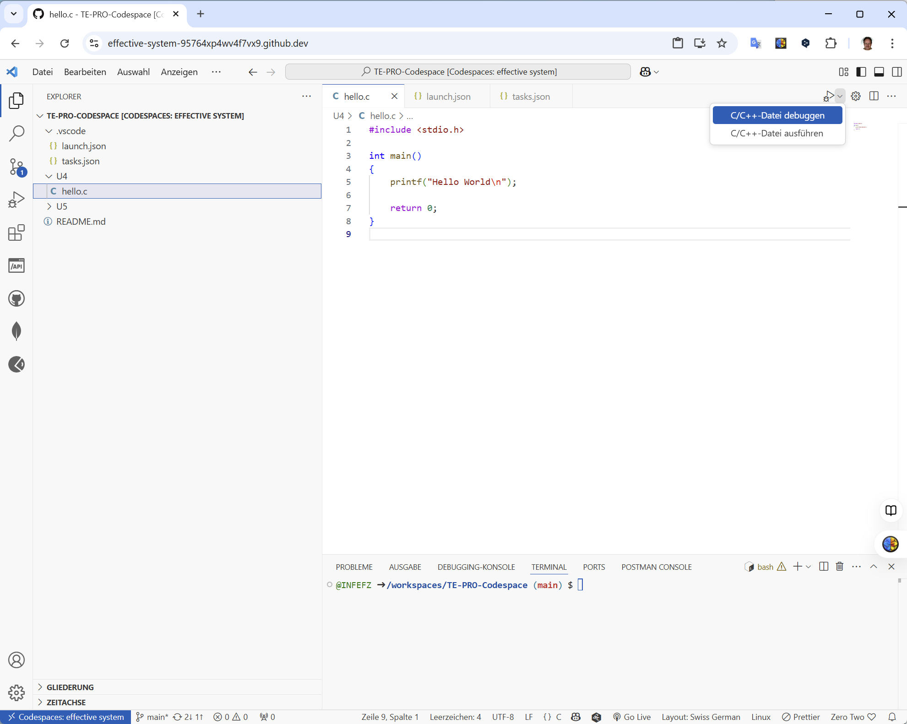
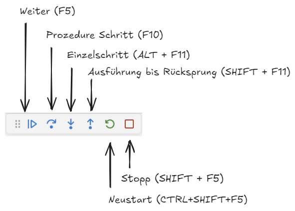
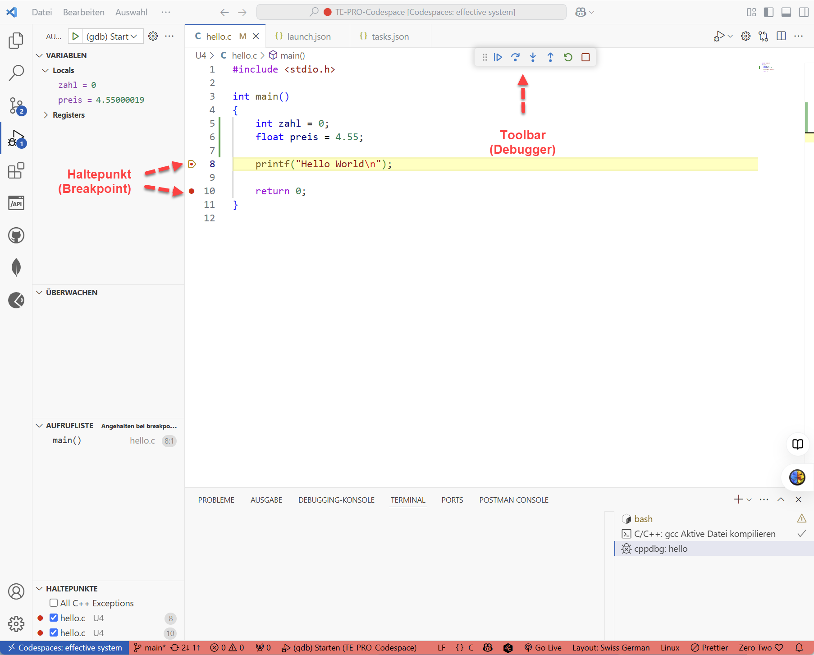

|                             |                          |                                        |
| --------------------------- | ------------------------ | -------------------------------------- |
| **Elektrotechniker/-in HF** | **Programmiertechnik A** |  |

- [1. Grundlagen der Softwareentwicklung](#1-grundlagen-der-softwareentwicklung)
  - [1.1. Anforderungen an Software](#11-anforderungen-an-software)
  - [1.2. Vorgehensmodelle](#12-vorgehensmodelle)
  - [1.3. Entwicklungsmethoden](#13-entwicklungsmethoden)
    - [1.3.1. EVA-Prinzip](#131-eva-prinzip)
      - [1.3.1.1. Eingabe (**E**)](#1311-eingabe-e)
    - [1.3.2. Verarbeitung (**V**)](#132-verarbeitung-v)
    - [1.3.3. Ausgabe (**A**)](#133-ausgabe-a)
    - [1.3.4. Ein- und Ausgabegeräte](#134-ein--und-ausgabegeräte)
  - [1.4. Übersicht der Entwicklungsmethoden](#14-übersicht-der-entwicklungsmethoden)
    - [1.4.1. Zusammenfassung](#141-zusammenfassung)
  - [1.5. Agile Praktiken (Scrum, Kanban)](#15-agile-praktiken-scrum-kanban)
  - [1.6. Software-Werkzeuge](#16-software-werkzeuge)
  - [1.7. GitHub Codespaces](#17-github-codespaces)
    - [1.7.1. Programm starten u. debugen](#171-programm-starten-u-debugen)
    - [1.7.2. Kurzbeschreibung](#172-kurzbeschreibung)
    - [1.7.3. Funktionen im Überblick](#173-funktionen-im-überblick)
- [2. Aufgaben](#2-aufgaben)
  - [2.1. Hochsprachen vs. Interpretersprachen](#21-hochsprachen-vs-interpretersprachen)
  - [2.2. Schnellstart für GitHub Codespaces](#22-schnellstart-für-github-codespaces)

---

</br>

# 1. Grundlagen der Softwareentwicklung

Die Umsetzung in der Softwareentwicklung beinhaltet eine Vielzahl von Prozessen, Techniken und Tools, die darauf abzielen, Software von der Idee bis zur fertigen Anwendung zu entwickeln. Sie umfasst die **Konzeptionierung**, das **Design**, die **Implementierung**, das **Testing** und die **Wartung** von Software.

## 1.1. Anforderungen an Software

- **Anforderungen** sind **spezifische Bedürfnisse oder Bedingungen**, die eine Software erfüllen muss, um erfolgreich eingesetzt werden zu können. 
- Sie werden üblicherweise in **funktionale** und **nicht-funktionale Anforderungen** unterteilt.

- **Funktionale Anforderungen**: beschreiben die spezifischen **Funktionen** oder Leistungen, die die Software ausführen soll. 
- **Nicht-funktionale Anforderungen**: betreffen die **Qualitätseigenschaften** der Software, wie Leistung, Sicherheit, Usability und Kompatibilität.

## 1.2. Vorgehensmodelle

Vorgehensmodelle strukturieren den Entwicklungsprozess und bieten einen Rahmen für die Planung, Durchführung und Kontrolle von Softwareprojekten. Bekannte Modelle sind:

- **Wasserfallmodell**
  - Stufenweise Entwicklung (Analyse → Entwurf → Implementierung → Test → Wartung); jede Phase wird abgeschlossen, bevor die nächste beginnt.
  - 
- **V-Modell**
  - Erweiterung des Wasserfalls mit besonderem Fokus auf Qualitätssicherung – jede Entwicklungsphase wird direkt mit einer Testphase verknüpft.
- **Agile Methoden (z.B. Scrum)**
  - Iterative, flexible Entwicklung in kurzen Zyklen (Sprints); enge Zusammenarbeit mit dem Kunden und schnelle Reaktion auf Änderungen.
  - 
  - 
- **Spiralmodell**
  - Kombination aus iterativer Entwicklung und Risikomanagement – das Projekt durchläuft wiederholt Planung, Risikoanalyse und Prototyping.


## 1.3. Entwicklungsmethoden

**Entwicklungsmethoden** sind spezifische Ansätze zur Softwareentwicklung, die Techniken, Werkzeuge und Prozesse umfassen sowie auch Best Practises (Allgemeine gute Erfahrungen).

### 1.3.1. EVA-Prinzip

Das EVA-Prinzip beschreibt den grundlegenden Ablauf in jedem informationsverarbeitenden System.



[Wiki](https://de.wikipedia.org/wiki/EVA-Prinzip)

EVA steht für:

- **Eingabe (E)** – Daten werden erfasst oder eingegeben.
- **Verarbeitung (V)** – Die Daten werden bearbeitet oder umgewandelt.
- **Ausgabe (A)** – Ergebnisse werden ausgegeben oder bereitgestellt.

> **Beispiel: Taschenrechner: Zahl eingeben → Rechnen → Ergebnis anzeigen.**

#### 1.3.1.1. Eingabe (**E**)

- Die Eingabe der Daten stellt einen Befehl oder eine Anweisung an das **Gerät** bzw. das System dar. 
- Die Eingabe kann je nach Bedarf über verschiedene Eingabegeräte erfolgen. 
- Dazu zählen u.a.:
  - Computer-Tastatur
  - Maus
  - Mikrofon
  - Touchscreen
  - Touchpad
  - Scanner
  - Webcam
  - Augensteuerung
  - Bildschirmtastatur
  - Game-Controller/Joystick

### 1.3.2. Verarbeitung (**V**)

- Die Verarbeitung bzw. Berechnung eingegebener Daten erfolgt über dafür ausgelegten Einheiten. 
- Zu den wichtigsten gehören der **Prozessor (CPU)**, der **RAM (Arbeitsspeicher)** und die **Grafikkarte (GPU)**. 
- Die wichtigste Einheit zur Verarbeitung ist das Zweigespann aus **Prozessor** und **RAM**. 
- Zur Speicherung kommen **Festplatten**, **Arbeitsspeicher**, **Cloud-Speicher**, **DVDs** und **USB-Sticks** zum Einsatz

### 1.3.3. Ausgabe (**A**)

- Um die verarbeiteten Daten wie gewünscht auszugeben, verfügen Computer bzw. elektronische Geräte über entsprechende Ausgabeeinheiten. 
- Diese sorgen dafür, dass verarbeitete Daten beispielsweise auf einem **Monitor/Screen** angezeigt oder über **Lautsprecher**, **Drucker**, **Beamer** oder **Kopfhörer** ausgegeben werden.

### 1.3.4. Ein- und Ausgabegeräte


## 1.4. Übersicht der Entwicklungsmethoden

- **EVA-Prinzip (Eingabe – Verarbeitung – Ausgabe)**
  - Grundmodell der Datenverarbeitung.
  - **Eingabe**: Der Benutzer oder ein anderes System liefert Daten.
  - **Verarbeitung**: Die Daten werden verarbeitet oder ausgewertet.
  - **Ausgabe**: Ergebnisse werden angezeigt, gespeichert oder weitergegeben.
  - > EVA beschreibt den grundsätzlichen Ablauf in Computersystemen.
- **Top-Down-Entwicklung**
  - Vorgehen vom **Allgemeinen** zum **Speziellen**.
  - Zuerst wird das **Gesamtsystem** grob geplant (Struktur, Funktionen).
  - Danach erfolgt eine schrittweise **Verfeinerung** bis auf Detailebene.
  - Vorteil: Klare Übersicht über das gesamte Projekt von Beginn an.
  - [Wiki](https://de.wikipedia.org/wiki/Top-down_und_Bottom-up)
  - 
  - > Besonders geeignet für **komplexe Projekte** mit klaren Anforderungen.
- **Bottom-Up-Entwicklung**
  - Vorgehen vom **Speziellen** zum **Allgemeinen**.
  - Einzelne Module oder Funktionen werden zuerst entwickelt und getestet.
  - Anschliessend werden sie zu einem vollständigen System zusammengeführt.
  - Vorteil: Frühe Funktionsfähigkeit einzelner Komponenten.
  - [Wiki](https://de.wikipedia.org/wiki/Top-down_und_Bottom-up)
  - 
  - > Besonders geeignet bei **modularem Aufbau** oder **unscharfen Anforderungen**.

### 1.4.1. Zusammenfassung

- **EVA** beschreibt, was Systeme tun (Eingabe → Verarbeitung → Ausgabe).
- **Top-Down** plant zuerst das Gesamtkonzept und verfeinert dann.
- **Bottom-Up** entwickelt zuerst Details und fügt sie später zusammen.

## 1.5. Agile Praktiken (Scrum, Kanban)

- **TDD (Test-Driven-Development)**
  - Test schreiben vor der Implementation, Idee gutes Verständnis der Funktion / Schnittstellen, Guter Code muss testbar sein
- **Paarprogrammierung**
  - 2 Entwickler implementieren gemeinsam, Code im Dialog, Navigator, Autor
- **Code-Review**
  - Überprüfung des Codes durch andere Entwickler, teilweise automatisiert mit Integrationsbuild, Coding-Guidelines-Check (Sonarqube)
- **Produktiv keine Bugs**
  - Ziel in der produktiven Software werden keine Fehler mehr gefunden
- **Testautomatisierung**
  - Es werden so viel Tests wie möglich automatische ausgeführt - Schnelles Feedback, Sicherheit bei Changes
- **Continous Integration**
  - Jeder Change wird getestet und überprüft, Software bleibt immer lauffähig, jeder Change ist getestet und integriert sauber

## 1.6. Software-Werkzeuge

- **Entwicklungsumgebung (IDE)**
  - **Code** editieren, compilieren, debuggen und weiteres Coding Guideline Check u. Support beim editieren
- **Versionskontrolle**
  - Verwalten von **Changes** im Code, vereinfacht Zusammenarbeit und Integration von mehreren Entwicklern
- **Build-System**
  - Automatisieren des **Buildprozesses**, Vereinfachung und Harmonisierung lokales Buildsystem und Buildsystem auf Build-Server
- **Assembler**
  - Niedrige **Programmiersprache**, nah an der Hardware und Maschinencode
- **Interpreter**
  - Übersetzt zur **Laufzeit** in Maschinensprache (langsamer als kompilierter Code)
- **Compiler**
  - Übersetzt Code einer höheren Programmiersprache in **Maschinencode**
- **Linker**
  - Löst **Referenzen** zwischen den von Compiler erzeugten **Objektdateien** auf
- **Debugger**
  - Erlaubt **Schritt für Schritt Ausführung** des Programmes, Anzeigen und Änderung von Variablen zur Laufzeit

## 1.7. GitHub Codespaces

**GitHub Codespaces** ist ein **Cloud-basierter Entwicklungsraum**, der es dir ermöglicht, direkt in GitHub eine komplette **Entwicklungsumgebung (IDE)** zu starten – ohne etwas lokal installieren zu müssen.

**Kernpunkte:**

- Es basiert auf Visual Studio Code (VS Code).
- Läuft komplett in der Cloud (GitHub-Server).
- Unterstützt Code schreiben, kompilieren, debuggen und versionieren direkt aus dem Browser.
- Ermöglicht schnelles Aufsetzen und einheitliche Entwicklungsumgebungen (z.B. für Teams oder Projekte).
- Du kannst eigene Dev-Container definieren, damit alle Teammitglieder die gleiche Entwicklungsumgebung haben.

**Typische Anwendung:**

- Sofort mit der Arbeit an einem GitHub-Projekt beginnen.
- Kein langes Einrichten von Tools und Abhängigkeiten auf dem eigenen Rechner nötig.
- Besonders praktisch für Open-Source-Projekte, Schulungen oder Teamarbeit.



### 1.7.1. Programm starten u. debugen



### 1.7.2. Kurzbeschreibung

Die Debug-Toolbar erscheint automatisch, wenn ein Debugging-Prozess in Visual Studio Code gestartet wird. Sie bietet zentrale Steuerfunktionen, um den Ablauf des Programms kontrolliert zu überwachen und zu beeinflussen.

### 1.7.3. Funktionen im Überblick



- **Starten/Neustarten** (`▶️ / ↻`): Beginnt oder startet den Debugging-Prozess neu.
- **Beenden** (`■`): Stoppt den Debugging-Prozess vollständig.
- **Step Over** (`→|`): Führt die aktuelle Codezeile aus, ohne in Funktionen hineinzugehen.
- **Step Into** (`↓`): Springt in die aufgerufene Funktion hinein, um diese Zeile für Zeile zu analysieren.
- **Step Out** (`↑`): Beendet die Analyse einer Funktion und kehrt zum aufrufenden Code zurück.
- **Breakpoints verwalten**: Schnell Zugriff auf gesetzte Breakpoints und Kontrollmöglichkeiten.



---

</br>

# 2. Aufgaben

## 2.1. Hochsprachen vs. Interpretersprachen

| **Vorgabe**         | **Beschreibung**                                                                         |
| :------------------ | :--------------------------------------------------------------------------------------- |
| **Lernziele**       | Sind in der Lage die Vor- und Nachteile von Skript- und Hochsprachen erläutern zu können |
|                     | Können gängige bzw. verbreitete Hoch- und Skriptsprachen nennen                          |
| **Sozialform**      | Teamarbeit mit max. Grösse von 3-4 Personen                                              |
| **Auftrag**         | siehe unten                                                                              |
| **Hilfsmittel**     |                                                                                          |
| **Zeitbedarf**      | Arbeit 30min, Präsentation max. 10min                                                    |
| **Lösungselemente** | Präsentation (PowerPoint oder Markdown)                                                  |

- Identifiziere alle wichtigen Informationen und Merkmale, die Skriptsprachen von Hochsprachen (wie C#, C++, Java usw.) unterscheiden.
- Fasse die Punkte mittels praxisorientierten Beispielen und Anwendungen zusammen. 
- Die nachfolgenden Punkte geben einen Rahmen vor:
  - Einsatzbereich
  - Performance
  - Erstellungsprozess (Build)
  - Lernkurve
  - Typisierung
  - IDE (Integrated Development Equipment), Tools
  - Compiler / Interpreter

- Stelle die Ergebnisse mittels einer Kurzpräsentation der Klasse vor. 
- Verwende dabei die Hilfsmittel wie Flow-Charts, Video Beamer, Wandtafel usw. und verweisen Sie ggf. auf weitere die Literatur. 
- Die Zusammenfassungen sind dann den anderen Klassenkameraden zur Verfügung zu stellen.

---

## 2.2. Schnellstart für GitHub Codespaces

| **Vorgabe**         | **Beschreibung**                                                 |
| :------------------ | :--------------------------------------------------------------- |
| **Lernziele**       | Kennen die Möglichkeiten einer Cloud-basierter Entwicklungsraum  |
|                     | Können in GitHub ein Codespace anlegen                           |
|                     | Können ein Hello World Programm erstellen und ausführen          |
|                     | Kann ein Programm mit dem Debugger starten und Haltepunkt setzen |
| **Sozialform**      | Einzelarbeit                                                     |
| **Auftrag**         | siehe unten                                                      |
| **Hilfsmittel**     |                                                                  |
| **Zeitbedarf**      | 30 min                                                           |
| **Lösungselemente** | Codespace wurde erstellt, ein Programm kann ausgeführt werden    |

a)
GitHub Codespaces ist ein Cloud-basierter Entwicklungsraum, der es dir ermöglicht, direkt in GitHub eine komplette Entwicklungsumgebung (IDE) zu starten – ohne etwas lokal installieren zu müssen.
Verschaffe Dir mit den [Schnellstart für GitHub Codespaces](https://docs.github.com/de/codespaces/quickstart) zur Anwendung und Einsatzbereich einen Überblick.

Optional: [Secure developmentt made simple](https://github.com/features/codespaces)

b)

Erstelle ein kleines Hello World Programm (siehe unten) und starte das Programm.

```c
#include <stdio.h>

int main()
{
    int zahl = 0;
    float preis = 4.55;
    
    printf("Hello World\n");

    return 0;
}
```

c)

- Setze am Anfang des Programms einen Haltepunkt (Breakpoint) und starte den Debugger.
- Führe das Progamm nun im Einzelschritt bis zum Ende aus.
