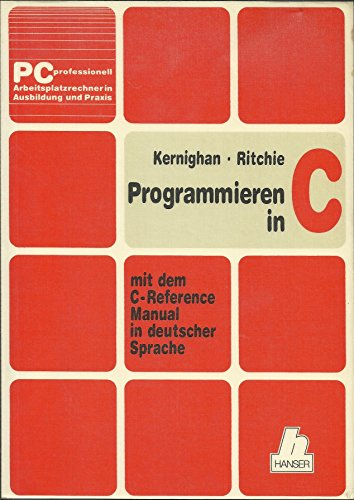

|                             |                          |                                        |
| --------------------------- | ------------------------ | -------------------------------------- |
| **Elektrotechniker/-in HF** | **Programmiertechnik A** |  |

- [1. Die Programmiersprache C](#1-die-programmiersprache-c)
  - [1.1. Entstehung von C](#11-entstehung-von-c)
  - [1.2. Einsatzgebiete](#12-einsatzgebiete)
  - [1.3. Standardisierung](#13-standardisierung)
  - [1.4. Basiskomponenten der C-Programmiersprache](#14-basiskomponenten-der-c-programmiersprache)
- [2. Aufgaben](#2-aufgaben)
  - [2.1. E-Book, Kapitel 1 - Einführung in die Programmiersprache C](#21-e-book-kapitel-1---einführung-in-die-programmiersprache-c)

---

# 1. Die Programmiersprache C

## 1.1. Entstehung von C

- Die Programmiersprache C wurde Anfang der 1970er Jahre von **Dennis Ritchie** am **Bell Telephone Laboratories (heute Bell Labs)** entwickelt.
- - Ihr Ursprung liegt in der Arbeit an dem Betriebssystem **UNIX**, das ursprünglich in der Assemblersprache geschrieben war.
- Die Entwickler suchten eine **effizientere**, aber dennoch maschinennahe Sprache, die sowohl **leistungsstark** als auch **portabel** war.

Zusammenfassung der Merkmale:

- Hohe Sprachexpressivität
- Sprachkonstrukte wie while, if etc.
- Sprechende Bezeichner (Variablen)
- Effiziente Programmierung einfachere Fehlersuche
- Portable und maschinenunabhängig

- **C** wurde in den **1970er** und **1980er** Jahren extrem populär, insbesondere durch die Veröffentlichung des Buches "The C Programming Language" (1978) von **Brian W. Kernighan** und **Dennis M. Ritchie** – oft einfach als **"K&R C"** bezeichnet.
- Dieses Buch setzte Massstäbe und prägte die frühe C-Programmierung massgeblich.

Später wurde C durch den **ANSI-Standard (ANSI C)** 1989 offiziell standardisiert, was ihre Definition und Kompatibilität zwischen verschiedenen Compilern sicherte.

## 1.2. Einsatzgebiete

- Von Anfang an war das Haupteinsatzgebiet von C die **Systemprogrammierung**.
- Es kommt bei den zu entwickelnden Programmen besonders auf **Geschwindigkeit** und einen **kompakten Programmcode** an.
- Ausserdem soll die **Hardware** besonders effektiv angesprochen werden können

Einsatzbereiche:

- Steuergeräte
- Lift
- Flugzeug
- Kaffeemaschine
- Auto
- etc.

## 1.3. Standardisierung

| **Standard** | **Bemerkung**                                                                                                                                                                                                                                                                                          |
| ------------ | ------------------------------------------------------------------------------------------------------------------------------------------------------------------------------------------------------------------------------------------------------------------------------------------------------ |
| **K&R-C**    | Diese Version basiert hauptsächlich auf dem ersten Buch zu C von den beiden Autoren Kernighan und Ritchie von 1978.                                                                                                                                                                                    |
| **C89**      | Die erste echte Standardisierung erfolgte über das American National Standards Institute (ANSI) im Jahre 1989.                                                                                                                                                                                         |
| **C90**      | Ein Jahr nach dem Erscheinen des 1. Standards wurden kleine Änderungen hinzugefügt und die ISO-Norm C90 definiert.   Sie ist Basis vieler heutiger C-Implementierungen. Die wichtigsten Verbesserungen waren die Einführung von Funktionsprototypen sowie die Normierung der C-Standardbibliothek. |
| **C95**      | 1995 wurden in einem neuen Standard Fehlerbehebungen, einige neue Makros sowie die Unterstützung weiterer Zeichensätze zusammengefasst.   Obwohl dieser Standard schon relativ alt ist, wird er selten von den gängigen Compilern vollständig implementiert.                                       |
| **C99**      | Über die Jahre wurden einige häufig vermisste Sprachkonstrukte und Schreibweisen anderer Sprachen hinzugefügt wie der   Datentyp _Bool, der einzeilige C++- Zeilenkommentator "//" oder die Möglichkeit, Variablen direkt in einer for-Schleife zu definieren.                                     |
| **C11**      | Ende 2011 wurde der aktuelle C11-Standard verabschiedet.   Er enthält Korrekturen der Vorversion und Neuerungen wie beispielsweise Unterstützung von Multithreading, neue Datentypen und generische Ausdrücke.                                                                                     |

## 1.4. Basiskomponenten der C-Programmiersprache

| **Komponenten**           | **Syntax**                        | **Beschreibung**                                                                                                                                                                                                                                                                                 |
| ------------------------- | --------------------------------- | ------------------------------------------------------------------------------------------------------------------------------------------------------------------------------------------------------------------------------------------------------------------------------------------------ |
| **Präprozessor**          | **`#`**  `#include, #define`  | Präprozessoranweisung können als Textersatz immer wieder verwendet warden.   z.B: `#include` wird verwendet um Header-Dateien in C einzufügen.   `#include <stdio.h>` enthält Funktionen für Ein- u. Ausgabe `scanf` und `printf` `#define` definiert Makros und Konstanten (Textersatz) |
| **Einstiegspunkt**        | **`main()`**   **`{ }`**      | **Startpunkt** der Ausführung – das erste, was beim Starten des Programms ausgeführt wird.                                                                                                                                                                                                       |
| **Variablen**             | **`int c=1;`**                    | **Variablendefinition** enthält eine Grösse und einen Datentyp und einen Wert. z.B. Integer-Variable mit Wert 1                                                                                                                                                                                  |
| **Funktionen**            | **`void test()`**   **`{ }`** | **Funktion**, welche immer wieder verwendet werden können                                                                                                                                                                                                                                        |
| **Bibliotheksfunktionen** | **`printf("Hallo")`**             | Funktionen der **Standard-Library** ANSI-C                                                                                                                                                                                                                                                       |

---

 

# 2. Aufgaben

## 2.1. E-Book, Kapitel 1 - Einführung in die Programmiersprache C

| **Vorgabe**         | **Beschreibung**                                                             |
| :------------------ | :--------------------------------------------------------------------------- |
| **Lernziele**       | Syntax u. Semantik eines C-Programmes sind bekannt                           |
|                     | Kennen die Schritte und Werkzeuge zur Programmerstellung                     |
|                     | Können die Basiselemente/Konstrukte in einem Hello Word C-Programm erläutern |
| **Sozialform**      | Einzelarbeit                                                                 |
| **Auftrag**         | siehe unten                                                                  |
| **Hilfsmittel**     |                                                                              |
| **Zeitbedarf**      | 15min                                                                        |
| **Lösungselemente** | Fragenkatalog                                                                |

- Lese im offiziellen Buch [C als erste Programmiersprache](./x_gitres/k01-Einführung-in-die-Programmiersprache-C.pdf) das Kapitel 1
- Erstelle zu Unklarheiten einen Fragenkatalog, sodass wir die Fragen im Anschluss klären können.
