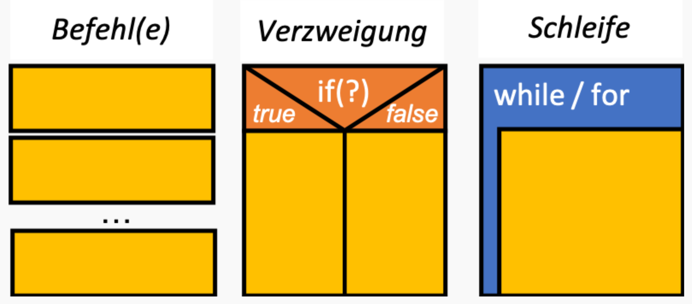
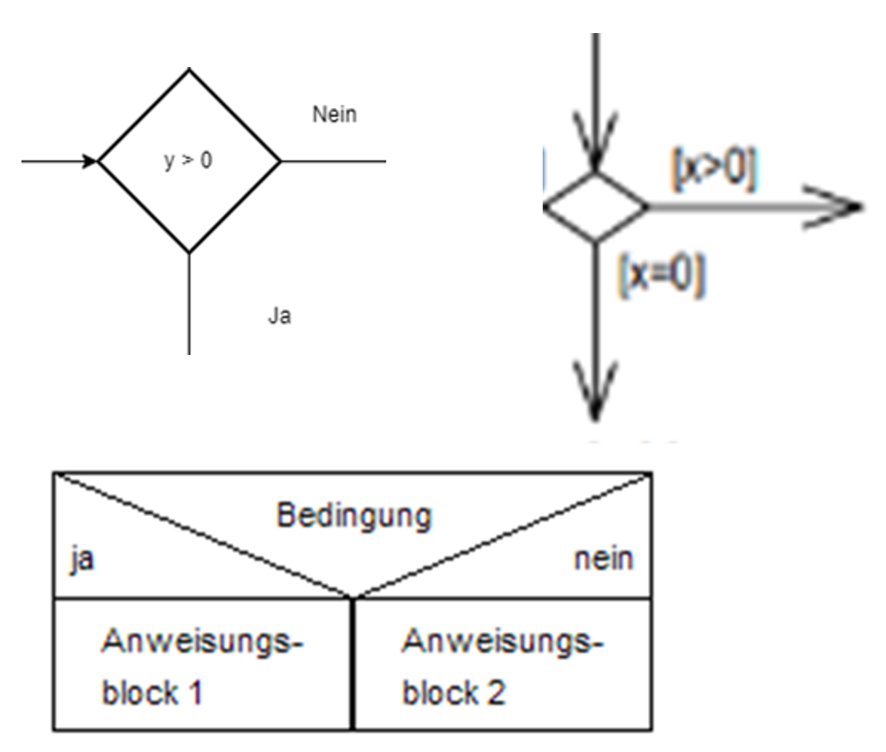
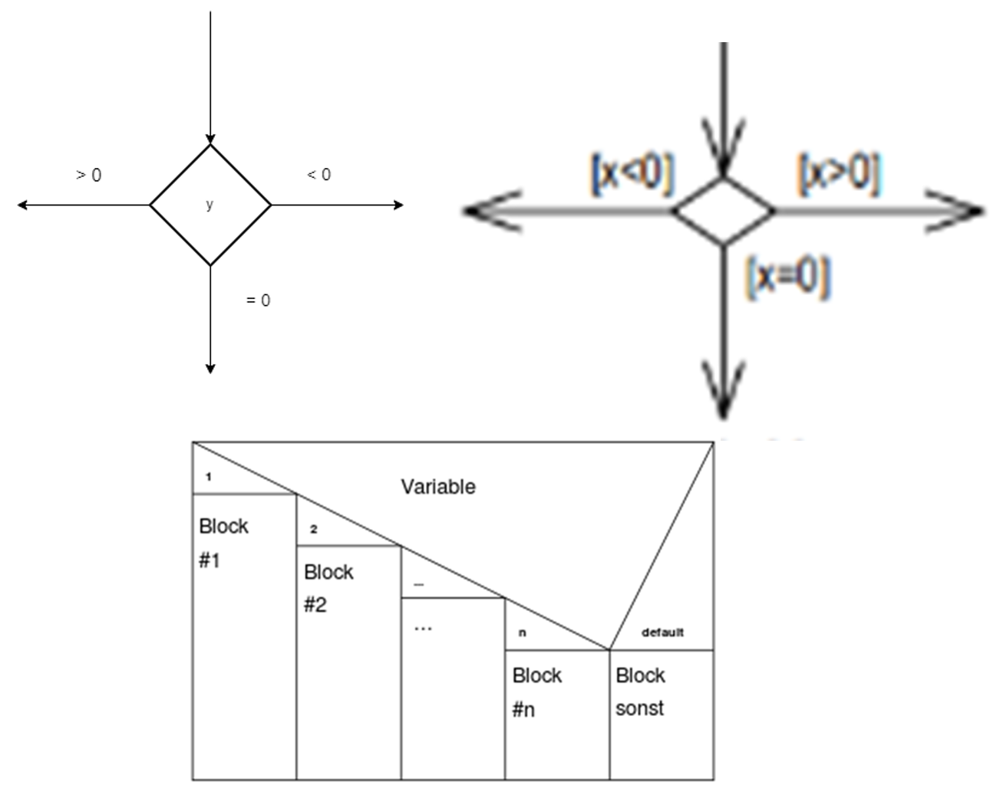
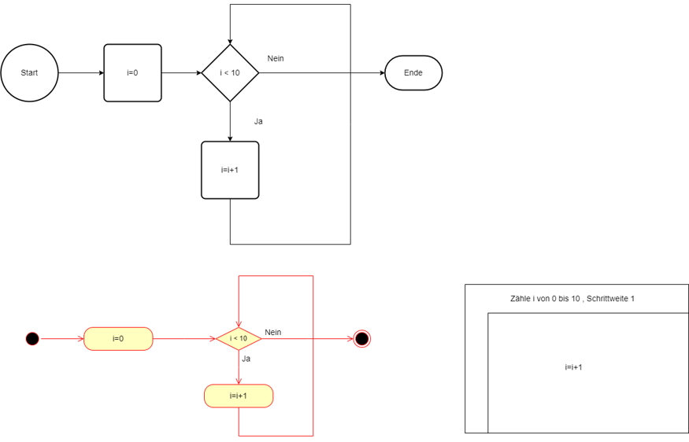
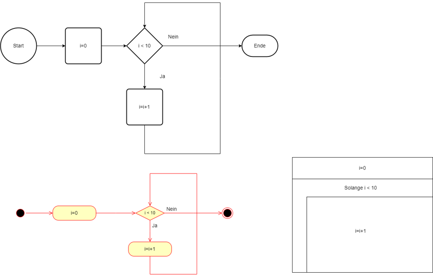
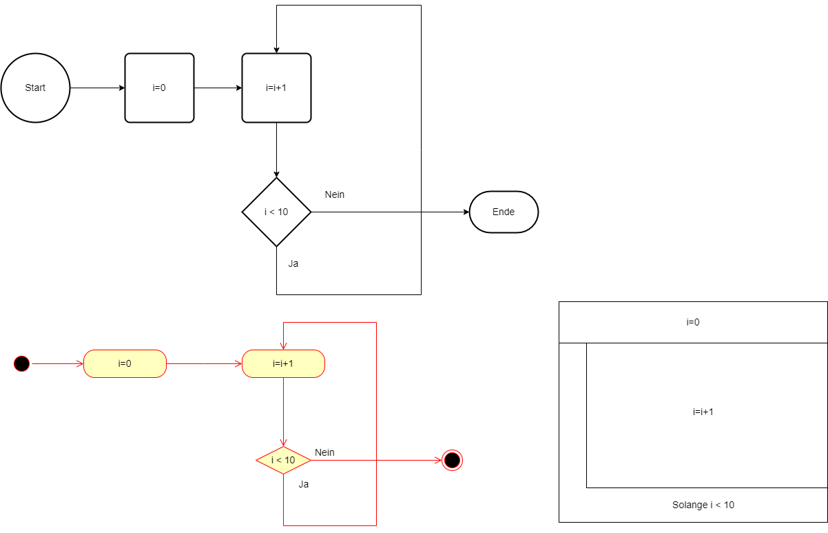
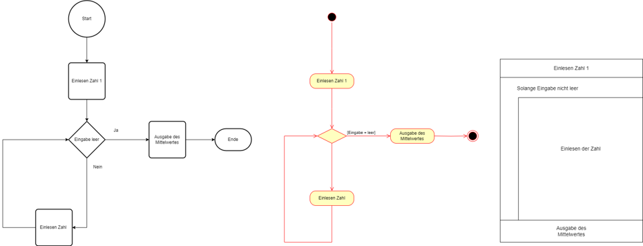

|                             |                          |                                        |
| --------------------------- | ------------------------ | -------------------------------------- |
| **Elektrotechniker/-in HF** | **Programmiertechnik A** |  |

- [1. Kontrollstrukturen](#1-kontrollstrukturen)
  - [1.1. Sequenz (Sequentielle Ausführung)](#11-sequenz-sequentielle-ausführung)
  - [1.2. Verzweigung (Bedingte Anweisungen)](#12-verzweigung-bedingte-anweisungen)
    - [1.2.1. if-Anweisung](#121-if-anweisung)
    - [1.2.2. switch-Anweisung](#122-switch-anweisung)
  - [1.3. Wiederholung (Schleifen)](#13-wiederholung-schleifen)
    - [1.3.1. for-Schleife](#131-for-schleife)
    - [1.3.2. while-Schleife](#132-while-schleife)
    - [1.3.3. do-while-Schleife](#133-do-while-schleife)
    - [1.3.4. Schleifensteuerung (break, continue)](#134-schleifensteuerung-break-continue)
      - [1.3.4.1. break](#1341-break)
      - [1.3.4.2. continue](#1342-continue)
- [2. Aufgaben](#2-aufgaben)
  - [2.1. Iterative Ablaufstrukturen (Mittelwert)](#21-iterative-ablaufstrukturen-mittelwert)

---

# 1. Kontrollstrukturen

- **Sequenz:**
  - Der Code wird in der Reihenfolge ausgeführt, wie er geschrieben ist.
- **Verzweigung:
  - Mit `if`- und `switch`-Anweisungen können Sie Entscheidungen treffen, die den Fluss des Programms ändern.
- **Wiederholung:**
  - Schleifen wie `for`, `while` und `do-while` ermöglichen es, Codeblöcke basierend auf einer Bedingung mehrmals auszuführen.
- **Schleifensteuerung:**
  - Mit `break` und `continue` können Schleifen kontrolliert werden.

- Diese grundlegenden Ablaufstrukturen bilden die Grundlage für jedes C-Programm und sind entscheidend für die Erstellung effizienter und flexibler Programme.




## 1.1. Sequenz (Sequentielle Ausführung)

- Die einfachste Ablaufstruktur in C ist die Sequenz, bei der die Befehle einfach nacheinander ausgeführt werden.
- Dies entspricht dem Standardablauf, bei dem eine Anweisung die nächste folgt.

```c
#include <stdio.h>

int main() {
    int a = 5;
    int b = 10;
    
    // Diese Anweisungen werden sequenziell ausgeführt
    int sum = a + b;  // Addition
    printf("Summe: %d\n", sum);  // Ausgabe
    
    return 0;
}
```

Erläuterung:

- Zuerst wird a und b deklariert und mit Werten initialisiert.
- Dann wird die Summe berechnet und das Ergebnis ausgegeben.
- Die Ausführung folgt dem Code strikt von oben nach unten ohne Abzweigungen.

## 1.2. Verzweigung (Bedingte Anweisungen)

- Mit einer Verzweigung können Sie den Ablauf des Programms basierend auf einer Bedingung ändern.
- In C gibt es zwei Hauptstrukturen für Verzweigungen: if-Bedingungen und switch-Anweisungen.

### 1.2.1. if-Anweisung

- Die `if`-Anweisung erlaubt es, Bedingungen zu prüfen und nur dann bestimmte Aktionen auszuführen, wenn die Bedingung wahr ist.
- Es gibt auch die Möglichkeit, eine `else`-Bedingung hinzuzufügen.



```c
#include <stdio.h>

int main() {
    int a = 15;
    
    // Wenn a größer als 10 ist, wird dies ausgegeben
    if (a > 10) {
        printf("a ist größer als 10.\n");
    } else {
        printf("a ist kleiner oder gleich 10.\n");
    }
    
    return 0;
}
```

Erläuterung:

- Wenn der Wert von a größer als 10 ist, wird die erste Nachricht ausgegeben.
- Falls die Bedingung nicht zutrifft, wird die Nachricht im else-Block ausgeführt.

### 1.2.2. switch-Anweisung

- Ein `switch`-Statement wird verwendet, wenn mehrere Bedingungen auf denselben Wert überprüft werden sollen.
- Es bietet eine elegantere Möglichkeit, **viele if-Anweisungen zu ersetzen**.



```c
#include <stdio.h>

int main() {
    int zahl = 2;

    switch (zahl) {
        case 1:
            printf("Zahl ist 1\n");
            break;
        case 2:
            printf("Zahl ist 2\n");
            break;
        case 3:
            printf("Zahl ist 3\n");
            break;
        default:
            printf("Unbekannte Zahl\n");
    }

    return 0;
}
```

Erläuterung:

- Der switch-Block prüft den Wert von zahl und führt den entsprechenden `case`-Block aus.
- Der `break`-Befehl stellt sicher, dass das Programm den switch-Block nach Ausführung eines case verlässt.
- Der default-Block wird ausgeführt, wenn kein `case` zutrifft.

## 1.3. Wiederholung (Schleifen)

- Schleifen erlauben es, einen Codeblock wiederholt auszuführen, solange eine Bedingung erfüllt ist.
- In C gibt es drei Haupttypen von Schleifen: `for`, `while` und `do-while`.



### 1.3.1. for-Schleife

Die `for`-Schleife ist ideal, wenn die Anzahl der Wiederholungen im Voraus bekannt ist.

```c
#include <stdio.h>

int main() {
    for (int i = 1; i <= 5; i++) {
        printf("Durchgang: %d\n", i);
    }
    
    return 0;
}
```

Erläuterung:

- Die Schleife startet mit `i = 1` und wird fortgesetzt, solange `i` kleiner oder gleich `5` ist.
- Nach jedem Durchgang wird i um 1 erhöht.

### 1.3.2. while-Schleife

- Die `while`-Schleife wird verwendet, wenn die Anzahl der Wiederholungen **nicht im Voraus bekannt ist**, sondern auf einer Bedingung basiert, die zu Beginn jedes Durchgangs überprüft wird.



```c
#include <stdio.h>

int main() {
    int i = 1;
    
    while (i <= 5) {
        printf("Durchgang: %d\n", i);
        i++;
    }
    
    return 0;
}
```

Erläuterung:

- Solange `i` kleiner oder gleich `5` ist, wird der Codeblock wiederholt ausgeführt.
- `i++` erhöht den Wert von `i` nach jedem Durchgang.

### 1.3.3. do-while-Schleife

- Die `do-while`-Schleife unterscheidet sich von der while-Schleife dadurch, dass der Codeblock **immer mindestens einmal ausgeführt** wird, bevor die Bedingung überprüft wird.



```c
#include <stdio.h>

int main() {
    int i = 1;
    
    do {
        printf("Durchgang: %d\n", i);
        i++;
    } while (i <= 5);
    
    return 0;
}
```

Erläuterung:

- Der Codeblock wird **zuerst** ausgeführt und danach wird die Bedingung überprüft.
- Falls `i <= 5` wahr ist, wird der Code erneut ausgeführt.

### 1.3.4. Schleifensteuerung (break, continue)

- In C können Sie die Ausführung von Schleifen mit den Anweisungen `break` und `continue` steuern.

#### 1.3.4.1. break

- Die `break`-Anweisung beendet sofort die Schleife oder den `switch`-Block und fährt mit dem Code fort, der nach der Schleife kommt.

```c
#include <stdio.h>

int main() {
    for (int i = 1; i <= 10; i++) {
        if (i == 6) {
            break;  // Schleife wird beendet, wenn i == 6
        }
        printf("Durchgang: %d\n", i);
    }
    
    return 0;
}
```

#### 1.3.4.2. continue

Die `continue`-Anweisung überspringt den aktuellen Durchgang der Schleife und fährt mit der nächsten Iteration fort.

```c
#include <stdio.h>

int main() {
    for (int i = 1; i <= 5; i++) {
        if (i == 3) {
            continue;  // Überspringt den Durchgang, wenn i == 3
        }
        printf("Durchgang: %d\n", i);
    }
    
    return 0;
}
```

---

</br>

# 2. Aufgaben

## 2.1. Iterative Ablaufstrukturen (Mittelwert)

| **Vorgabe**         | **Beschreibung**                                                      |
| :------------------ | :-------------------------------------------------------------------- |
| **Lernziele**       | Kennt die Ablaufstrukturen in Programmiersprache C                    |
|                     | Kann einige Ablaufstruktur nach Vorgabe implementieren                |
|                     | Kann eine effiziente Ablaufstrukturen problemlösungsbezogen bestimmen |
| **Sozialform**      | Partnerarbeit                                                         |
| **Auftrag**         | siehe unten                                                           |
| **Hilfsmittel**     |                                                                       |
| **Zeitbedarf**      | 20min                                                                 |
| **Lösungselemente** | Korrekte und lauffähige Implementation                                |

- Programmiere folgendes Programm
  - Einlesen einer Zahl vom User (Console)
  - Einlesen von n-Zahlen in einer Schleife bis der User **«q»** eingibt.
  - Ausgabe der des Mittelwertes der n-Zahlen


