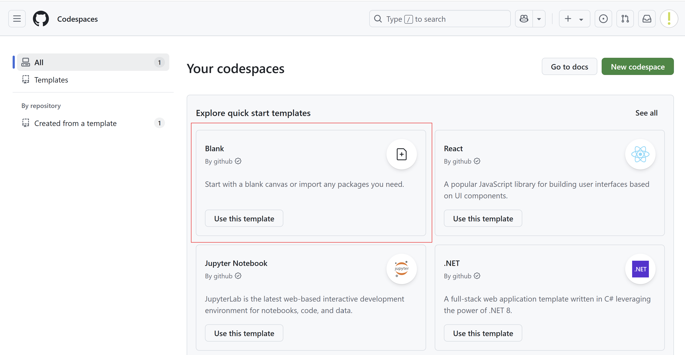

|                             |                          |                                        |
| --------------------------- | ------------------------ | -------------------------------------- |
| **Elektrotechniker/-in HF** | **Programmiertechnik A** |  |

- [1. Programmerzeugung](#1-programmerzeugung)
  - [1.1. Werkzeuge](#11-werkzeuge)
  - [1.2. Aufbau eines C-Programmes / Syntax](#12-aufbau-eines-c-programmes--syntax)
  - [1.3. Präprozessor (#Include, \*.h-Dateien)](#13-präprozessor-include-h-dateien)
  - [1.4. Standard Library, Compiler, Linker](#14-standard-library-compiler-linker)
  - [1.5. Bibliotheksfunktionen und Präprozessor-Anweisungen](#15-bibliotheksfunktionen-und-präprozessor-anweisungen)
  - [1.6. Das Hello World Programm](#16-das-hello-world-programm)
  - [1.7. Schritte von Quellcodedateien zum lauffähigen Programm](#17-schritte-von-quellcodedateien-zum-lauffähigen-programm)
  - [1.8. Compiler-Fehler vs. Linker-Fehler](#18-compiler-fehler-vs-linker-fehler)
- [2. Aufgaben](#2-aufgaben)
  - [2.1. Entwicklungswerkzeuge](#21-entwicklungswerkzeuge)
  - [2.2. GitHub Codespace einrichten und konfigurieren](#22-github-codespace-einrichten-und-konfigurieren)
  - [2.3. Programm lokal ausführen (Optional)](#23-programm-lokal-ausführen-optional)

---

# 1. Programmerzeugung

## 1.1. Werkzeuge

| **Werkzeuge** | **Beschreibung**                                                                                                                                                                                                                      |
| ------------- | ------------------------------------------------------------------------------------------------------------------------------------------------------------------------------------------------------------------------------------- |
| **Compiler**  | Ein Programm, das den **Quellcode** eines C-Programms in **Maschinensprache (Binärcode)** übersetzt, die vom Computer direkt ausgeführt werden kann.                                                                                  |
| **Linker**    | Ein Werkzeug, das mehrere **Objektdateien**, die vom Compiler erzeugt wurden, zu einer einzigen **ausführbaren Datei** zusammenfügt und dabei sicherstellt, </br> dass alle Referenzen zwischen den Dateien korrekt aufgelöst werden. |
| **Debugger**  | Erlaubt eine schrittweise Ausführung des Programms mit verschiedenen Instrumenten wie Breakpoints, Step und Ansichten von Variablen, Speicherbereiche, Register etc.                                                                  |
| **IDE**       | **Entwicklungsumgebung (Integrated Development Environment)** mit Editor, Compiler, Linker u. Debugger z.B. Visual Studio, Github Codespace, Eclipse, Clion etc.                                                                      |


## 1.2. Aufbau eines C-Programmes / Syntax

- Ein C-Programm besteht aus mehreren Komponenten, die zusammen die Grundlage für die Ausführung des Programms bilden.
- Die Struktur eines solchen Programms beinhaltet **Präprozessoranweisungen**, **Funktionen**, **Variablendeklarationen** und -**-definitionen** sowie **Kommentare**, die den Code lesbar und wartbar machen.

## 1.3. Präprozessor (#Include, *.h-Dateien)

- `#Include`: Eine **Präprozessoranweisung**, die verwendet wird, um Header-Dateien in ein C-Programm einzufügen.
- Diese **Header-Dateien** enthalten Deklarationen von **Funktionen** und **Makros**, die im Programm verwendet werden können. Beispiel: **`#include <stdio.h>`** fügt die Standard-Input-Output-Bibliothek hinzu, die Funktionen wie `printf` und `scanf` enthält.
- .h-Dateien: Header-Dateien mit der Erweiterung `.h` enthalten Deklarationen von Funktionen, Makros und manchmal Typdefinitionen, die in verschiedenen Teilen des Programms oder in verschiedenen Programmen wiederverwendet werden können.

## 1.4. Standard Library, Compiler, Linker

- **Standard Library**: Eine Sammlung vordefinierter Funktionen, die verschiedene Aufgaben wie Ein-/Ausgabeoperationen, String-Manipulation, mathematische Berechnungen und mehr unterstützen.
- **Compiler**: Ein Programm, das den Quellcode eines C-Programms in Maschinensprache (Binärcode) übersetzt, die vom Computer direkt ausgeführt werden kann.
- **Linker**: Ein Werkzeug, das mehrere Objektdateien, die vom Compiler erzeugt wurden, zu einer einzigen ausführbaren Datei zusammenfügt und dabei sicherstellt, dass alle Referenzen zwischen den Dateien korrekt aufgelöst werden.

## 1.5. Bibliotheksfunktionen und Präprozessor-Anweisungen

- Bibliotheksfunktionen (Standard Library): C bietet eine umfangreiche Standardbibliothek mit Funktionen für verschiedenste Aufgaben (z.B. `printf`, `scanf`, `strcpy`, `malloc`).
- Präprozessor-Anweisungen:  
  - **`#include`**: Bindet den Inhalt einer Header-Datei ein.
  - **`#define`**: Definiert Makros oder Konstanten.

## 1.6. Das Hello World Programm

```c
#include <stdio.h>  // Präprozessoranweisung: stdio.h wird inkludiert. Enthält Ein- und Ausgabefunktionen, wie scanf u. printf

void main(void)     // Einstiegspunkt: main-Funktion. Wird beim Programmstart aufgerufen
{
  printf("Hello World\n");  // Funktion printf von der Standard-Library (Ausgabe auf Konsole)
}
```

## 1.7. Schritte von Quellcodedateien zum lauffähigen Programm

1. **Schreiben des Quellcodes**: Der Entwickler schreibt den Quellcode in einer oder mehreren Dateien, typischerweise in einer Entwicklungsumgebung.
2. **Präprozessierung**: Präprozessor-Anweisungen wie **`#include`** und **`#define`** werden aufgelöst. Zum Beispiel werden Inhalte von Header-Dateien in den Quellcode eingefügt.
3. **Kompilierung**: Der Compiler übersetzt den Quellcode in Objektcode (Maschinencode, der noch externe Referenzen enthalten kann).
4. **Linking**: Der Linker kombiniert Objektcode aus verschiedenen Quellen, löst Referenzen auf und erzeugt eine ausführbare Datei.
5. **Ausführung**: Das fertige Programm kann vom Benutzer gestartet und genutzt werden.

## 1.8. Compiler-Fehler vs. Linker-Fehler

- **Compiler-Fehler**: Tritt auf, wenn der Compiler auf Probleme im **Quellcode** stösst, die ihn am erfolgreichen Kompilieren hindern. Beispiele hierfür sind **Syntaxfehler**, **Typ-Konflikte** oder **nicht deklarierte Variablen**.
- **Linker-Fehler**: Tritt auf, wenn der Linker nicht alle **Referenzen** zwischen den Objektdateien auflösen kann, z.B. wenn eine Funktion aufgerufen wird, die nirgendwo definiert ist.

---

</br>

# 2. Aufgaben

## 2.1. Entwicklungswerkzeuge

| **Vorgabe**         | **Beschreibung**                                                               |
| :------------------ | :----------------------------------------------------------------------------- |
| **Lernziele**       | Können die wichtigsten Entwicklungswerkzeuge zur Programmentwicklung erläutern |
|                     | Können konkrete Einsatzbereiche der Entwicklungswerkzeuge benennen             |
| **Sozialform**      | Teamarbeit mit max. Grösse von 3-4 Personen                                    |
| **Auftrag**         | siehe unten                                                                    |
| **Hilfsmittel**     |                                                                                |
| **Zeitbedarf**      | Arbeit 30min, Präsentation max. 10min                                          |
| **Lösungselemente** | Präsentation (PowerPoint oder Markdown)                                        |

- Identifiziere alle wichtigen Informationen und Anwendungen zu den nachfolgend aufgeführten Entwicklungswerkzeugen gemäss der Zuteilung.
  - **Editor / IDE**
  - **Compiler**
  - **Linker**
  - **Debugger**
  
- Fasse die Punkte mittels konkreten Anwendungsbeispielen oder Grafiken zusammen.
- Stelle die Ergebnisse mittels einer Kurzpräsentation der Klasse vor.
- Verwende dabei die Hilfsmittel wie Flow-Charts, Video Beamer, Wandtafel usw. und verweisen Sie ggf. auf weitere die Literatur.
- Die Zusammenfassungen sind dann den anderen Klassenkameraden zur Verfügung zu stellen.

---

## 2.2. GitHub Codespace einrichten und konfigurieren

| **Vorgabe**         | **Beschreibung**                                                                         |
| :------------------ | :--------------------------------------------------------------------------------------- |
| **Lernziele**       | Kann GitHub Codespace einrichten                                                         |
|                     | Kann Verzeichnisse und Dateien im Codespace erstellen                                    |
|                     | Kann im Editor ein Programmcode eingeben und das Programm ausführen                      |
|                     | Kann ein Programm im Debug-Modus ausführen und die Verädnerungen der Variablen verfolgen |
| **Sozialform**      | Einzelarbeit                                                                             |
| **Auftrag**         | siehe unten                                                                              |
| **Hilfsmittel**     |                                                                                          |
| **Zeitbedarf**      | 40min                                                                                    |
| **Lösungselemente** | Lauffähiges C-Programm                                                                   |

**Aufgabe 1:**

GitHub Codespaces ist eine **Cloud-basierte Entwicklungsumgebung**, die direkt in GitHub integriert ist und keine lokale Installation benötigt.
> **GitHub Codespace gibt eine Visual Studio Code Instanz mit.**

Bitte dein GitHub Codespace wie folgt einrichten:

1. Erstelle ein [GitHub-Account](https://github.com/), falls noch nicht verhanden.
2. Rufe die [GitHub Codespace](https://github.com/codespaces) Seite auf.
3. Erstelle einen leeren Codespace 
4. Gib deinem Codespace einen Namen z.B. PROT-A [Rename Codespace](./x_gitres/github-codespaces-rename.png)
5. Installiere in deinem Codespace Projekt die Extensions für die Programmiersprache C/C++ 
6. Erstelle nun für jede Unterrichtsunit ein Projektverzeichnis 
7. Erstelle eine neue Datei z.B. `main.c` 
8. Schreibe nun im Editor ein Programmcode 
9. Starte nun das Programm 
10. Prüfe die Ausgabe unten im Terminalfenster. 

**Aufgabe 2:**

Das Programm soll erweitert werden und dann in Einzelschritten (Debugger) ausgeführt werden.

1. Erweitere das Programm wie folgt. 
2. Setze nun einen Breakpoint (roter Punkt) und starte das Programm mit **C/C++ Datei debuggen** 
3. Führe das Programm in Einzelschritten bis zum Ende durch und überwache die Veränderungen der Variablen im linken Variablenfenster

---

</br>

## 2.3. Programm lokal ausführen (Optional)

| **Vorgabe**         | **Beschreibung**                                                       |
| :------------------ | :--------------------------------------------------------------------- |
| **Lernziele**       | Können ein kleines C-Programm (Hello Word) programmieren und ausführen |
|                     | Können die Entwicklungswerkzeuge korrekt einsetzen                     |
| **Sozialform**      | Einzelarbeit                                                           |
| **Auftrag**         | siehe unten                                                            |
| **Hilfsmittel**     |                                                                        |
| **Zeitbedarf**      | 30min                                                                  |
| **Lösungselemente** | Lauffähiges C-Programm                                                 |

- Versuche das Programm auch lokal mit Visual Studio Code umzusetzen
- Arbeite das komplette Tutorial zu "Using GCC with MinGW" durch.
  - Installiere die notwendigen Tools und füge auch den Installationspfad in die `PATH` Umgebungsvariable ein.
  - [Installationsanleitung](https://code.visualstudio.com/docs/cpp/config-mingw#_prerequisites)
  - [Video zu Installing MinGW to build C++ Code on Windows](https://www.youtube.com/watch?v=oC69vlWofJQ)

> Wichtig: `pacman -S --needed base-devel mingw-w64-ucrt-x86_64-toolchain`
