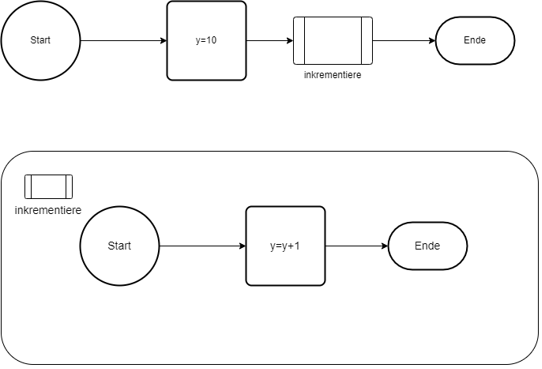

|                             |                          |                                        |
| --------------------------- | ------------------------ | -------------------------------------- |
| **Elektrotechniker/-in HF** | **Programmiertechnik A** |  |

- [1. Funktionen](#1-funktionen)
  - [1.1. Grafische Notation](#11-grafische-notation)
    - [1.1.1. Programmablaufplan](#111-programmablaufplan)
    - [1.1.2. Notation Aktivitätsdiagramm](#112-notation-aktivitätsdiagramm)
    - [1.1.3. Notation Struktogramm](#113-notation-struktogramm)
  - [1.2. Funktionsdefinition](#12-funktionsdefinition)
  - [1.3. Funktionsdeklaration (Prototyp)](#13-funktionsdeklaration-prototyp)
  - [1.4. Funktionsaufruf](#14-funktionsaufruf)
  - [1.5. Rückgabewert einer Funktion](#15-rückgabewert-einer-funktion)
  - [1.6. Funktionen ohne Rückgabewert (`void` Funktionen)](#16-funktionen-ohne-rückgabewert-void-funktionen)
  - [1.7. Übergabe von Parametern an Funktionen](#17-übergabe-von-parametern-an-funktionen)
    - [1.7.1. Pass-by-Value](#171-pass-by-value)
    - [1.7.2. Pass-by-Reference (Zeiger)](#172-pass-by-reference-zeiger)
  - [1.8. Rekursive Funktionen](#18-rekursive-funktionen)
  - [1.9. Variablenbereich (Scope)](#19-variablenbereich-scope)
  - [1.10. Standardbibliotheken und Funktionen](#110-standardbibliotheken-und-funktionen)
  - [1.11. Beispielprogramm mit Funktion (GitHub)](#111-beispielprogramm-mit-funktion-github)
  - [1.12. Beispielprogramm mit mehreren Funktionen (GitHub)](#112-beispielprogramm-mit-mehreren-funktionen-github)
- [2. Aufgaben](#2-aufgaben)
  - [2.1. C-Tutorial (Functions)](#21-c-tutorial-functions)
  - [2.2. Mathematikbibliothek implementieren](#22-mathematikbibliothek-implementieren)

---

</br>

# 1. Funktionen

- **Funktionen** sind ein zentraler Bestandteil der C-Programmierung, da sie es ermöglichen, Code zu **modularisieren** und zu **strukturieren**.
- Eine **Funktion** in C ist ein Block von Code, der eine **bestimmte Aufgabe ausführt**.
- **Funktionen** kann Daten empfangen (Argumente) und ein Ergebnis zurückgeben.
- **Funktionen** in C bieten eine Möglichkeit zur **Wiederverwendbarkeit** von Code.
- Eine **Funktion** hat immer einen **Rückgabetyp**, einen **Namen** und ggf. **Parameter**.
- **Funktionen** können Parameter nach **Wert** oder nach **Referenz** übergeben (mit Zeigern).
- Rekursive **Funktionen** rufen sich selbst auf und lösen wiederkehrende Probleme.


## 1.1. Grafische Notation

### 1.1.1. Programmablaufplan



### 1.1.2. Notation Aktivitätsdiagramm


### 1.1.3. Notation Struktogramm


## 1.2. Funktionsdefinition

- Eine Funktion wird durch ihre **Signatur** und **Implementierung** definiert.
- Die Signatur umfasst den **Rückgabetyp** der Funktion, ihren **Namen** und die **Parameter** (Eingabewerte).

**Syntax der Funktionsdefinition:**

```c
Rückgabetyp Funktionsname(Parameter1, Parameter2, ...) {
    // Funktionskörper
}
```

- **Rückgabetyp:**
  - Gibt an, welchen Typ von Wert die Funktion zurückgibt (z. B. `int`, `float`, `void` für keine Rückgabe).
- **Funktionsname:**
  - Der Name der Funktion, der verwendet wird, um sie aufzurufen.
- **Parameter:**
  - Die Werte, die an die Funktion übergeben werden (optional).

## 1.3. Funktionsdeklaration (Prototyp)

- Bevor eine **Funktion** verwendet wird, muss sie entweder definiert oder ihr Prototyp deklariert werden.
- Der Funktionsprototyp wird häufig am Anfang einer Datei oder in einer Header-Datei (`.h`) platziert.

**Syntax des Funktionsprototyps:**

```c
Rückgabetyp Funktionsname(Parameter1, Parameter2, ...);
```

- Ein Funktionsprototyp gibt an, welche Parameter die Funktion erwartet und welchen Rückgabetyp sie hat.
- Es ist nicht notwendig, den Funktionskörper zu definieren.

**Beispiel eines Prototyps:**

```c
int addiere(int a, int b);
```

## 1.4. Funktionsaufruf

- Ein Funktionsaufruf erfolgt durch den Funktionsnamen und Übergabe der Argumente (falls vorhanden).

**Syntax des Funktionsaufrufs:**

```c
Funktionsname(Argument1, Argument2, ...);
```

**Beispiel eines Funktionsaufrufs:**

```c
int ergebnis = addiere(5, 3);
```

## 1.5. Rückgabewert einer Funktion

- Eine Funktion kann einen Wert zurückgeben, der an den Funktionsaufrufer übergeben wird.
- Der Rückgabewert wird durch das Schlüsselwort `return` angegeben.

**Syntax:**

```c
return Wert;
```

Der Rückgabetyp der Funktion muss mit dem Datentyp des Wertes übereinstimmen.

**Beispiel:**

```c
int addiere(int a, int b) {
    return a + b;  // Gibt die Summe von a und b zurück
}
```

## 1.6. Funktionen ohne Rückgabewert (`void` Funktionen)

- Wenn eine Funktion keinen Wert zurückgeben soll, wird der Rückgabetyp mit `void` angegeben.
- Diese Funktionen werden oft verwendet, um eine Aufgabe auszuführen, ohne etwas zurückzugeben.

**Beispiel:**

```c
void druckeGruss() {
    printf("Hallo, Welt!\n");
}
```

**Aufruf:**

```c
druckeGruss();  // Ruft die Funktion auf, die nichts zurückgibt
```

## 1.7. Übergabe von Parametern an Funktionen

In C gibt es zwei Hauptmethoden, um Parameter an eine Funktion zu übergeben: **Pass-by-Value** und **Pass-by-Reference**.

### 1.7.1. Pass-by-Value

- Beim **Pass-by-Value** wird eine **Kopie** der übergebenen Variablen an die Funktion übergeben.
- Änderungen an der Kopie haben **keine** Auswirkungen auf die Originalvariable.

**Beispiel:**

```c
void verdoppeln(int x) {
    x = x * 2;
}

int main() {
    int a = 5;
    verdoppeln(a);  // a bleibt 5
    printf("%d\n", a);  // Ausgabe: 5
    return 0;
}
```

### 1.7.2. Pass-by-Reference (Zeiger)

Beim **Pass-by-Reference** wird die **Adresse** der Variablen an die Funktion übergeben, sodass die Funktion die Originalvariable ändern kann.

**Beispiel:**

```c
void verdoppleMitZeiger(int *x) {
    *x = *x * 2;
}

int main() {
    int a = 5;
    verdoppleMitZeiger(&a);  // a wird auf 10 gesetzt
    printf("%d\n", a);  // Ausgabe: 10
    return 0;
}
```

## 1.8. Rekursive Funktionen

- Eine Funktion kann sich selbst aufrufen, was als **Rekursion** bezeichnet wird.
- Rekursive Funktionen werden verwendet, um Probleme zu lösen, die sich in kleinere Teilprobleme zerlegen lassen.

**Beispiel: Berechnung der Fakultät (n!):**

```c
int fakultät(int n) {
    if (n <= 1) {
        return 1;  // Basisfall
    } else {
        return n * fakultät(n - 1);  // Rekursiver Aufruf
    }
}

int main() {
    int result = fakultät(5);  // Berechnet 5! = 120
    printf("%d\n", result);  // Ausgabe: 120
    return 0;
}
```

## 1.9. Variablenbereich (Scope)

- Der **Scope** einer Variablen gibt an, in welchem Bereich des Programms sie **sichtbar** und **verfügbar** ist.
- Variablen, die innerhalb einer Funktion deklariert werden, haben nur in dieser Funktion Gültigkeit (lokaler Scope).

**Beispiel:**

```c
void meineFunktion() {
    int a = 10;  // 'a' ist nur innerhalb von meineFunktion sichtbar
}

int main() {
    // 'a' ist hier nicht sichtbar, es führt zu einem Fehler
    return 0;
}
```

## 1.10. Standardbibliotheken und Funktionen

Die C-Standardbibliothek enthält viele nützliche Funktionen, die in Programmen verwendet werden können, z. B. Funktionen zur Eingabe/Ausgabe, String-Manipulation oder mathematische Funktionen.

**Beispiel (Eingabe/Ausgabe):**

```c
#include <stdio.h>

int main() {
    int zahl;

    printf("Gib eine Zahl ein: ");
    scanf("%d", &zahl);

    printf("Die eingegebene Zahl ist: %d\n", zahl);
    return 0;
}
```

**Beispiel (Mathematische Funktionen):**

```c
#include <math.h>

int main() {
    double wurzel = sqrt(16);  // Berechnet die Quadratwurzel von 16

    printf("Die Quadratwurzel von 16 ist: %.2f\n", wurzel);
    return 0;
}
```

## 1.11. Beispielprogramm mit Funktion (GitHub)

```c
#include <stdio.h>

int inkrementiere(int i) 
{
    i++;//i=i+1
    return i;
}

void main(void)
{
    int y = 10;  // Initialwert für y
    y=inkrementiere(y);
    printf("Ende, y = %d\n", y);
}
```

- Dieses Programm definiert eine Funktion `inkrementiere`, die eine Ganzzahlen als Eingabe erhält, diese inkrementiert und  zurückgibt.
- Das Beispiel zeigt, wie man Funktionen definiert, aufruft und mit Rückgabewerten umgeht.

---

## 1.12. Beispielprogramm mit mehreren Funktionen (GitHub)

```c
#include <stdio.h>

// Deklaration der Funktionen
int summe(int a, int b);
int produkt(int a, int b);
void ausgabe(int ergebnis);

// Definition der Funktion zur Berechnung der Summe
int summe(int a, int b) {
    return a + b;
}

// Definition der Funktion zur Berechnung des Produkts
int produkt(int a, int b) {
    return a * b;
}

// Definition der Funktion zur Ausgabe
void ausgabe(int ergebnis) {
    printf("Das Ergebnis ist %d.\n", ergebnis);
}

void main(void) {
    int zahl1, zahl2, ergebnisSumme, ergebnisProdukt;

    // Eingabe der zwei Zahlen
    printf("Geben Sie die erste Zahl ein: ");
    scanf("%d", &zahl1);
    printf("Geben Sie die zweite Zahl ein: ");
    scanf("%d", &zahl2);

    // Aufruf der Funktionen und Speichern der Ergebnisse
    ergebnisSumme = summe(zahl1, zahl2);
    ergebnisProdukt = produkt(zahl1, zahl2);

    // Ausgabe der Ergebnisse
    printf("Die Summerechnung von %d und %d:\n", zahl1, zahl2);
    ausgabe(ergebnisSumme);
    printf("Das Produktrechnung von %d und %d:\n", zahl1, zahl2);
    ausgabe(ergebnisProdukt);
}
```

---

</br>

# 2. Aufgaben

## 2.1. C-Tutorial (Functions)

| **Vorgabe**         | **Beschreibung**                                                        |
| :------------------ | :---------------------------------------------------------------------- |
| **Lernziele**       | Kennt die Möglichkeiten zur Modularisierung und Strukturierung von Code |
|                     | Kennt die Möglichkeit an Funktionen Parametern zu übergeben             |
|                     | Kann Funktionen korrekt aufrufen und das Funktionsergebnis speichern    |
| **Sozialform**      | Einzelarbeit                                                            |
| **Auftrag**         | siehe unten                                                             |
| **Hilfsmittel**     |                                                                         |
| **Zeitbedarf**      | 10min                                                                   |
| **Lösungselemente** |                                                                         |

Rufe die [W3School C-Functions](https://www.w3schools.com/c/c_functions.php) Seite auf und arbeite das Kapitel C-Functions durch.

---

## 2.2. Mathematikbibliothek implementieren

| **Vorgabe**         | **Beschreibung**                                                        |
| :------------------ | :---------------------------------------------------------------------- |
| **Lernziele**       | Kennt die Möglichkeiten zur Modularisierung und Strukturierung von Code |
|                     | Kann Funktionen mit und ohne Parameter implementieren                   |
|                     | Kann Funktionen korrekt aufrufen und das Funktionsergebnis speichern    |
| **Sozialform**      | Einzelarbeit                                                            |
| **Auftrag**         | siehe unten                                                             |
| **Hilfsmittel**     |                                                                         |
| **Zeitbedarf**      | 30min                                                                   |
| **Lösungselemente** | Funktionierendes Programm                                               |

Schreibe ein C-Programm, dass eine einfache Mathematikbibliothek implementiert

Das Programm soll die folgenden **Funktionen** bereitstellen:

- `addiere(int a, int b)`
  - Addiert zwei Ganzzahlen und gibt das Ergebnis zurück
- `subtrahiere(int a, int b)`
  - Subtrahiert die zweite Ganzzahl von der ersten und gibt das Ergebnis zurück
- `multiplizieren(int a, inb b)`
  - Multipliziert zwei Ganzzahlen und gibt das Ergebnis zurück
- `dividiere(int a, int b)`
  - Dividiert die erste Ganzzahl durch die zweite und gibt das Ergebnis zurück. Falls die zweite Ganzzahl 0 ist, soll eine Fehlermeldung ausgegeben werden.

Zusätzlich soll das Programm ein **Hauptprogramm** enthalten, das diese Funktionen testet und die Ergebnisse auf der Konsole ausgibt.
