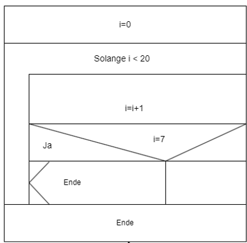

|                             |                          |                                        |
| --------------------------- | ------------------------ | -------------------------------------- |
| **Elektrotechniker/-in HF** | **Programmiertechnik A** |  |

- [1. Sprung-Anweisung](#1-sprung-anweisung)
  - [1.1. `break`-Anweisung](#11-break-anweisung)
    - [1.1.1. Verwendung von `break` in einer `for`-Schleife](#111-verwendung-von-break-in-einer-for-schleife)
    - [1.1.2. Verwendung von `break` in einem `switch`-Block](#112-verwendung-von-break-in-einem-switch-block)
  - [1.2. `continue`-Anweisung](#12-continue-anweisung)
    - [1.2.1. Verwendung von `continue` in einer `for`-Schleife](#121-verwendung-von-continue-in-einer-for-schleife)
    - [1.2.2. Verwendung von `continue` in einer `while`-Schleife](#122-verwendung-von-continue-in-einer-while-schleife)
  - [1.3. `goto`-Anweisung](#13-goto-anweisung)
    - [1.3.1. Verwendung von `goto`](#131-verwendung-von-goto)
    - [1.3.2. Verwendung von `goto` zum Verlassen einer verschachtelten Schleife](#132-verwendung-von-goto-zum-verlassen-einer-verschachtelten-schleife)
- [2. Aufgaben](#2-aufgaben)
  - [2.1. Sprung](#21-sprung)

---

# 1. Sprung-Anweisung

- **`break`**
  - Verlässt vorzeitig Schleifen oder `switch`-Blöcke.
- **`continue`**
  - Überspringt den Rest der aktuellen Iteration und fährt mit der nächsten Iteration fort.
- **`goto`**
  - Springt direkt zu einem bestimmten Code-Label (häufig verwendet, aber meist in modernen Programmen nicht empfohlen).


## 1.1. `break`-Anweisung

Die `break`-Anweisung wird verwendet, um die Ausführung einer Schleife oder eines `switch`-Statements vorzeitig zu beenden. Wenn `break` in einer Schleife (z. B. `for`, `while`, `do-while`) oder in einem `switch`-Block ausgeführt wird, wird die Steuerung sofort an die Zeile nach der Schleife oder dem `switch`-Block übergeben.




### 1.1.1. Verwendung von `break` in einer `for`-Schleife

```c
#include <stdio.h>

int main() {
    for (int i = 0; i < 10; i++) {
        if (i == 5) {
            break;  // Verlasse die Schleife, wenn i gleich 5 ist
        }
        printf("i = %d\n", i);
    }
    printf("Die Schleife wurde beendet.\n");
    return 0;
}
```

**Erläuterung:**

- Die **Schleife** läuft normalerweise von 0 bis 9, aber sobald `i` den Wert `5` erreicht, wird die `break`-Anweisung ausgeführt und die Schleife wird verlassen.
- Die Ausgabe ist:

`
  i = 0
  i = 1
  i = 2
  i = 3
  i = 4
  Die Schleife wurde beendet.
`

### 1.1.2. Verwendung von `break` in einem `switch`-Block

```c
#include <stdio.h>

int main() {
    int x = 3;
    
    switch (x) {
        case 1:
            printf("x ist 1\n");
            break;
        case 2:
            printf("x ist 2\n");
            break;
        case 3:
            printf("x ist 3\n");
            break;
        default:
            printf("Kein passender Fall gefunden\n");
    }
    return 0;
}
```

**Erläuterung:**

- In einem `switch`-Block beendet `break` den aktuellen Fall, sobald der entsprechende Fall gefunden wurde.
- Da `x` den Wert 3 hat, wird "x ist 3" ausgegeben und die `break`-Anweisung sorgt dafür, dass keine weiteren Fälle durchlaufen werden.

---

## 1.2. `continue`-Anweisung

- Die `continue`-Anweisung **überspringt** die verbleibenden Anweisungen innerhalb der aktuellen Iteration einer Schleife und fährt mit der nächsten Iteration fort.
- Dies kann nützlich sein, wenn du in einer Schleife bestimmte Bedingungen überspringen möchtest.

### 1.2.1. Verwendung von `continue` in einer `for`-Schleife

```c
#include <stdio.h>

int main() {
    for (int i = 0; i < 10; i++) {
        if (i % 2 == 0) {
            continue;  // Überspringe gerade Zahlen
        }
        printf("i = %d\n", i);  // Wird nur für ungerade Zahlen ausgeführt
    }
    return 0;
}
```

**Erläuterung:**

- In diesem Beispiel wird jede gerade Zahl durch `continue` **übersprungen**, sodass nur ungerade Zahlen (1, 3, 5, 7, 9) ausgegeben werden.
- Die Ausgabe ist:

  `
  i = 1
  i = 3
  i = 5
  i = 7
  i = 9
`

### 1.2.2. Verwendung von `continue` in einer `while`-Schleife

```c
#include <stdio.h>

int main() {
    int i = 0;
    while (i < 10) {
        i++;
        if (i == 5) {
            continue;  // Überspringe die Ausgabe, wenn i 5 ist
        }
        printf("i = %d\n", i);
    }
    return 0;
}
```

**Erläuterung:**

- In dieser `while`-Schleife wird die Ausgabe für `i == 5` übersprungen, aber alle anderen Werte werden ausgegeben.
- Die Ausgabe ist:

 `
  i = 1
  i = 2
  i = 3
  i = 4
  i = 6
  i = 7
  i = 8
  i = 9
  i = 10
 `

---

## 1.3. `goto`-Anweisung

- Die `goto`-Anweisung ermöglicht es, den Programmfluss direkt zu einer anderen Stelle im Code zu springen.
- Man kann ein **Label** definieren und mit `goto` auf dieses Label springen. **Achtung:**
- Die Verwendung von `goto` wird in modernen Programmierpraktiken oft als **schlecht angesehen**, da es den Code schwer lesbar und wartbar machen kann.
- Trotzdem kann es in bestimmten Fällen (z. B. zum schnellen Verlassen mehrerer verschachtelter Schleifen) nützlich sein.

### 1.3.1. Verwendung von `goto`

```c
#include <stdio.h>

int main() {
    int i = 0;
    
    start:  // Label, zu dem wir mit goto springen
    if (i >= 5) {
        printf("Ende erreicht\n");
        return 0;
    }
    
    printf("i = %d\n", i);
    i++;
    goto start;  // Springe zurück zum Label 'start'

    return 0;
}
```

**Erläuterung:**

- Das Programm druckt `i` von 0 bis 4, und sobald `i` den Wert 5 erreicht, wird das Programm beendet.
- Der `goto`-Befehl springt immer zum Label `start`, was eine Schleife im Programm simuliert.
- Die Ausgabe ist:

 `
  i = 0
  i = 1
  i = 2
  i = 3
  i = 4
  Ende erreicht
 `

### 1.3.2. Verwendung von `goto` zum Verlassen einer verschachtelten Schleife

```c
#include <stdio.h>

int main() {
    for (int i = 0; i < 5; i++) {
        for (int j = 0; j < 5; j++) {
            if (i == 3 && j == 3) {
                goto exit_loop;  // Verlasse beide Schleifen
            }
            printf("i = %d, j = %d\n", i, j);
        }
    }

    exit_loop:  // Label zum Verlassen der Schleifen
    printf("Die Schleifen wurden verlassen.\n");
    return 0;
}
```

**Erläuterung:**

- In diesem Beispiel wird mit `goto` direkt zum Label `exit_loop` gesprungen, wenn `i == 3` und `j == 3` erreicht sind, wodurch beide Schleifen verlassen werden.
- Die Ausgabe ist:

 `
  i = 0, j = 0
  i = 0, j = 1
  i = 0, j = 2
  i = 0, j = 3
  i = 0, j = 4
  i = 1, j = 0
  i = 1, j = 1
  i = 1, j = 2
  i = 1, j = 3
  i = 1, j = 4
  i = 2, j = 0
  i = 2, j = 1
  i = 2, j = 2
  i = 2, j = 3
  i = 2, j = 4
  i = 3, j = 0
  i = 3, j = 1
  i = 3, j = 2
  Die Schleifen wurden verlassen.
 `

---

</br>

# 2. Aufgaben

## 2.1. Sprung

| **Vorgabe**         | **Beschreibung**                                          |
| :------------------ | :-------------------------------------------------------- |
| **Lernziele**       | Kennt die Sprunganweisungen in Programmiersprache C       |
|                     | Kann einige Sprunganweisung nach Vorgabe implementieren   |
|                     | Kann eine Sprunganweisung problemlösungsbezogen bestimmen |
| **Sozialform**      | Partnerarbeit                                             |
| **Auftrag**         | siehe unten                                               |
| **Hilfsmittel**     |                                                           |
| **Zeitbedarf**      | 20min                                                     |
| **Lösungselemente** | Korrekte und lauffähige Implementation                    |

Implementiere folgendes Struktogramm mit einem Sprung.  


